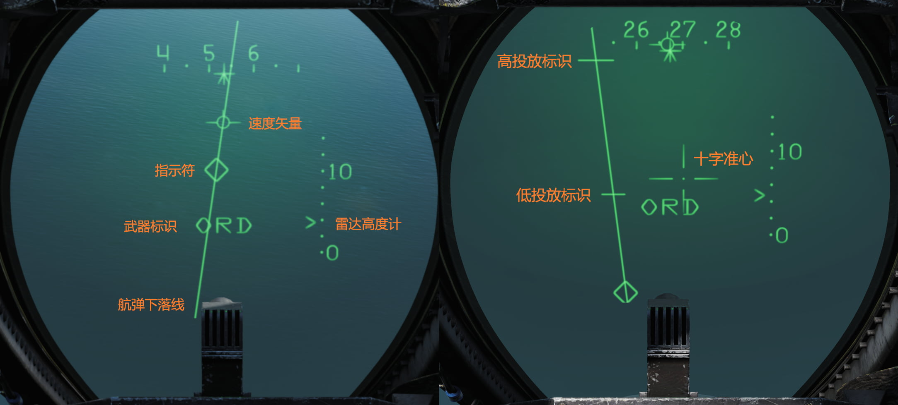
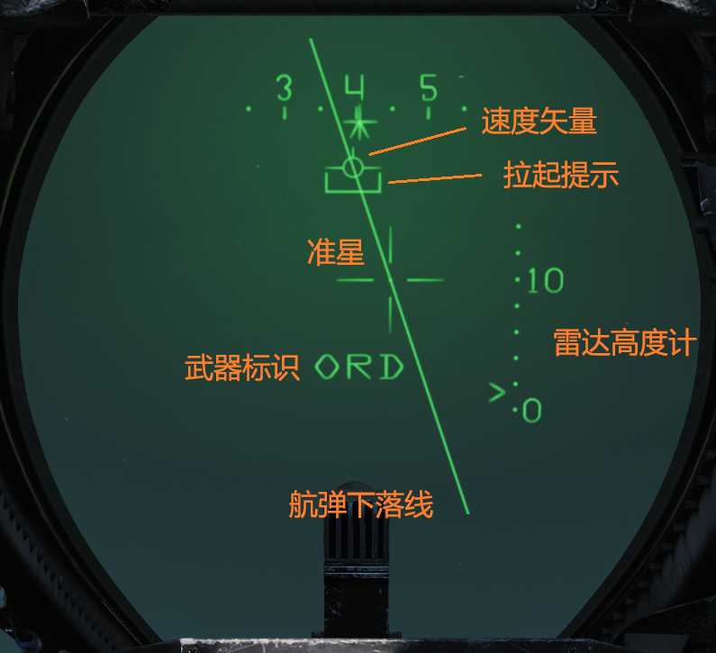
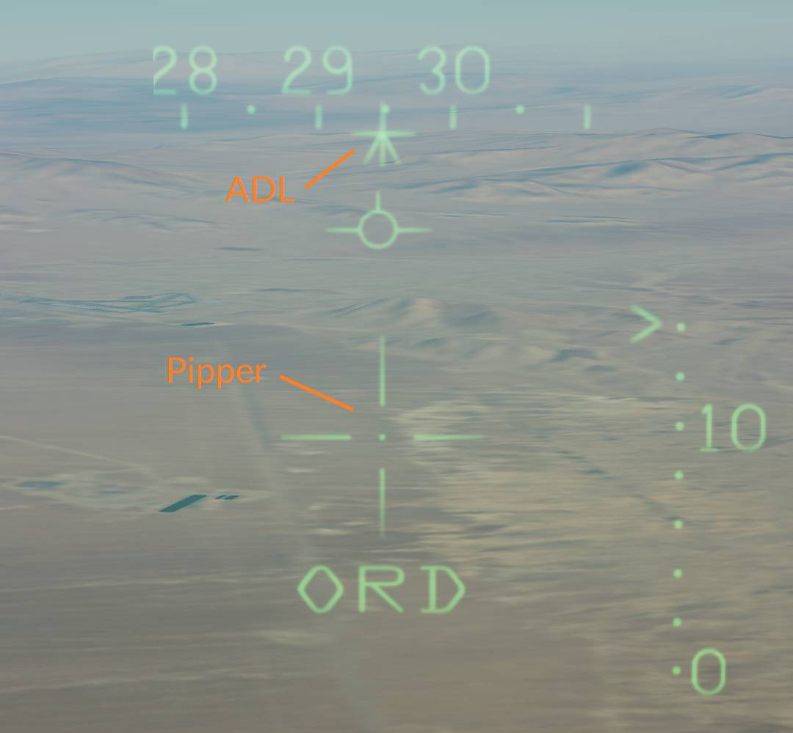

# 空对地武器投放

飞行员在显示控制面板中选择了 **A/G**
模式后飞机就会进入空对地投放模式。在磁带数据读入（需约30秒）完成后，WCS 将进入空对地模式并且在显示器上显示相关的符号。

除非飞行员已经选择了其他武器，否则 HUD 会自动切换至（对地）挂载模式（HUD 中显示
**ORD**）。所有其他投放选项都由后座 RIO 设置。

RIO 驾驶舱内的 **ATTK MODE** 选择旋钮用于选择攻击模式，F-14 中可用的攻击模式分别是：

- **CMPTR
  TGT** - 计算机目标模式，这是一种半自动计算机引导模式，类似于新型战机中的 CCRP（连续计算投放点）模式。
- **CMPTR IP** - 计算机起始点模式是 CMPTR
  TGT 模式的扩展模式，它使用一个已知的起始点（IP）作为挂载投放参考点。通常在预期目标难以被目视定位，但其附近有易于识别的参考点/地标的情况下使用。
- **CMPTR
  PLT** - 计算机引导模式——是一种手动、计算机以及飞行员引导的模式，计算机引导模式将使用 WCS 计算挂载命中点并将命中点显示在 HUD 中。计算机引导模式类似于新型战机中的 CCIP（连续计算命中点）模式。
- **MAN** - 手动，手动模式是备用模式。该模式下，HUD 上会显示一个由飞行员设置的下压角度可调的准星（十字准星）。用于系统出现故障，其他模式无法启用时。
- **D/L
  BOMB** - 数据链投弹模式是一种驾驶员通过数据链路的提示来操纵飞机，在远程操纵下完成挂载投放的自动模式（DCS中尚未实装此功能）。

## 计算机目标模式

计算机目标模式允许飞行员指定目标，然后由 WCS 引导飞行员向目标投弹。 此模式适用于所有空对地挂载，包括火箭弹。

选择计算机目标模式时，HUD 将显示菱形目标指示符、一条穿过速度矢量符的航弹下落线（BFL）和挂载命中点准星（十字准线）。

飞行员调整飞机航向，将目标置于 BFL 上来指定目标。 然后，用飞行员驾驶舱壁上的目标指定开关的
**UP/DN** 来调整目标指示符位置，直到指示符覆盖目标。这时，按下目标指定开关至 **DES**
档位来指定目标。

指定目标后，菱形目标指定符会相对地面稳定，并且 AN/AWG-9 会指向指定的位置进行测距。 BFL 会保持在指定的目标上，而十字准星和飞机速度矢量继续跟随飞机移动。 此外，HUD 会在 BFL 上分别显示高低投放标识。

现在飞行员需要控制飞机，将速度矢量和十字准星置于 BFL 上，直到两个投放标识接近速度矢量符和准星。低投放标识穿过速度矢量符时，表示即将投弹，此时飞行员应按下并按住航弹投放按钮，授权 WCS 投放挂载。当高投放标识与速度矢量符位置重合时，如果投放按钮处于按下状态，WCS 将自动投放选定的挂载。

随着飞机高度降低，HUD 上的拉起标识（开口方向朝上的方括号）朝着速度矢量符向上移动。当它与速度矢量符重合时，表示飞机低于投放挂载的安全高度。

## 计算机起始点模式

功能上与计算机目标模式相同，区别在于计算机起始点模式指定预设起始点（IP），而不是指定目标实际位置。这个 IP 在起飞前通过数据链路或由 RIO 在 CAP 中手动设置。

IP 航路点应该是易于飞行员目视辨认的地形特征，即使目标不易于辨认。

RIO 使用 CAP 来设置 IP 航路点，操作与设置导航系统中其他航路点相同。（参见“总体设计和系统概述”中 AN/AWG-9 下的 CAP 航向部分，或同章节中的导航系统部分）

CAP 上 SPL 类别中的 IP TO TGT MESSAGE（功能）与前缀按钮 **ALT**、 **RNG** 和 **BRG**
一起使用用来读数和设置以下数据点：

- **ALT** - 设置目标与 IP 航路点之间的高度差。
- **RNG** - 设置目标相对 IP 航路点的距离。
- **RNG** - 设置目标相对 IP 航路点的方位。

飞行员在 HUD 上目视指定 IP 点后，WCS 会根据 CAP 中 **IP TO TGT**
功能所设置的数据重新计算目标位置，并将菱形目标指示符移动到计算出的位置，使 HUD 显示的引导标识从 IP 航路点位置切换至目标实际位置。

此模式下的其他功能与计算机目标模式下的功能相同。

## 计算机引导模式

计算机引导模式通过 WCS 连续计算并在 HUD 中显示当前配置挂载的命中点。

选择计算机引导模式时，HUD 中的准星（十字）显示了当前挂载的实时命中点。WCS 设置为发射火箭弹时，如果菱形目标指示符出现在十字准星上方，则表示命中点在火箭弹射程外。与计算机目标和计算机起始点模式中一样，如果拉起标识位于速度矢量符上方，则表示飞机低于安全投放高度。

飞行员需要操纵飞机，将 HUD 中的命中点准星置于目标上，并按下武器发射扳机来攻击目标。

使用火箭弹攻击时，飞行员应该等到准星上的菱形消失，这表示命中点在火箭弹的射程内，然后使用扳机发射火箭弹。

## 手动模式

其他模式不可用时，手动模式将作为备用模式使用。

手动模式与计算机引导模式的基本原理相同，飞行员应控制飞机，将准星置于目标上方。虽然手动模式下 WCS 不会更新准星的位置，但可以根据所需的攻击速度、俯冲角度和投放高度来设置十字准星相对 ADL（武器基准线）的偏移量。

这个偏移量是由飞行员估算或根据投弹数据表，然后在右侧垂直控制台中的准星提前量设置面板上调定的。
