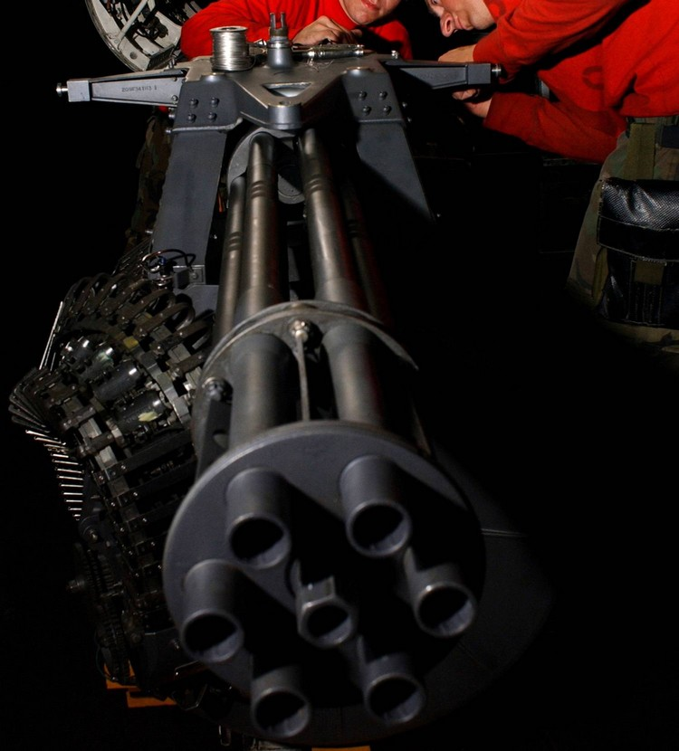
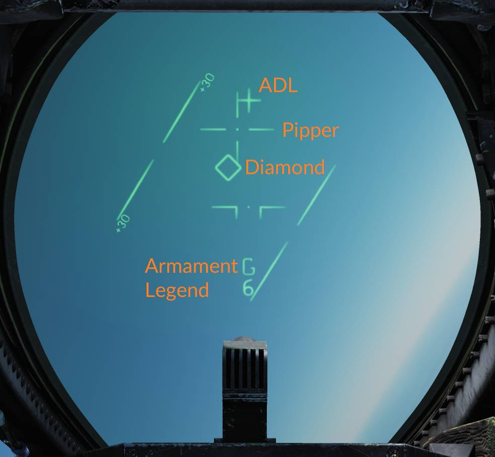
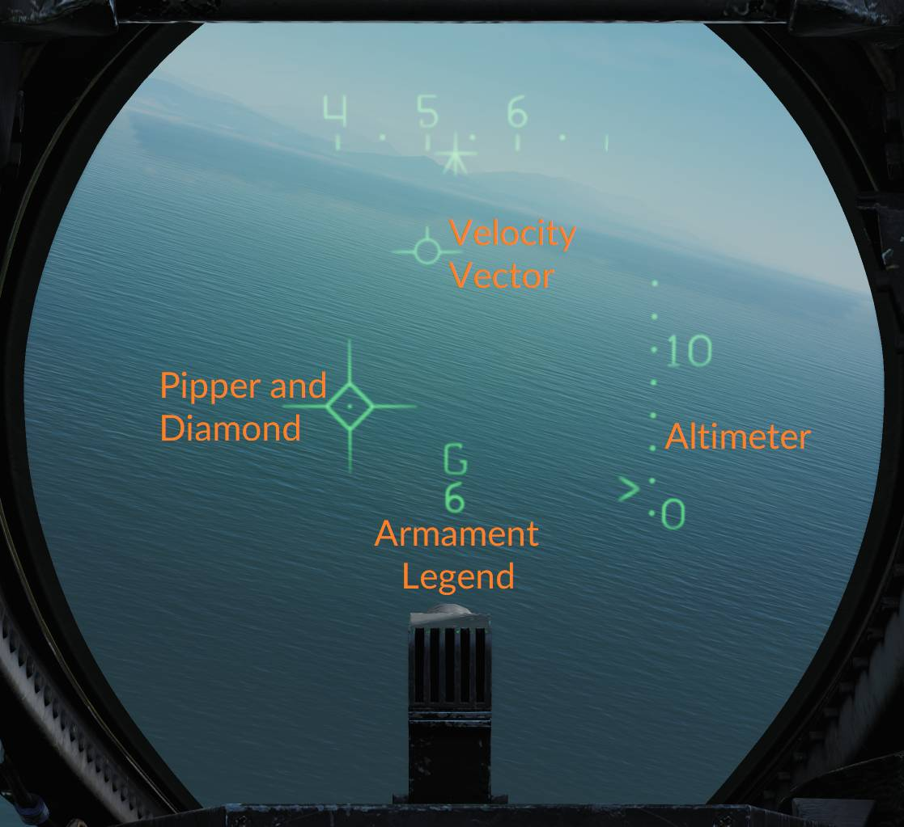

# M-61 Vulcan Six-Barreled Gatling Cannon

 _U.S. Navy photo by Photographers Mate
Airman Kristopher Wilson. (041129-N-5345W-034)_

The M-61 Vulcan is a six-barreled hydraulically driven 20 mm automatic cannon
capable of firing over 6,000 rpm (rounds per minute).

The F-14 carries the gun internally mounted beneath the cockpit with the muzzle
being located on the lower left side of the fuselage. 676 20 mm rounds are
carried in the ammunition drum for the gun and retain the spent cases after the
rounds have been fired.

The gun itself is mounted to be elevated slightly more than 3° from the ADL to
provide built-in lead for dog-fight situations.

To fire the gun, no input is needed from the WCS, the gun can be fired by the
trigger on the pilot stick when selected by the weapons selector on that same
stick, provided master arm is on. The WCS can, however, provide symbology on the
HUD to increase gun accuracy. For both air-to-air and air-to-ground modes the
gun has two sights available. For air-to-air it’s the manual sight and the RTGS
(real-time gun sight).

Selection of the gun is indicated on the bottom of the HUD by a capital G with
remaining hundreds of rounds indicated below.

Apart from the indication on the HUD, the rounds remaining indicator on the
pilot right vertical panel also shows remaining rounds. The indicator counts
down from 650 but can manually be reset by rotating the knob below the indicator
to the desired quantity.

The gun is capable of a 4,000 rpm or 6,000 rpm mode. The lower rate is normally
used for air-to-ground engagement and the higher rate for air-to-air engagement.
The gun rate is selected by the GUN RATE switch on the ACM, which also indicates
the selected option. Selection of ACM will set it to high automatically. The
maximum number of bullets fired by a trigger pull can be set to be either 50,
100, 200, or unlimited. The default value is 200 bullets but can be set
otherwise by the ground crew.

> 💡 In DCS this is set via the kneeboard.

## Manual Air-to-Air Sight

In manual mode, the HUD displays the ADL, the armament legend, and the manual
pipper. This mode is accessed by depressing and releasing the CAGE/SEAM
pushbutton on the left throttle when in the air-to-air mode with the gun
selected. In this mode, the pilot has to manually aim the gun using the manual
pipper as a reference to hit the target. Real target range and needed deflection
need to be estimated by the pilot.

The manual piper is adjustable to enable the selection of the desired lead. The
GUN ELEV panel on the pilot right vertical panel sets the lead; normally, this
should be set to 53 milliradians to place the manual pipper on the gun sight
line.

## Real-Time Gunsight (RTGS)

The real-time gunsight mode is the standard gun mode when in the air-to-air mode
with the gun selected.

In RTGS, the WCS computes the bullet trajectory and displays the location the
bullets will pass through at 1,000 and 2,000 feet, if no target data is
available from the WCS. The pipper represents bullet location at 1,000 feet and
the diamond represents the bullet location at 2,000 feet.

If target data is available from the WCS (target tracked in an STT mode), the
pipper instead displays bullet location at the target’s current range out to
4,000 feet. The diamond will display radar line of sight to the target (target
location). This means that when having a target track, the pilot should fly the
aircraft to place the pipper over the target to hit it.

In addition to computing the solution to put bullets at the target's location,
the RTGS sight will also calculate where the bullets actually are in relation to
the target when at target range. When the bullets fired are computed to be at
the target’s location, the diamond switches from target indication to indicating
bullet position at target range (BATR). This is also indicated by the diamond
flashing.

Using this symbology, it’s possible to see where the target would have needed to
be to be hit by the bullets. If the gun engagement was executed successfully,
this means that the diamond should still be on top of the target, blinking,
indicating that the bullets passed through the target’s location.

## Manual Air-to-Ground Sight

The manual air-to-ground sight works and looks the same way as the manual
air-to-air sight except that it’s set by the RIO using the ATTK MODE selector on
the armament control panel that’s located on the RIO left vertical panel.
Selecting MAN on that selector enables the same HUD symbology as in the manual
air-to-air sight upon the selection of the air-to-ground mode, the only
additional HUD symbology being the display of the radar altitude on the right
side of the HUD. The gun deflection should instead be set according to a
pre-calculated setting depending on airspeed, target range, and dive angle.

## Computer/Pilot Mode

Computer/pilot mode is used to have the WCS continuously compute a weapon impact
point for, among other air-to-ground weapons, the gun. It is set by the RIO on
the ATTK MODE selector, as for manual air-to-ground sight, by selecting
CMPTR-PLT.

In this mode, the AN/AWG-9 radar is slaved to the weapon impact point for
accurate range measurements and enables the HUD display of that same impact
point.

The HUD uses the pipper to indicate a real-time weapon impact point and the
diamond to indicate out of range. When the diamond disappears, the gun is in
range to engage a target under the pipper. The pull-up cue moves vertically on
the HUD and when it’s at or above the weapon impact point (pipper), it indicates
that an immediate pull-up is required to avoid striking the ground and that the
target is too close to engage safely.

The right side of the HUD displays the barometric altitude scale.

## Mixed Gun Mode

The gun can also be used at the same time as another air-to-ground munition is
selected by setting the A/G GUN switch on the armament panel (on the RIO left
vertical panel) to MIXED. This enables the trigger to fire the gun but no HUD
symbology is available for the gun as it’s being used to display release data
for the selected munition. In this mode, the pilot needs to estimate the gun
impact point manually with the ADL as the only reference on the HUD.
