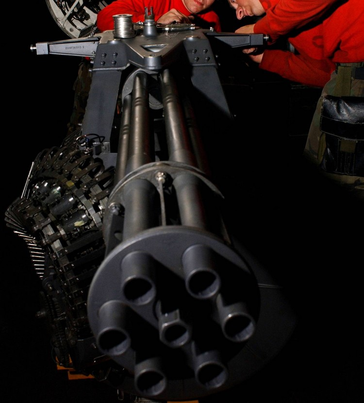
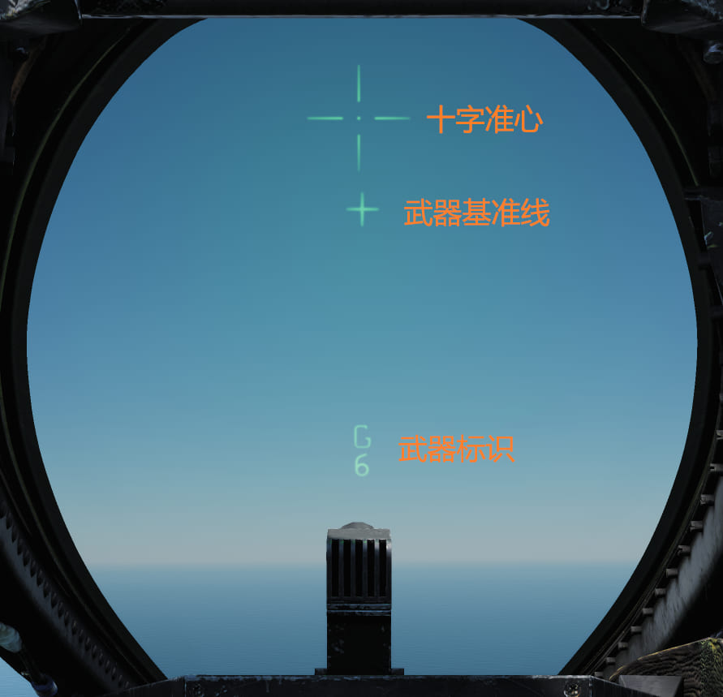
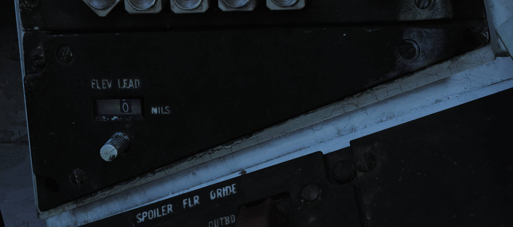
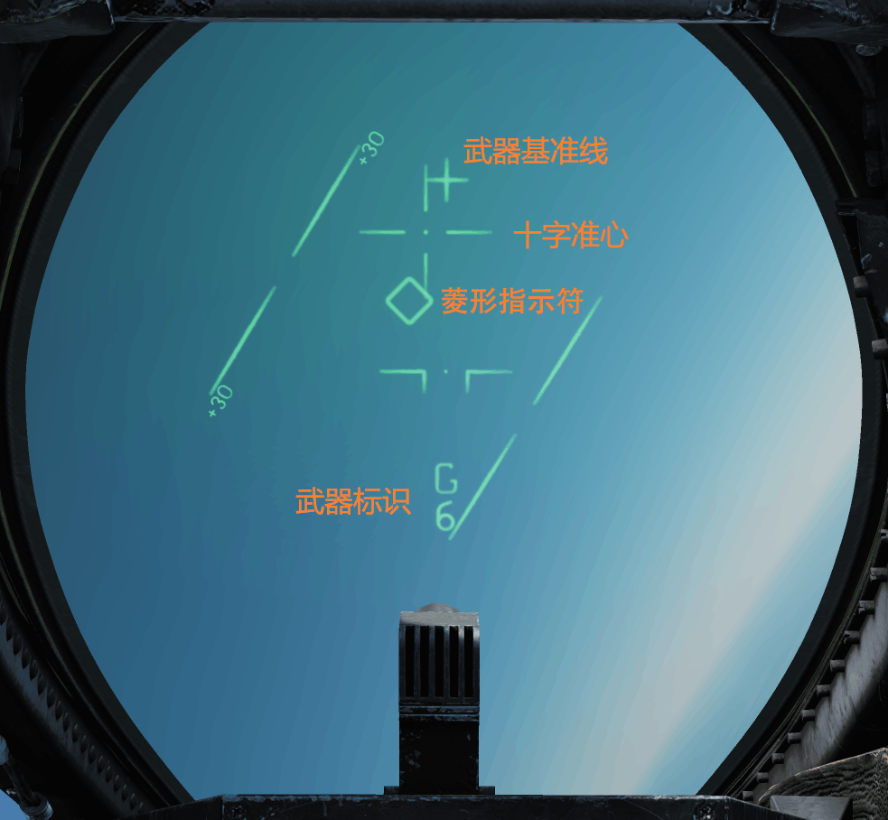
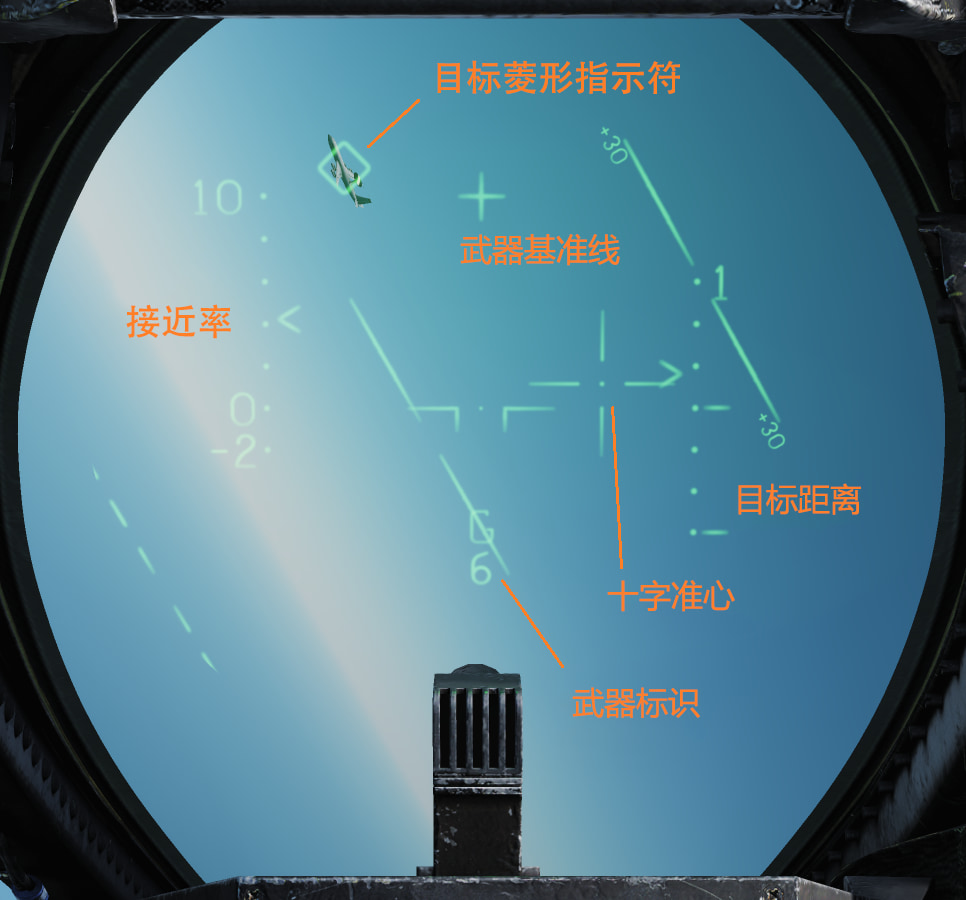
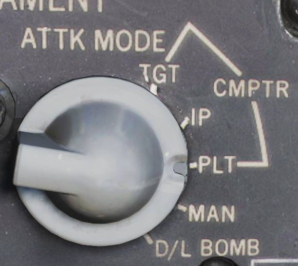
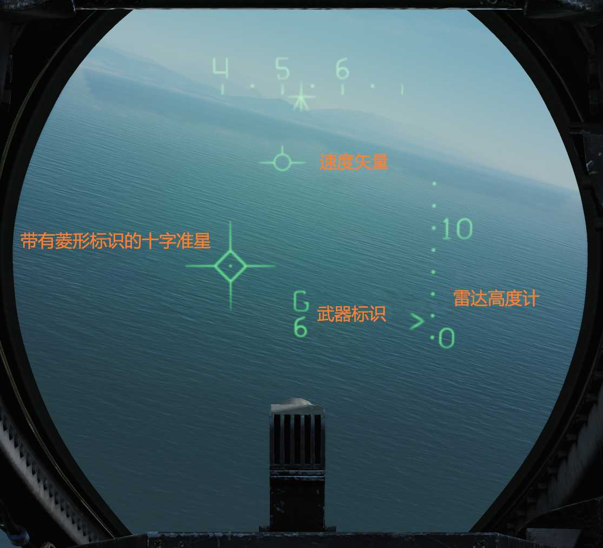
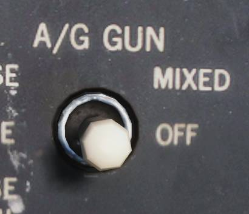

# M-61“火神”六管加特林航炮

 _由美国海军摄影师 Kristopher
Wilson 拍摄（041129-N-5345W-034）_

M-61 “火神” 是一种六管液压驱动的 20 毫米航炮，能以每分钟 6000 发的速度射击。

M-61 安装在 F-14 驾驶舱下方的机身内，炮口位于机身的左下侧。航炮的弹鼓内备有 676 发 20 毫米炮弹，并且航炮会保留射击后留下的药筒。

航炮安装的角度比武器基准线（ADL）略高3度，F-14 在格斗中进行提前射击时便能体现这样安装航炮的先天优势。

航炮击发无需经过 WCS，当武器选择开关选择 GUN 档位时，且主军械开关拨到 ON 档位，飞行员就可以通过按下驾驶杆中的扳机来发射机炮。但 WCS 可以在 HUD 上显示航炮攻击标识以提高射击精度。航炮在空对空和空对地模式下，每一种模式有两种可用的准星。空对空模式下使用的是手动空对空准星和实时航炮准星（RTGS）。

选择航炮作为武器时，HUD 底部会显示一个大写的 “G” 标识，这个标识下方显示了以百发为单位的剩余炮弹数量。

除了 HUD 上的标识外，飞行员右垂直控制台上的航炮弹药计数器也显示了剩余弹药数量。指示器从 650 开始倒数，但可以通过旋转指示器下方的旋钮来重新调整至所需的炮弹剩余数量。

航炮的两种模式对应的射击速率分别是每分钟 4000 发和每分钟 6000 发。低射速模式通常用于对地攻击，高射速模式用于对空攻击。可以通过 ACM 面板上的 GUN
RATE（航炮射速）开关切换，面板上也会显示当前选定的模式。选择 ACM 模式将会自动选择航炮高射速模式。每次按下扳机的最大连射开火数值可以设置为50、100、200或无限制。默认值为200发，玩家可以通过地勤来变更为其它设置。

> 💡 DCS 中通过膝板来设置。

## 手动空对空准星

在手动模式下，HUD 上显示了 ADL、武器标识以及手动准星。在空对空模式下选择航炮后，按下左油门握把上的 CAGE/SEAM 按钮来进入此模式。在手动模式下飞行员使用手动准星作为参考，操纵飞机来击中目标。实际目标距离和抬高/下压量需要飞行员自己估算。

飞行员可以调整手动准星的位置来选择所需的抬高/下压量角度。通过飞行员右垂直控制台上的准星偏移量设置面板来调定所需抬高/下压量，一般会将这个值设置为53毫弧度，以保持手动准星与航炮瞄准线位置对齐。

## 实时航炮准星（RTGS）

实时航炮准星模式是航炮在空对空模式下的标准射击模式。

在 RTGS 模式中，如果 WCS 无可用目标数据，WCS 会计算炮弹飞行轨迹，并显示炮弹在飞行1000英尺和2000英尺后将会通过的位置。十字准星指示1000英尺处炮弹通过的位置，而菱形标识则指示2000英尺处炮弹通过的位置。

如果 WCS 可以（使用 STT 模式跟踪目标）获取目标数据，当目标距离在 4000 英尺内时，十字准星将变为显示目标距离上航炮炮弹通过的位置。菱形标识则显示雷达的视线（也就是目标的位置）。这意味着飞行员需要控制飞机将十字准星对准目标来击落它。

除了根据目标位置计算航炮射击诸元外，RTGS 准星还将计算并显示目标距离上航炮炮弹通过的位置与目标实际位置之间的偏差
（注：目标与本机的当前距离称为“目标距离”，航炮炮弹的飞行距离与目标距离相同时，炮弹所处的位置叫做 BATR，即目标距离上航炮炮弹通过的位置）。
当 WCS 计算出炮弹飞行至目标所处的位置时，原本用作指示目标位置的菱形标识会切换为指示目标距离上航炮炮弹通过的位置（BATR），同时，菱形指示框会闪烁。

利用这个标识便可以判断出，要击中目标，炮弹需要通过的位置。如果航炮成功命中目标，菱形标识应正好位于目标上方并闪烁，表示炮弹穿过了目标位置。

## 手动空对地准星

手动空对地准星的工作方式与手动空对空准星相同，只不过它是由 RIO 使用左侧垂直控制台上的武器控制面板 ATTK
MODE 旋钮开关设置的。选择空对地模式时，通过 ATTK
MODE 拨扭选择 MAN 档位， HUD 中会显示与空对空航炮准星相同的标识，唯一的区别是，HUD 右侧增加了当前雷达高度指示。航炮准星的偏移量需要考虑到空速、目标距离和俯冲角度，使用手动空对地模式进行攻击时，应根据这些数值，参考预制的航炮攻击参数进行对照设置。

## 计算机/引导模式

使用计算机/引导模式时，WCS 会连续计算航炮及其他空对地武器命中点。与手动空对地准星一样，计算机/引导模式是由 RIO 选择 ATTK
MODE 旋钮开关上的 CMPTR-PLT 档位来启用的。

在此模式下，AN/AWG-9 雷达会隶属到武器命中点并对准武器命中点来进行精确测距并在 HUD 上显示命中点位置。

HUD 上的十字准星指示武器实时命中点，菱形标识则代表超出武器射程。菱形消失表示十字准星指向的目标正处于航炮射程内。HUD 上的拉起提示符将根据飞机的高度垂直移动，当拉起提示符高于/处在武器命中点 (十字准星）的位置时，则表示高度过低，飞行员需要立刻拉起避免撞击地面以及目标过近无法保证安全的进行攻击。

HUD 右侧显示了气压高度标度。

## 航炮混合模式

在选择了其他空对地武器的情况下，将武器控制面板（在 RIO 左侧垂直控制台上）的 A/G GUN 开关拨至 MIXED 档位，便可以同时使用航炮和其他武器。
在设置为 MIXED 档位后，按下扳机可发射航炮，但是 HUD 中将不会显示航炮瞄准标识，因为 HUD 标识正被用于显示当前选中武器的投放数据。
使用航炮混合模式时，HUD 中的 ADL 是航炮唯一的参考标识，飞行员需要自行估算炮弹命中点。
