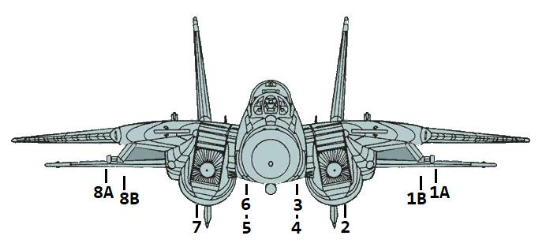

# 武器 & 挂载

F-14 的作战效能不仅源于其先进的航电系统和机体设计，更得益于其强大的武器与挂载配置。

F-14 主要使用以下四种类型武器： [空对空](./air_to_air/overview.md) 武器包括各型
[AIM-9](./air_to_air/aim_9.md) 红外制导导弹，各型 [AIM-7](./air_to_air/aim_7.md)
半主动雷达制导导弹，使用主动雷达制导的 [AIM-54](./air_to_air/aim_54.md) 的各种改型以及一门
[M61A1 火神航炮](./guns.md#internal-cannon-m61a1-vulcan) 用来攻击空中以及地面目标。

飞机可挂载各型 [航弹](./air_to_ground/mk80_series.md)、[航箭](./air_to_ground/rockeye.md)
和 [制导武器](./air_to_ground/paveways.md) 来攻击并摧毁地面目标。

除开致命武器外，F-14 还可以携带 [副油箱](./tanks.md) 来增加航程，携带专用挂载如
[LANTIRN 吊舱](./pods.md#lantirn) 和 [战术空中侦察吊舱系统 (TARPS)](./pods.md#tarps)。

## 挂载

下图为所有可挂载在挂点上的挂载一览。

> 💡 实际上，因为存在诸多技术因素限制，并非所有组合都可行。

| 挂载 / 挂点        | 1A  | 1B  | 2   | 3   | 4   | 5   | 6   | 7   | 8B  | 8A  | 总共   |
| ------------------ | --- | --- | --- | --- | --- | --- | --- | --- | --- | --- | ------ |
| AIM-9              | 1   | 1   |     |     |     |     |     |     | 1   | 1   | 4      |
| AIM-7              |     | 1   |     | 1   | 1   | 1   | 1   |     | 1   |     | 6      |
| AIM-54             |     | 1   |     | 1   | 1   | 1   | 1   |     | 1   |     | 6      |
| Mk-81              | 2   | 4   |     | 3   | 3   |     | 4   | 2   |     |     | 18     |
| Mk-82              | 2   | 4   |     | 3   | 3   |     | 4   | 2   |     |     | 18     |
| Mk-82AIR           | 2   | 4   |     | 3   | 3   |     | 4   | 2   |     |     | 18     |
| Mk-82 蛇眼         | 2   | 4   |     | 3   | 3   |     | 4   | 2   |     |     | 18     |
| Mk-83              | 1   | 3   |     | 1   | 1   |     | 3   | 1   |     |     | 10     |
| Mk-84              |     | 1   |     | 1   |     |     | 1   |     | 1   |     | 4      |
| Mk-20              | 2   | 2   |     | 1   | 1   |     | 2   | 2   |     |     | 10     |
| GBU-10             |     |     |     | 1   |     |     | 1   |     |     |     | 2      |
| GBU-12             | 1   |     |     | 1   |     |     | 1   |     |     | 1   | 4      |
| GBU-16             |     |     |     | 1   |     |     | 1   |     |     | 1   | 4      |
| GBU-24             |     |     |     | 1   |     |     |     |     |     | 1   | 2      |
| BDU-33             |     | 3   |     | 3   | 3   | 3   | 3   |     | 3   |     | 18     |
| LAU-10 (阻尼)      |     | 2   |     | 2   | 1   |     | 2   |     | 2   |     | 7 (28) |
| ADM-141A TALD      |     |     |     | 1   | 1   | 1   | 1   |     |     | 1   | 4      |
| SUU-25 F/A 照明弹  |     |     |     |     | 2   | 2   |     |     |     |     | 4 (16) |
| LAU-138 箔条适配器 | 1   |     |     |     |     |     |     |     |     | 1   | 2      |
| 拉烟吊舱           | 1   |     |     |     |     |     |     |     |     | 1   | 4      |
| TACTS              | 1   |     |     |     |     |     |     |     |     | 1   | 2      |
| LANTIRN            |     |     |     |     |     |     |     |     |     | 1   | 1      |
| FPU-1 副油箱       |     |     | 1   |     |     |     |     | 1   |     |     | 2      |
| CNU-188 行李吊舱   |     |     |     | 1   |     |     | 1   |     |     |     | 2      |
