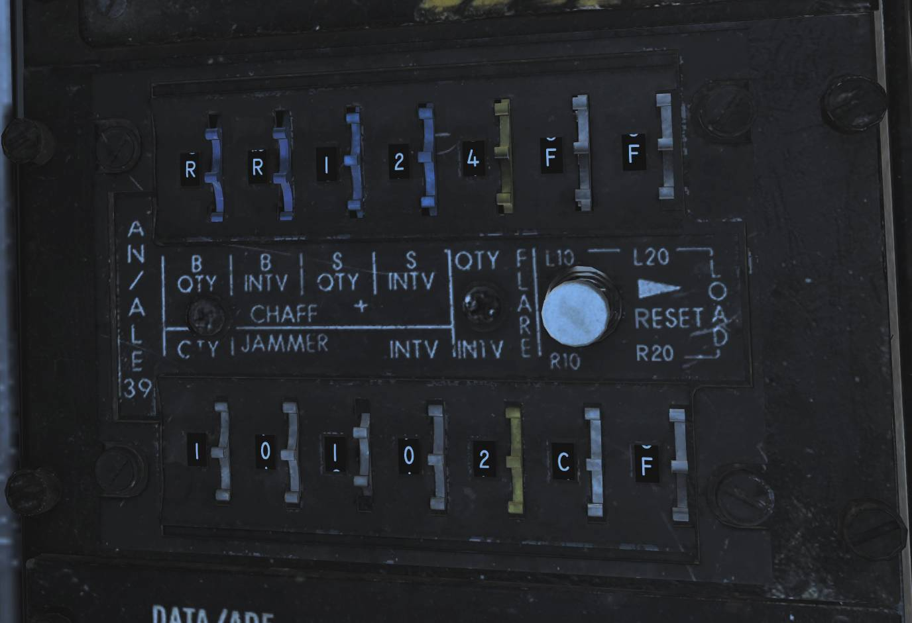

# AN/ALE-39 Countermeasures Dispensing Set

The AN/ALE-39 is the countermeasures dispensing set installed in the F-14 in
this simulation. It controls its own set of launchers located between the engine
nozzles on the underside of the so called beaver-tail.

The launchers each have two sections, one containing 10 cartridges and the
other 20. They are referred to the left and right dispensers even though the
left is really the front one and the right the back one with both being mounted
in line on the left side of the tail-hook. This is a remnant from the earliest
model F-14s carrying the AN/ALE-29.

This all sums up to a capacity of 60 cartridges in the system with each section
necessarily holding one type of cartridge meaning that any combination of
cartridges is possible as long as each type’s quantity is a multiple of 10. The
system itself has no real knowledge of what is loaded where so incorrectly
programming the system can lead to the wrong type of cartridge being ejected.

The system itself can be operated manually from the control panel in the RIO pit
or the DLC thumbwheel on the pilot stick when the flaps lever is in the up
position. It is also capable of running programmed sequences of ejection which
in turn can be initiated manually by the RIO from the control panel or the
direction hats mounted on the hand hold over the DDD. In addition the AN/ALR-67
can also initiate the chaff ejection program if set up correctly on the
AN/ALE-39 control panel.

## Controls and Operation

> 💡 In DCS the F-14 countermeasure loadout is set in the Mission Editor, see
> DCS Mission Editor Functions Specific to the HB DCS F-14 or controlled through
> the radio menu under ground crew. The default setting in the mission editor is
> bypassed. To see the real loadout check the kneeboard.

### Programmer

The programmer is used to set up what countermeasure cartridges are loaded where
and to set up the different ejection programmes. The panel is located on the
right horizontal console of the RIO cockpit.

The left side of the programmer holds the controls (thumbwheels) for the
different ejection programmes, one section for each type of cartridge.

The **CHAFF** section controls how to eject chaff in program mode. The chaff
sequences are programmed to launch a number of salvoes, each consisting of a
burst of a set amount of cartridges.

- **B QTY** controls how many cartridges to eject in each burst, selection of
  1-4 cartridges and C for continuous and R for random (4-6 cartridges)
  possible.
- **B INTV** sets the time in seconds between each individual cartridge ejection
  in each burst, possible settings being .1 (0.125), .2 (0.25), .5 (0.5), .7
  (0.75), 1 and R for random.
- **S QTY** controls how many salvoes of bursts to eject in each program,
  settings available are 1, 2, 4, 6, 8, 10 and 15.
- **S INT** sets the time in seconds between each salvo in the program,
  available settings are 2, 4, 6, 8 and 10.

When using the random and continuous settings for B special conditions apply.

- **B at C QTY** and **R INTV** sets the first 3 cartridges to launch at 0.125
  second intervals, the rest at random intervals from 0.25 to 4 seconds.
  Ejection disregards the S settings and continue until all cartridges are
  ejected.
- **B at R QTY** and **R INTV** sets each burst to have between 4-6 cartridges
  and to eject at random intervals between 0.25 to 4 seconds. The first burst in
  a salvo will always launch the first 3 cartridges at 0.125 second intervals.
- **B at R QTY** and **INTV** at set number sets each burst to launch between
  4-6 cartridges at set interval. First burst will always launch first 3
  cartridges at 0.125 sec interval.
- **B at fixed QTY** and **R INTV** sets each burst to eject one cartridge
  disregarding B QTY.

The **JAMMER** section controls the ejection of jammer cartridges in programmed
mode.

- **QTY** sets how many jammer cartridges to eject, possible settings are 1-4.
- **INTV** uses all three indicated thumbwheels to set time in seconds between
  each ejection in the program. Settings from 1 to 299 possible in 1 second
  increments.

> 💡 Jammer cartridges not currently implemented in DCS.

The **FLARE** section controls ejection of flares when using programmed mode.

- **QTY** sets amount of flare cartridges to eject, possible settings being 2,
  3, 4, 6, 8 and 10.
- **INTV** sets time interval between each ejection in seconds, possible
  settings being 2, 4, 6, 8 and 10.

The right side of the programmer sets the type of cartridge loaded into each
section and the reset switch used after loading new cartridges.

The **L10**, **L20**, **R10** and **R20** thumbwheels can be set to C, J or F
setting what cartridge is loaded into which section.

> 💡 Incorrectly setting type of cartridge loaded can result in the launch of
> the wrong type of cartridge.

The **RESET** switch needs to be used to reset the system's internal counters
after loading new cartridges into the launchers. Needs to be held to reset for
at least 5 seconds to reset the system.

### Control Panel

The control panel is used to control system power, to set up automatic ejections
and to manually eject cartridges and is also located on the RIO right horizontal
console.

The mechanical counters on the upper part of the panel are used to indicate
remaining cartridges of each type. They need to be set up manually using the
knob below each counter but decreases automatically as each cartridge ejection
pulse is sent. As they’re set manually it’s possible to end up in a situation
were the counter is at 0 but additional cartridges are still available. In this
cases ejection pulses will still be sent but the counter will remain at 0.

Below each counter each cartridge type has a switch for manual ejection
commands. The switches are momentary and spring-loaded to center, each having
three positions. **PRGM** initiates respective set ejection program, **SGL**
commands ejection of a single cartridge of respective type and **STBY** is the
default center position not commanding manual ejection.

The **PWR/MODE** switch enables power to the AN/ALE-39 and can enable automatic
chaff launch via the AN/ALR-67 RWR. **AUTO (CHAFF) / MAN** enables power to the
system and allows the AN/ALR-67 to initiate the set chaff ejection program but
flares remain in manual. Chaff ejection is initiated when the RWR detects a
threat actively engaging own aircraft, after each program initiation a 30 second
cool-down is present before next program is initiated if such a detection is
still present. Manual ejection is still available as normal. **MAN** enables
power to the system and allows for manual initiation of all functions. **OFF**
disables the system.

The **FLARE MODE** switch controls how flares are ejected and also sets up how
the pilot stick **DLC button is used**. The flaps lever needs to be in the up
position to enable DLC button cartridge ejection. The switch has three
positions. **MULT**, multiple, sets the system to eject one cartridge from each
section set to flares on the programmer for each ejection pulse.

> 💡 That this means that if flares are loaded on all four sections this results
> in 4 flares being launched each time a flare ejection command is sent.

**NORM** sets normal flare ejection pulse behavior. **PILOT** enables ejection
of one flare cartridge with each depression of the DLC button. Normal flare
ejection still possible. If the switch is set a position **other than PILOT**
the DLC button will command ejection of a single chaff cartridge.

Finally the _SALVO FLARES_ switch initiates rapid ejection of all flares using a
0.125 second time interval. Normally spring-loaded to the _OFF_ position. Can’t
be stopped once initiated.

> 🔴 WARNING: All countermeasure cartridge ejection is inhibited while the
> weight on wheels sensor is active, preventing countermeasure ejection while on
> the ground.

### RIO Hand Hold Switches

Two four-way direction hats are mounted on the RIO hand hold above the DDD to
enable quick access to countermeasure ejection. The two switches are mirrored
and **UP** commands ejection of a single chaff cartridge. **DOWN** initiates the
chaff ejection program, **INBOARD** (towards center) initiates the jammer
ejection program and **OUTBOARD** (towards the sides) initiates the flare
ejection program.
