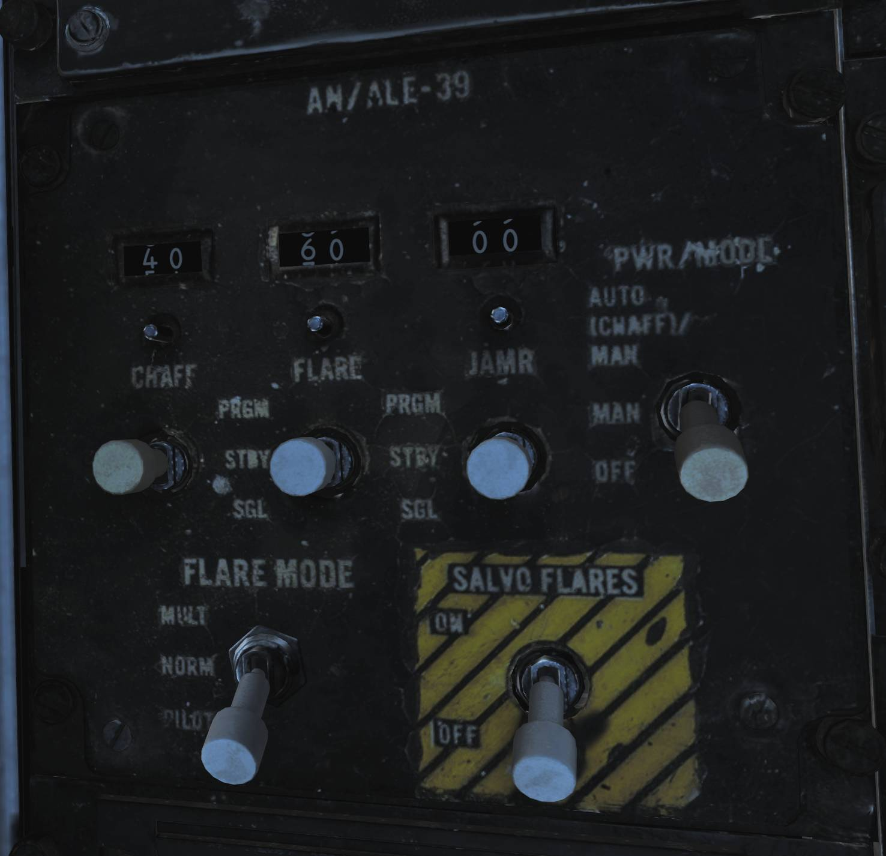

# AN/ALE-39 对抗弹射套件

DCS 中模拟的 F-14 搭载的是 AN/ALE-39 对抗弹射套件。AN/ALE-39 控制着位于发动机喷口之间“河狸尾巴”下方的发射器的套件。

每个发射器包含两个部分，一个部分中含有10发干扰弹，另外一个部分则为20发。
发射器被称为左发射器和右发射器，即使实际上是前后发射器，两个发射器并列安装在拦阻钩的左侧。这实际上是沿用了 F-14 早期型号中 AN/ALE-29 的叫法。

系统中总共可装填60发干扰弹，每个部分必须装填同一种类型的抛放弹，也就是说只要每种类型的干扰弹只要是10的倍数，那么任何组合都是可能的。
系统本身不知道填装了哪种干扰弹，因此错误的编程可能使得系统弹射错误的干扰弹类型。

机组可通过 RIO 驾驶舱中的控制面板或当襟翼控制杆处于收上档位时通过飞行员驾驶杆中的 DLC 拨轮来手动操作系统。
系统也可以按照编程好的程序进行弹射，弹射程序可由 RIO 从控制面板或 DDD 上方握把中的苦力帽来启动。
另外，如果在 AN/ALE-39 控制面板正确地设置了箔条弹射程序，那么 AN/ALE-67 也可以启动箔条弹射程序。

## 控制开关/按钮和操作

> 💡 在 DCS 中，F-14 对抗措施填装是在任务编辑器中进行设置的，参阅 Heatblur DCS F-14 任务编辑器相关功能或通过无线电菜单中地勤页面下进行控制。
>    如果使用无线电菜单填装的话将会绕过任务编辑器中的默认设置。在膝板中查看实际的对抗措施填装。

### 编程面板

编程面板用来设置干扰弹的填装位置与类型，并且设置不同的干扰弹弹射程序。面板位于 RIO 驾驶舱中的右侧控制台上。

编程面板左侧有用于设置不同弹射程序的控制组件（拨轮），每种类型干扰弹都有一部分用于设置。

在投射程序中，**CHAFF** 部分用来控制如何弹射箔条。系统编程箔条程序以齐射的轮数进行弹射，每次齐射由设定的干扰弹连投数量组成。

- **B QTY** 控制每次连投时弹射干扰弹的数量，可以选择1-4发干扰弹或 C（连续）和 R（随机）。
- **B INTV** 设置连投中弹射干扰弹的间隔时间（精度为秒），可以设置为 .1 (0.125)、 .2 (0.25)、 .5 (0.5)、 .7 (0.75)、 1 和 R（随机）。
- **S QTY** 用来控制一次弹射程序中，连投的齐射轮数。可以设置为：1、2、4、6、8、10 和 15。
- **S INT** 用于设置一次弹射程序中，每轮齐射的时间间隔（精度为秒），可以设置为 2、4、 6,、8 和 10。

使用 R 和 C 设置时，可启用 B 特殊设置。

- **B 在 C QTY** 和 **R INTV** 时将设置前三发干扰弹以0.125秒间隔弹射，其余的干扰弹弹射间隔将为0.25至4秒内随机弹射。弹射将忽略 S 开头设置，并且继续弹射直到弹射完所有干扰弹。
- **B 在 R QTY** 和 **R INTV** 时将设置为每次连投中弹射4-6发干扰弹并以0.25至4秒随机间隔弹射。每轮齐射中的首次连投，始终以间隔0.125秒弹射3发干扰弹。
- **B 在 R QTY** 和 **INTV** 调至设定数值时将设置为每次连投将以设置的间隔弹射4-6发干扰弹。首次连投始终将首先以间隔0.125秒弹射3发干扰弹。
- **B 在固定 QTY** 和 **R INTV** 时将设置为每次连投中弹射一发干扰弹，无视 B QTY 设置。

**JAMMER** 部分用于控制在程序模式中有源干扰弹的弹射。

- **QTY** 用来设置有源干扰弹的弹射数量，可以设置为1-4。
- **INTV** 使用三个指示拨轮来设置程序中弹射的时间间隔（精度为秒）。可每秒逐步增加从1至 299。

> 💡 DCS 尚未实装有源干扰弹。

**FLARE** 部分用于控制在程序模式下红外干扰弹的弹射。

- **QTY** 将设置红外干扰弹弹射的数量，可以设置为2、3、4、6、8和10。
- **INTV** 将设置弹射的时间间隔（精度为秒），可以设置为2、4、6、8和10。

RIO 可在编程面板的右侧设置装载到各部分的干扰弹类型，以及在装载了新干扰弹后需要使用的复位开关也位于面板右侧。

**L10**、**L20**、**R10** 和 **R20** 拨轮可以设置为 C（箔条）、J（有源干扰弹）或者 F（红外干扰弹），来设置发射器中对应部分填装的干扰弹类型。

> 💡 错误地设置填装的干扰弹类型可能导致弹射错误的干扰弹。

在填装了新的干扰弹至发射器后，需要使用 **RESET** 开关来复位系统内部计数器。开关需要保持至少5秒来复位系统。

### 控制面板

控制面板用于控制系统电源、设置自动弹射以及手动弹射干扰弹，并且控制面板同样位于 RIO 右侧控制台上。

面板上部的机械计数器用于指示各种类型干扰弹的剩余数量。计数器需要使用每个计数器下方的旋钮手动设置，但是在每次发射干扰弹弹射脉冲过后计数将会自动减少。
由于计数器是手动来设置的，因此可能会碰到计数器指示的数量为0但实际还有干扰弹的情况。在这种情况下系统仍然会发送弹射脉冲但是计数器不会继续减少。

在每种类型干扰弹的计数器下方都包含有开关，这些开关用于手动执行弹射指令。弹射指令开关为自复位以及弹簧归中，每个开关都有三个档位。
**PRGM** 启动对应的弹射程序，**SGL** 用于单发弹射对应类型的干扰弹以及 **STBY** 默认归中档位（无手动弹射指令）。

**PWR/MODE** 开关用于为 AN/ALE-39 通电，以及通过 AN/ALR-67 RWR 启动自动弹射。
**AUTO (CHAFF) / MAN** 档位用于接通系统电源，并且允许 AN/ALR-67 来启动设定的箔条弹射程序，但要注意的是，红外干扰弹弹射仍然为手动。
当 RWR 探测到一个威胁主动攻击本机时将会启动箔条弹射，探测的威胁仍然存在的话，在启动下一个程序前存在30秒冷却时间。
手动弹射仍然可正常使用。**MAN** 档位用于接通系统电源，并且允许手动启动所有功能。**OFF** 档位用于关闭系统。

**FLARE MODE** 开关用于控制红外干扰弹如何弹射并且同时设置了飞行员驾驶杆中 **DLC 按钮的用途** 。
襟翼控制杆需要处于收上档位来启用 DLC 按钮干扰弹弹射。FLARE MODE 开关有三个档位。**MULT** ——齐射模式，每个弹射脉冲将从编程面板中设置为 F 的部分弹射一发红外干扰弹。

> 💡 这表示如果四个部分的填装都为红外干扰弹将导致每发送一次红外干扰弹弹射脉冲将有四发红外干扰弹被弹射。

**NORM** 将设置正常红外干扰弹弹射脉冲行为。**PILOT** 启用每按下一次 DLC 按钮弹射一发红外干扰弹。
正常弹射红外干扰弹仍然可用。如果开关设置在 **PILOT 以外** 的档位，那么 DLC 按钮将会指令弹射一发箔条干扰弹。

最后是 _SALVO FLARES_ 开关，用于启动以0.125秒间隔快速弹射所有红外干扰弹。正常档位为弹簧归中至 _OFF_ 档位。一旦启动就无法停止。

> 🔴 警告：当机轮负重时，所有对抗干扰弹弹射都被禁止，从而防止在地面上弹射干扰弹。

### 握把控制开关

两个四向苦力帽安装在 DDD 上方的 RIO 握把上，这两个苦力帽可以让 RIO 快速使用对抗措施弹射。
两个苦力帽的功能是相同的的，**UP**（向上）用于弹射一发箔条，**DOWN**（向下）用于启用箔条弹射程序，
**INBOARD**（向内）用于启用有源干扰弹的弹射程序，**OUTBOARD**（向外）用于启用红外干扰弹的弹射程序。
