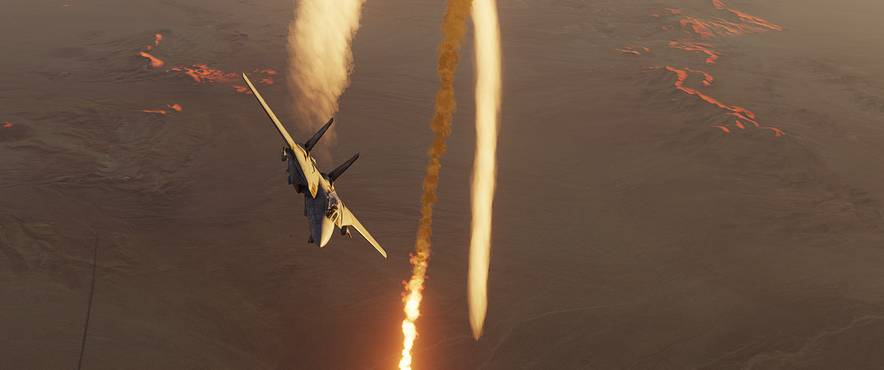

# Countermeasures

In order to defend against incoming missile threats the Tomcat can be equipped
with either the [ALE-39](ale_39.md) or [LAU-138](lau_138.md) countermeasure
dispensing system launching chaff and flares.

