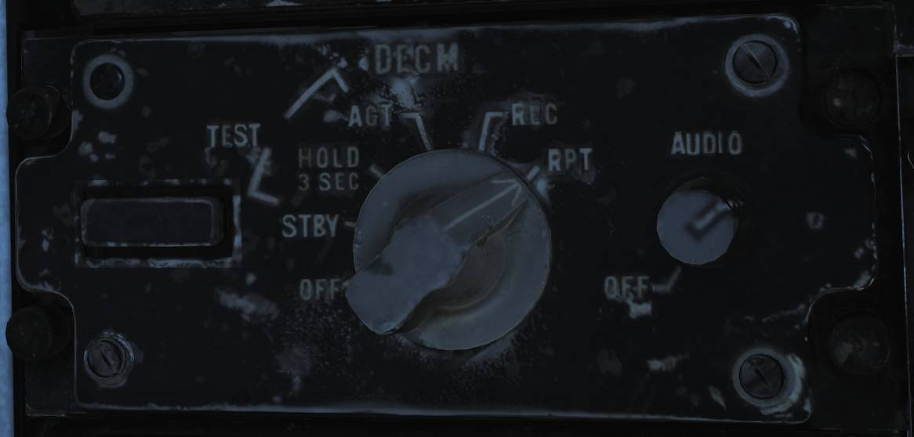

# Electronic Countermeasures - AN/ALQ-100 & 126 DECM (Defensive Electronic CounterMeasures)

The AN/ALQ-100 and 126 jammers are designed to detect radar threats, analyze
them, select the optimum countermeasure technique available and apply it.
Available techniques for jamming are amongst others, mainlobe blanking, inverse
con-scan, range-gate pull-off and swept square modes.

In real life these two systems differ greatly with the AN/ALR-126 being by far
the most effective system. In DCS both are modelled as a simple noise jammers
due to engine limitations but controlled by the DECM logic as to when it’s on or
off and thus work the same.

## DECM Controls and Indicators

The controls for the DECM are all located on the right horizontal panel in the
RIO pit, panel as image above. In addition there are two indication lights
co-located with the RWR threat indicators on the right side of the TID.

The two indication lights on the threat advisory are RCV (recieve) and XMIT
(transmit). RCV illuminates up when the system detects and analyzes a threat
while the XMIT illuminates up when it's actively jamming a threat.

The control panel itself contains a STANDBY indicator light, a mode selector
knob and an AUDIO volume knob.

The STANDBY light indicates that system warmup is not yet completed and when
completed turns off. At other times, illumination of this indicator indicates
the presence of a fault in the system.

The AUDIO (volume) knob controls the audio volume of the RIO sound from the
system. The pilot has no access to this audio unless he put his amplifier
selector to **EMER** (to use RIO amplifier). The audio itself is generated based
on radar signal characteristics (mainly PRF).

The mode selector knob controls power and operational mode that the system is
in.

- **OFF** turns off power to the system. **STBY** begins pre-warming of the
  system, taking in all around 5 minutes.
- **TEST - HOLD 3 SEC** is used to prepare the system for BIT, after 3 seconds
  in this mode, turn the knob to TEST - ACT.
- **TEST - ACT** starts the BIT in the system. The BIT takes approximately 30
  seconds and the RCV light will be illuminated the whole time while the XMIT
  light will flash twice. If the STANDBY light illuminates it indicates that a
  no-go condition exists in the system.
- **REC** enables the system in recieve only mode, enabling analysis of threats
  and also the threat audio.
- **RPT** enables full system functionality, in addition to REC it also now
  tries to jam threats according to selected method.

> 💡 In DCS jamming is always done with noise jamming, turning on as a threat is
> detected.
