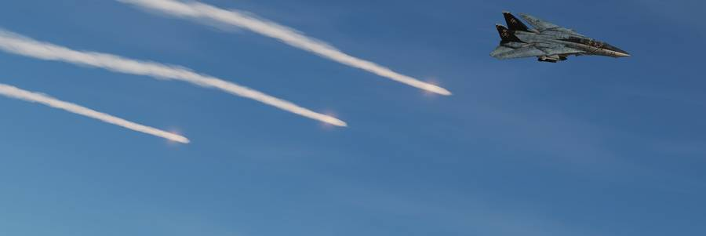

# Defensive Systems

The Tomcat can equip either the [ALE-39](countermeasures/ale_39.md) or the
[LAU-138](countermeasures/lau_138.md) in order to defend itself against threats
by dispensing chaff or flares.

Also installed on the aircraft is either the [ALR-67](rwr/alr_67.md) or
[ALR-45/50](rwr/alr_45-50.md) Radar Warning Receiver to increase passive
situational awareness by detecting airborne and surface-to-air radar threats.

For extended protection and radar jamming it can also carry the
[ECM Pods](ecm.md).

