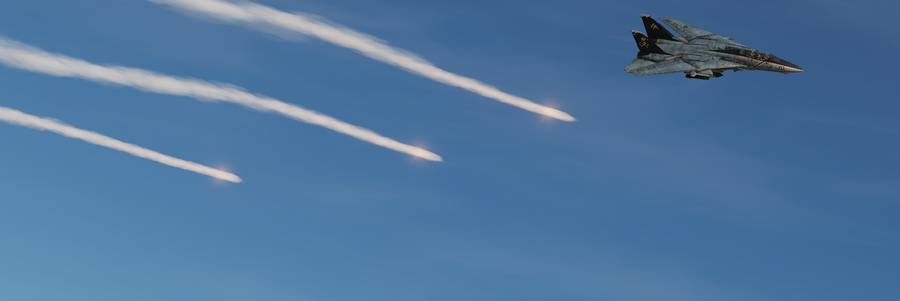

# 防御系统

“雄猫” 可装备 [ALE-39](countermeasures/ale_39.md) 或
[LAU-138](countermeasures/lau_138.md)，通过释放箔条或红外干扰弹来进行防御。

飞机还安装了 [ALR-67](rwr/alr_67.md) 或
[ALR-45/50](rwr/alr_45-50.md) 雷达警告接收机，通过探测空中和地空雷达威胁，
增强被动态势感知能力。

为了增强防护能力和雷达干扰，该机还可挂载
[ECM Pods](ecm.md).

