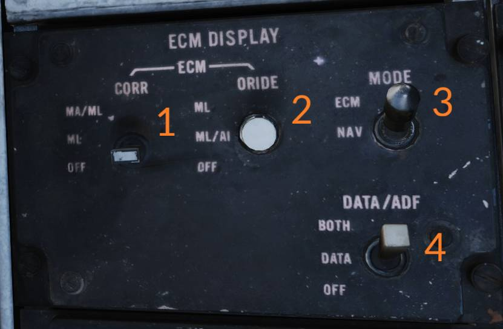
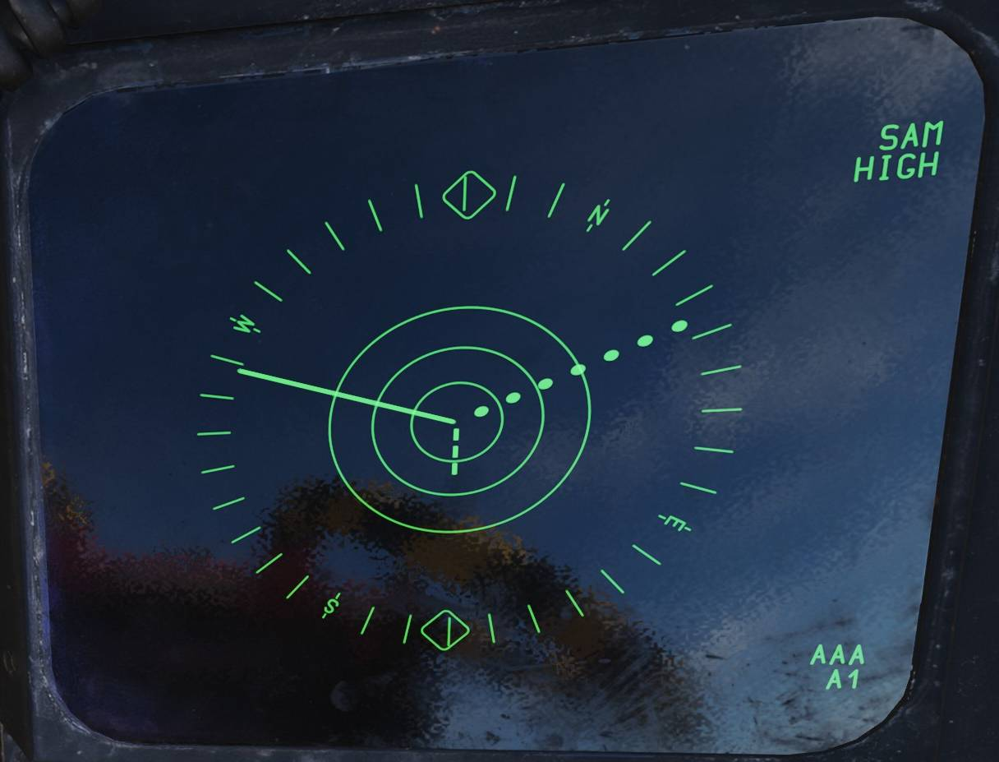
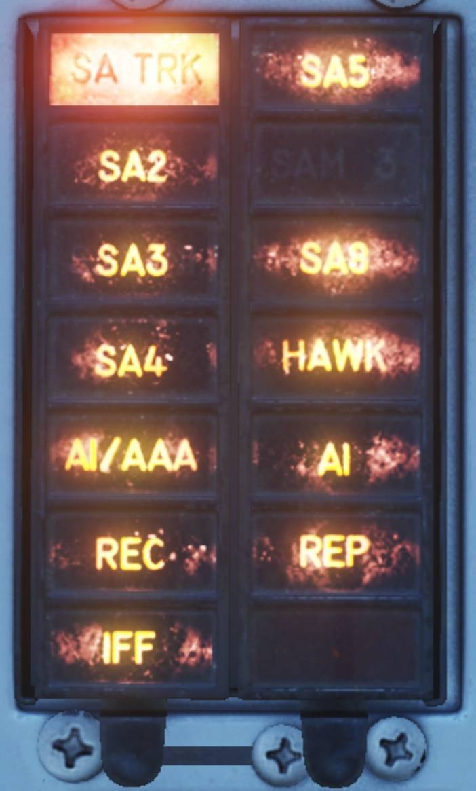

# ALR-45/50 (F-14A 早期)

AN/ALR-45 与 AN/ALR-50 组合于70年代初问世，来应对当时日益致命的地空导弹与高射炮系统。其功能在于向机组人员提供威胁信息，通过接收威胁信号并判断其对飞机的威胁程度来协助进行防御。
与 ALR-67 类似，系统需要和 DECM 干扰机（ALQ-100）协同工作。

AN/ALR-45 的四象限接收天线分别在在发动机进气道前缘及平尾后缘外侧，实现360度全方位覆盖探测。系统不仅提供全面的 ECM 态势感知，还能指示锁定并攻击飞机的辐射源。

AN/ALR-50 是专用导弹警告系统，在上部下部各布置了一根天线分别位于，驾驶舱后方以及前轮轮舱盖上。系统的功能是探测并提供可能的导弹发射告警。
针对某些使用指令数据链路信号的雷达，系统可识别 **MA（导弹警告）** 与 **ML（导弹发射）** 两种状态。（当前在 DCS 中，MA 应解理解为锁定状态，ML 应解理解为发射状态）

两套系统需组合使用，并且可触发 AN/ALE-39 对抗措施程序投放，并触发 DECM 进入发射状态。

当飞行员 HSD 和 RIO ECMD 设置为 ECM 档位时，系统会在上述显示器呈现威胁信息。通过显示控制开关/按钮设置，系统在探测到威胁时可强制超控当前显示内容。

## 控制开关/按钮

AN/ALR-45 与 AN/ALR-50 的主 **ECM** 控制面板位于 RIO 右侧控制台上。整套系统的电源开关位于该控制面板右侧，开关标有 **PWR - ALR-45/50** (<num>5</num>)。

位于顶部三个三档位开关 (<num>1</num>, <num>2</num> 和 <num>3</num>) 分别控制 AN/ALR-45 的三个工作波段，可单独显示该波段或将该波段从显示中移除。
向上档位——**BYPASS** 为自复位按钮，保持在档位时允许该波段内所有信号（无论参数如何）通过系统——正常情况下仅匹配威胁特征的信号会被放行显示。
将一个波段开关拨至 **BYPASS** 档位时会完全移除另外两个波段的显示，因此松开时开关会自动复位至 **NORM**，NORM 档位允许该波段正常工作。
向下档位——**DEFEAT** 为限位式，需向上提起开关方可拨至此档位。**DEFEAT** 档位会完全禁用所选波段。

中部音量旋钮——<num>4</num>——控制 RIO 头戴中 AN/ALR-45 与 AN/ALR-50 的音频音量。旋钮外圈控制 AN/ALR-45 提供的音频音量，可按需关闭。内圈控制 AN/ALR-50 提供的音频音频音量，但不可完全静音，因其负责 MA/ML 音调提示。

**AAA** 开关（<num>10</num>）用于启用或禁用高射炮威胁相关射线显示，但威胁缩写与指示灯功能仍正常工作。
**NORM** 档位允许正常工作并显示高射炮威胁，**DEFEAT** 档位禁用威胁射线显示。

**UNKNOWN** 开关（<num>6</num>）会禁用正常威胁显示，并将所有未识别为常规威胁的不明信号以实线显示，系统探测到不明信号时，UNK 缩写将持续显示。**DISPLAY** 为自复位档位，需持续按住来允许显示不明信号
**OFF** 档位让 AN/ALR-45 正常工作。

三个测试开关（<num>7</num>, <num>8</num> 和 <num>9</num>）均采用弹簧复位归中，用于开始指定波段或系统的 BIT。
**TEST - LOW/OFF/MID** 开关用于开始 AN/ALR-45 **低** 和 **中** 波段 BIT：拨至 **LOW** 档位时，各象限应出现点状线，并伴随音调提示及相关告警灯与 AAA 和 SAM LOW 缩写。
拨至 **MID** 档位时，各象限应出现点划线，并伴随音调提示及相关告警灯与 AAA/AI 和 SAM MID 缩写。**TEST - ML/OFF** 开关用于启用 AN/ALR-50 ML BIT
拨至 **ML** 时，应触发 SAM 灯闪烁、显示距离圈并伴随相关音调提示。
**TEST - HIGH/OFF** 开关用于启用 AN/ALR-45 **高** 波段 BIT：拨至 HIGH 时，四个象限应出现虚线，并伴随音调提示及相关告警灯与 AI 和 SAM HIGH 缩写。

**ECM DISPLAY** 控制面板同样位于 RIO 右侧控制台。面板同时控制 RIO 的 **ECMD** 显示及两个显示器通用的显示设置。

**ECM - CORR** 开关（<num>1</num>）用于设置两套系统的威胁关联模式。开关采用弹簧复位至 **ML** 设计。
**MA/ML** 为自复位档位，允许 RIO 将 AN/ALR-50 系统探测到 **MA** 或 **ML** 状态的威胁与 AN/ALR-45 威胁相关联；
**ML** 档位（正常开关档位）设定 ECM 仅当出现 **ML** 状态时才将一个 AN/ALR-50 威胁与 AN/ALR-45 威胁进行关联；
**OFF** 会短暂禁用关联功能，转而显示正常的非关联威胁。

**ECM - ORIDE** 开关（**2**）控制 ECM 何时超控 **ECMD** 的 NAV 显示。**ML** 档位允许出现 **ML** 状态时触发超控；
**ML/AI** 档位允许出现 ML 状态或探测到 AI（机载截击雷达，即战斗机雷达）时触发超控；
**OFF** 档位禁用超控功能。

**MODE** 开关（<num>3</num>）选择 **ECMD** 的显示内容
**ECM** 档位显示 ECM，**NAV** 显示导航信息。

**DATA/ADF** 开关（<num>4</num>）控制 NAV 模式下显示的附加文本信息：**BOTH** 同时显示 ADF 与常规导航信息，**DATA** 仅显示常规导航信息
**OFF** 禁用所有附加文本。

控制飞行员驾驶舱显示 ECM 信息的开关位于  以及音量控制旋钮位于 。

## 显示

 

## 告警灯

| 飞行员                                                         | RIO                                                        |
| -------------------------------------------------------------- | ---------------------------------------------------------- |
|  |  |

两名机组人员的前方面板上均设有特定威胁专用的告警灯。飞行员告警灯位于 HUD 右侧，RIO 警告灯位于 TID 右侧。
RIO 告警灯面板还包含了 AN/ALQ-100 的指示灯以及 IFF 应答机的指示灯，这些指示灯在对应的部分有详细说明。

不同的指示灯亮起来指示存在特定类型的威胁。

## 威胁指示警告音

ALR-45/50 系统可生成 3 类警告音：

- ALR-45 威胁雷达注意 - 取决于雷达
- ALR-50 MA (导弹警告) 音 - 低频颤音
- ALR-50 ML (导弹发射) 音 - 高频颤音
