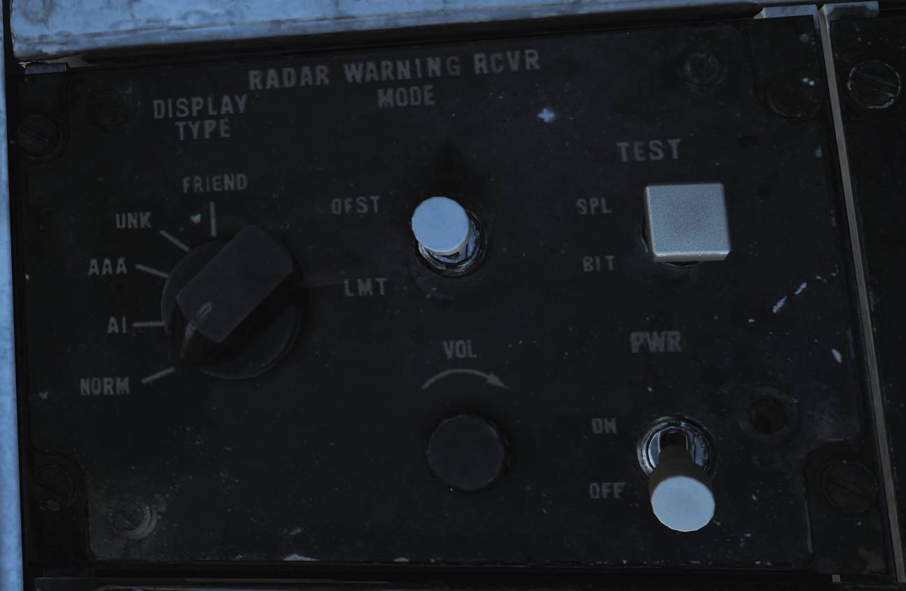
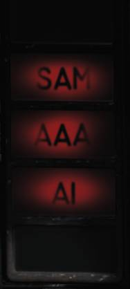

# AN/ALR-67 RWR

AN/ALR-67 雷达告警接收机（RWR）旨在在通常区域内通知和警告 F-14 机组雷达辐射源。它同样还设计用于通过指示雷达跟踪和雷达制导武器的攻击来帮助机组进行防御。

F-14 集成了 AN/ALR-67 以取代老旧的 AN/ALR-45 和 AN/ALR-50，其最初安装在 F-14B 中，在后期部分 F-14A 机队收到了改装。
在 PMDIG 升级到来前，AN/ALR-67 只能使用其独立的显示系统。
但是，RWR 连接了 AN/ALQ-126 从而允许 RWR 发送威胁辐射信息至干扰机并将干扰的目标显示在 ALR-67 的显示器中。
AN/ALR-67 还能够触发 AN/ALE-39 中预编程的对抗程序。

在后续包括 PTID 升级的 F-14B 中，AN/ALR-67 同样也被集成进 MDIG 显示系统中从而允许在 ECMD 中更详细地显示威胁。

F-14B 中的 AN/ALR-67 带有四根小型螺旋状高波段天线，四个宽带高波段分角接收机以及低波段阵列。
连接到这些天线的是一个窄带超外差接收机，接收机分析接收到的信号并且通过使用两个显示器将辐射和威胁向飞行员和 RIO 指示出来，每个驾驶舱中都包含有一个显示器并且向两名机组的 ICS 播放音频信号

## 控制开关/按钮

AN/ALR-67 RWR 由 RIO 右侧控制台上的控制面板进行控制。

PWR（电源）开关控制 RWR 的电源，并应设置为 ON 以为系统供电。

VOL（音量）控制旋钮可用于调整 RIO 的 RWR 音频信号音量。在飞行员的音量 / TACAN 指令面板中也有一个对应的旋钮可以调整飞行员的 RWR 音频信号音量。

TEST （测试）开关有两个可选择的模式，未拨动时开关由弹簧归中。
拨动开关至自复位 BIT 档位将开始 AN/ALR-67 机内自检，当 BIT 第一页显示时，只要将开关保持在 SPL（特殊）档位，RWR 将会显示特殊 BIT 状态页。

MODE（模式）开关也有两个可选择的模式，可通过将开关拨动至对应的档位进入，松开开关时由弹簧归中。
如果未激活任意一种模式，那么将启用正常运行模式，拨动开关至 OFST 将会启用偏置模式，拨动至 LMT 的话将启用限制模式。
偏置模式由显示器内状态环中的字母 O 指示，在这个模式下，重叠的威胁符号将会被分隔开来，以牺牲方位精度为代价来换取更加清楚的威胁显示。
限制模式由显示器内状态环中的字母 L 指示，在这个模式下，将会限制显示器仅显示最多六个最高优先级威胁的威胁符号。

DISPLAY TYPE 旋钮可设置在 RWR 上优先显示的威胁。

- **NORM** - 正常模式由状态环中的字母 N 指示，在这个模式下，威胁符号将会根据预载的威胁库内的符号显示出来。
- **AI** - 机载截击雷达由状态环中的字母 I 指示，机载截击雷达优先于其他所有威胁。
- **AAA** - 高射炮由状态环中的字母 A 指示，高射炮优先于其他所有威胁。
- **UNK** - 不明由状态环中的字母 U 指示，不明威胁优先于其他所有威胁。
- **FRIEND** - 友方由状态环中的字母 F 指示，允许威胁显示优先级同正常模式下一样，同时还将显示友方辐射源。

## 显示

RWR 显示器在前后驾驶舱所处的位置相同并且显示器使用三个区域（圆环）来划分显示出的威胁符号的威胁等级。

- **最外层——严重威胁区:** 显示的辐射源威胁符号表示对本机构成严重危险，这些威胁可能是锁定本机的跟踪雷达或是探测到主动攻击本机的雷达。
探测到的一个辐射源主动攻击本机的话，这个跟踪的威胁符号将会闪烁以提高辨识度。
- **中间层——致命威胁区:** 在这个区域显示的辐射源威胁符号表示系统认定本机处在辐射源的致命威胁区内，但没有跟踪或攻击本机。
- **内层:** 非致命威胁区显示的辐射源威胁符号表示辐射源没有攻击本机的能力或者辐射源可以攻击但 RWR 不认为本机处在辐射源的攻击内。
- **系统状态环:** 这个状态环指示系统的运行模式或显示故障。左上角象限显示设定的显示类型（N、I、A、U 或 F），
右上角象限在系统处于限制模式时将显示 L，下半部分可以显示表示系统处于偏置模式的 O，显示 B 表示 BIT 出现故障或显示 T 表示系统过载（过热）。
- **亮度控制旋钮:** 在显示器右下角的是亮度控制旋钮，用来控制旋钮所连接显示器的亮度。

> 💡 自从采用 AN/ALR-67 以来，三个威胁区的顺序至少变更了一次，虽然我们模拟的 AN/ALR-67 为早期型号，但我们选择了最新的顺序。

## 告警灯

| 飞行员                                                         | RIO                                                        |
| -------------------------------------------------------------- | ---------------------------------------------------------- |
|  |  |

两名机组人员各自的前仪表板中都装有专门用于指示特定威胁的告警灯。
飞行员的告警灯位于 HUD 右侧，RIO 的告警灯位于 TID 的右侧。
RIO 告警灯面板还包含了 AN/ALQ-126 的指示灯以及 IFF 应答机的指示灯，这些指示灯在对应的部分有详细说明。

不同的指示灯亮起来指示某些类型的威胁位于 RWR 的致命威胁区内，并且当探测到主动攻击时，威胁类型对应的指示灯将会开始闪烁。
指示灯的类别为 **SAM**（面对空导弹）、**AAA**（高射炮）、**AI**（机载截击雷达）以及仅在 RIO 驾驶舱中拥有的 **CW**（连续波）。

## 威胁提示警告音

AN/ALR-67 使用四种不同的音调提示来指示威胁和这些威胁的状态变化。

单个短音用来指示出现新的辐射源或威胁移动至其它的威胁区。

循环、缓慢的颤音，用于指示威胁出现在严重威胁区。

循环、急促的颤音，用于指示威胁主动攻击本机。

特殊的四音调提示音，音调会逐渐降低，用来指示威胁库中编程好的特殊事件。
在 Heatblur DCS F-14 中，这个提示音表示一个新威胁能够静默攻击本机，即，它可以攻击本机而不让其威胁符号显示在严重威胁区域中，因此不会出现其警告音。
之所以能够静默攻击是因为发射导弹的飞机可以在 TWS 模式中发射导弹或 SAM 系统发射的导弹可由雷达以外的其它方式来进行导弹制导，因此不会出现主动攻击的提示音。

## BIT

AN/ALR-67 BIT 将会在不同的屏幕测试之间来测试屏幕、符号和威胁提示音，以及显示系统版次和威胁库信息。

测试第一页显示了系统以及威胁库的版次，并且接下来的屏幕测试将显示器符号的生成。

威胁提示音还会在机内自检中进行测试，测试第一页将会测试状态变更音调，测试第二页则为特殊提示音，第三页为严重威胁区提示音，第四页为急促颤音（威胁主动攻击音调）。

在测试过程中，飞行员和 RIO 的威胁告警灯也将会亮起。

| 威胁符号       | 平台/传感器                                              | 特殊提示音 |
| -------------- | -------------------------------------------------------- | ---------- |
| **舰船**       |                                                          |            |
| AB             | 阿利·伯克级驱逐舰                                       |            |
| AK             | 库兹涅佐夫海军上将级载机巡洋舰                           |            |
| GR             | 格里莎级护卫舰 5 型（信天翁）                            |            |
| HP             | 奥利弗·哈泽德·佩里级护卫舰                             |            |
| J2             | Jiangkai II 级(054A 型护卫舰)                            |            |
| KK             | 克里瓦克级护卫舰 3 型 (雷兹基)                           |            |
| KV             | 基洛夫级 (彼得大帝号)                                    |            |
| L1             | Luyang I 级驱逐舰 (052B 型)                              |            |
| L2             | Luyang II 级驱逐舰 (052C 型)                             |            |
| LC             | 斗士 IIa 级快速导弹艇                                    |            |
| N              | 只携带导航雷达的船只(民用船只、潜艇等)                   |            |
| NE             | 不惧级护卫舰                                             |            |
| NZ             | 尼米兹级航空母舰                                         |            |
| SV             | 光荣级导弹巡洋舰(莫斯科号)                               |            |
| TC             | 提康德罗加级巡洋舰                                       |            |
| TT             | 毒蜘蛛 3 型 (闪电)                                       |            |
| TW             | 塔拉瓦级两栖攻击舰                                       |            |
| YU             | Yuzhao 级两栖船坞登陆舰 (型)                             |            |
| **航空器**     |                                                          |            |
| 14             | F-14A/B                                                  | 是         |
| 15             | F-15C/E                                                  | 是         |
| 16             | F-16C                                                    | 是         |
| 17             | JF-17                                                    | 是         |
| 18             | F/A-18C                                                  | 是         |
| 19             | MiG-19                                                   |            |
| 21             | MiG-21bis                                                |            |
| 23             | MiG-23MLD                                                |            |
| 24             | Su-24M/MR                                                |            |
| 25             | MiG-25PD                                                 |            |
| 29             | Su-27, Su-33, MiG-29A/G/S 和 J-11A                       | 是         |
| 30             | Su-30                                                    | 是         |
| 31             | MiG-31                                                   |            |
| 34             | Su-34                                                    | 是         |
| 37             | AJS-37                                                   |            |
| 39             | Su-25TM (Su-39)                                          | 是         |
| 50             | A-50                                                     |            |
| 52             | B-52                                                     |            |
| AN             | AN-26B 和 AN-30M                                         |            |
| AP             | AH-64D                                                   |            |
| B1             | B-1B                                                     |            |
| BE             | Tu-95 和 Tu-142M                                         |            |
| BF             | Tu-22M3                                                  |            |
| BJ             | Tu-160                                                   |            |
| E2             | E-2D                                                     |            |
| E3             | E-3C                                                     |            |
| F4             | F-4E                                                     |            |
| F5             | F-5E                                                     |            |
| HX             | Ka-27                                                    |            |
| IL             | IL-76MD 和 IL-78M                                        |            |
| KC             | KC-135                                                   |            |
| KJ             | KJ-2000                                                  |            |
| M2             | 幻影 2000-C 和 2000-5                                    | 是         |
| S3             | S-3B                                                     |            |
| SH             | SH-60B                                                   |            |
| TO             | 狂风                                                     |            |
| TR             | C-130 和 C-17A                                           |            |
| **防空**       |                                                          |            |
| 2              | SA-2 Guideline“扇歌”跟踪雷达 (S-75)                    |            |
| 3              | SA-3 Goa“偷袭”跟踪雷达 (S-125)                         |            |
| 5              | SA-5 Gammon “双正方形”跟踪雷达                         |            |
| 6              | SA-6 根弗 "同花顺" 跟踪雷达 (库班河)                     |            |
| 7              | HQ-7 跟踪雷达                                            |            |
| 8              | SA-8 “壁虎” 搜索跟踪雷达 (黄蜂)                        |            |
| 10             | SA-10 Grumble “活动板”跟踪雷达 (S-300PS 30N6)          |            |
| 11             | SA-11 Gadfly Fire Dome 跟踪雷达 (“山毛榉”)             |            |
| 15             | SA-15 Gauntlet Scrum Half 搜索跟踪雷达 (“道尔” 9A331)  |            |
| 19             | SA-19 Grison Hot Shot 搜索跟踪雷达 ("通古斯卡" 2C6M)     | 是         |
| A              | “猎豹”, M163 “火神” 和 ZSU-23-4 “石勒喀河”跟踪雷达 |            |
| BB             | SA-10 Grumble “大鸟” 搜索雷达 (S-300PS 64H6E)          |            |
| BF             | “轻剑” “盲射” 跟踪雷达                               |            |
| CS             | SA-10 Grumble “贝壳” 搜索雷达 (S-300PS 5N66M)          |            |
| DE             | “斯科尔巴” (“狗耳”) 搜索雷达                         |            |
| FF             | SA-2, SA-3 和 SA-5 “平面” 搜索雷达 (S-125 P-19)        |            |
| GR             | “罗兰德” MPDR-3002 S 搜索雷达                          |            |
| HA             | “霍克” AN/MPQ-50 和 AN/MPQ-55 搜索雷达                 |            |
| HK             | “霍克” AN/MPQ-46 跟踪雷达                              |            |
| HQ             | HQ-7 搜索雷达                                            |            |
| NS             | NASAMS AN/MPQ-64 “哨兵”搜索雷达                        | 是         |
| PT             | “爱国者” AN/MPQ-53 搜索雷达                            |            |
| RO             | “罗兰德” MPDR-16 搜索雷达和 Domino 30 跟踪雷达         |            |
| RP             | “轻剑” "短剑" 搜索雷达                                 |            |
| S              | 1L13 和 55G6 早期预警搜索雷达                            |            |
| SD             | SA-11 Gadfly “雪堆” 搜索雷达 (“山毛榉”)              |            |
| TS             | SA-5 Gammon “锡盾” 搜索雷达                            |            |
| **导弹**       |                                                          |            |
| M              | AIM-54, AIM-120, MICA-EM, R-37, R-77 和 SD-10            |            |
| **ATC (空管)** |                                                          |            |
| T              | 机场 ATC 雷达                                            |            |

> 💡 在任务中同一阵营的飞机会自动设置为友方以及使用 DISPLAY TYPE 选择器设置为 FRIEND 时显示。N 仅在选择 UNK 时显示，T 仅在选择 FRIEND 时显示。>
> 舰船符合通过用放大的 U 包住来增强符号辨识度。
