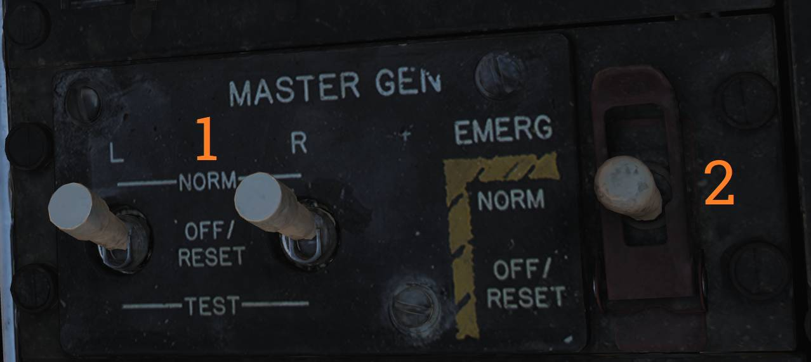

# 电力系统

F-14 中所有主要的电力都由两台发动机驱动的 AC（交流）发电机来提供。连接到发动机齿轮箱的每台发电机都能发出足够的电力来驱动飞机中所有的系统。

F-14 装备了两台整流变压器来作为 DC（直流）发电为系统提供 28V
DC（直流电），同样每台整流变压器都可以单独驱动飞机中所有需要用到 DC 的设备。

F-14 在前轮后方包含有一个使用 AC 电源的外部电源插座，外部电源插座能够为飞机提供 AC 和 DC（通过整流变压器）。
当一台内部发电机正常工作时，外部电源将自动从飞机电气系统中断开。

## 应急电力

F-14 中包含有一台由联合液压系统驱动的应急发电机，应急发电机可以发出有限的电力来提供 AC （交流电）和 DC（直流电）。如果系统失去由两台主发电机提供的电力，应急发电机将在1秒内接管关键飞行系统的供电。

## 控制开关/按钮和指示器

电气系统的控制开关全部位于主发电机控制面板中。

**MASTER GEN** (<num>1</num>) 开关控制主发电机到电力母线的连接。 **NORM**
档位用于将单独的发电机连接到母线。 **OFF/RESET**
档位用于断开发电机与母线的连接，并且复位任何由于供电超出正常限制而被切断的保护回路。
**TEST**
档位用于起动发电机，但不会将发电机连接到电力母线，从而在不影响其他飞机系统的情况下对发电机进行测试。开关被锁定在 NORM 档位，提起开关后才能将其拨回 OFF/RESET 档位。

**EMERG** (<num>2</num>) 开关用于控制应急发电机开关位于 **NORM**
档位时，如果主发电机发生故障，应急发电机将自动连接到应急总线。 **OFF/RESET**
档位将禁用应急发电机，同时还复位相关保护回路（如果发生跳闸）。此开关被保护盖固定在 NORM 档位，需要升起保护盖才能将开关拨至 OFF/RESET 档位。

电气系统相关的注意/提示灯位于飞行员驾驶舱注意 - 提示灯面板中。 **L GEN** 和 **R
GEN**
指示灯亮起表示对应的发电机没有正常工作。可能是由于发电机故障或驱动发电机的发动机没有运转。

**TRANS/RECT** 提示灯亮起表示一个或全部整流变压器没有正常工作。

应急发电机可以通过主测试面板中的 **MASTER TEST** 开关，选择 **EMERG GEN**
档位对发电机进行测试。**GO** 指示灯亮起表示测试完成。 发生故障时， **NO GO**
指示灯将会亮起。

## 断路器

F-14 的断路器位于飞行员的左/右膝仪表板以及 RIO 座椅后部的左侧和右侧。
通过弹出断路器来从过电流中保护飞机的系统并隔离消耗太多电流的系统。
断路器弹出时，断路器中将会出现一根白线表示已弹出。机组可以通过按下断路器来将断路器复位，也可以手动抽出断路器。

断路器实装至 DCS 时，我们会在此处详细描述各个断路器的功能。
