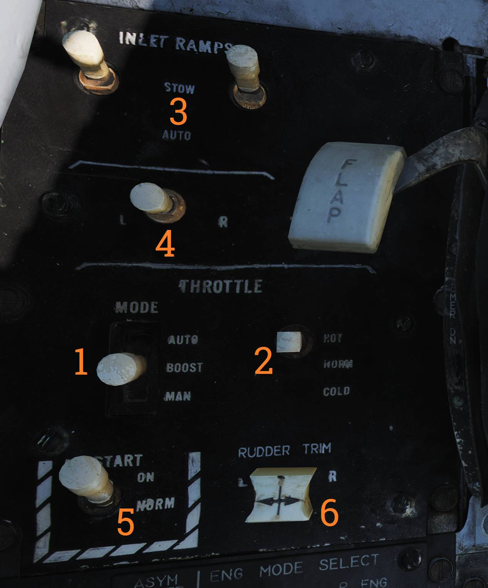
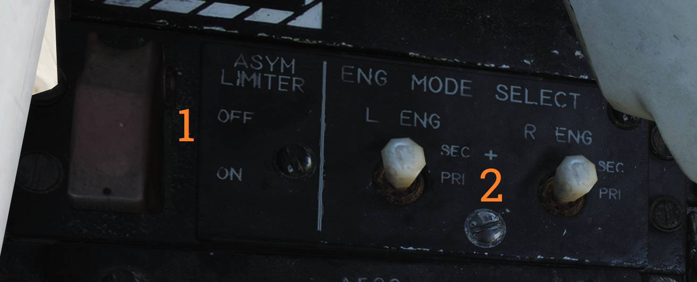
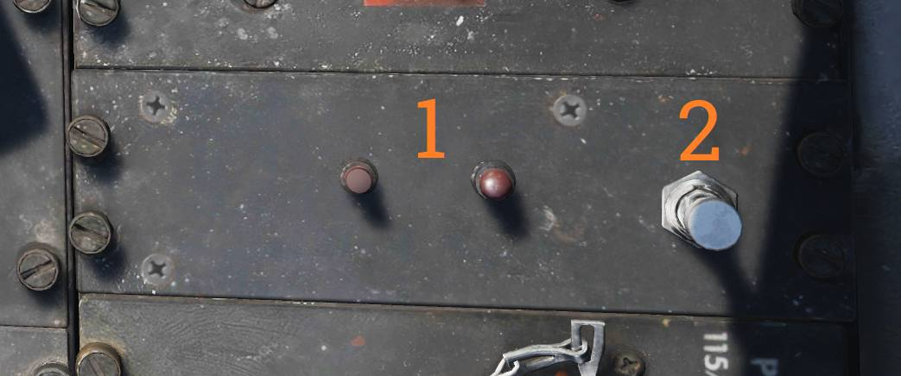
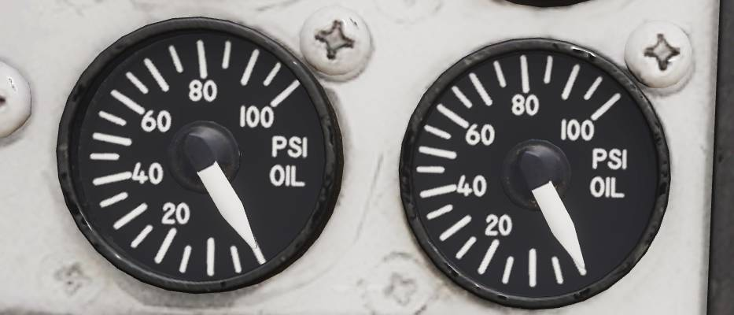

# 发动机

F-14A 装备了两台普惠 TF30-P-414A 发动机，而 F-14B 装备了两台通用电气 F110-GE-400 发动机，两台发动机均为带加力燃烧室的涡轮风扇发动机。

为了向发动机提供均匀的亚声速气流，F-14 装备了 AICS 或称为进气控制系统。
AICS 是通过控制可调进气道——更准确地说，是通过控制安装在进气道中的可调斜板来使气流减速。
可调斜板的位置是通过使用各种传感器输入，加以计算后使用设定的制度来决定的，以此通过改变斜板的位置来完成对气流进行减速。（译注：制度表示调定程序）

此外，TF-30 发动机使用两个系统来改善工作可靠性——中间级放气系统（MCB）和马赫摇臂。

MCB 系统用于帮助降低大迎角下气流对压气机风扇的影响，从而降低发动机失速的可能性。
MCB 系统将压气机部分的气流释放至发动机外涵道来为后一级压气机提供稳定的气流。
正常情况下 MCB 系统将使用迎角、马赫数传感器来决定是否启用，但是在起落架手柄在放下位时，系统仅在五级加力时启用。
此外，当在伸出受油管、发射 AIM-7 或 AIM-9、发射空对地航空火箭或发射 M61 火神航炮时，WCS 将指令启用 MCB。

马赫摇臂同样用于减缓发动机失速的风险——根据马赫数来控制发动机的最小和最大 RPM 来实现。
此外，马赫摇臂还提高了飞机在亚声速大迎角状态下的最小发动机转速。

而在 F-14B 中的两台 F110 发动机则是通过 AFTC（增推扇叶温度控制装置）来进行控制的。
AFTC 是一种早期的发动机控制计算机，类似于较新发动机中所使用的早期版 FADEC（全权数字发动机控制）。
AFTC 控制发动机本身以及发动机排气的可变喷口的开闭，并取消了 F110 对 MCB 和马赫摇臂的需求。
F-14A 中缺少类似的系统来控制 TF30 发动机，这也是 TF30 被认为不如 F110 发动机可靠的原因之一。

在 AFTC 发生故障的情况下，MEC（主发动机控制）可以对发动机进行控制以提供备份机械控制。
正常模式——AFTC——将其称为发动机的主要模式（PRI），而备份 MEC 称为次要（SEC）模式。
如果 AFTC 中发生故障，那么次要模式或主要模式将被自动选用，但也可以手动选择次要或主要模式。
值得一提的是，在次要模式下，除了加力燃烧被禁用外，喷口还将完全闭合并被禁用，两者都被禁用将导致发动机性能下降。

此外，两台发动机还将分别驱动的供油系统、液压系统和发电机，以此来增加余度。

> 💡 TF30 和 F110 发动机最主要的区别（除了 TF30 发动机推力比 F110 小外）是 TF30 发动机对进入压气机截面的气流更加敏感。
一般来讲，当在进行大迎角机动时应避免将油门设置在军推或开启后燃加力以下的位置，以及避免大偏航输入（译注：蹬舵）或不对称发动机油门设定。
这就是说，HB F-14A 模组的 TF30 发动机使用了现有的数据和 SME（主题专家）的专业知识进行了大量的调整，从而对发动机进行精确建模而无愧于它的坏名声。
TF30 发动机的液压-机械燃油控制的一个“优势”是其高速推力，这使得 TF30 发动机的极速比 F110 能够达到的极速要高。
如果在常规飞行参数下，TF30 发动机的表现良好，但比起 F110 来说就显得有些动力不足。

## 油门控制握把

F-14 的油门行程中含有数个限位以防止发动机意外起动或关闭发动机，或意外启用加力燃烧室。
此外，如上图所示，油门还用来控制数个根据油门位置操作的系统。这些系统中，其中最重要的就是发动机燃油关断和点火系统。

油门有三种操作模式：

MAN（手动模式）为机械操作模式，在手动模式下，油门通过机械传动机构直接连接到发动机来对其进行控制。
手动模式被设计为备用模式，并且由于机械控制的特性，这种模式下对发动机的控制并不准确。

BOOST（助力）模式，助力模式是油门的正常操作模式，在这个模式下，油门通过电力控制作动器来移动与机械传动机构相同的发动机控制器，
但与手动模式不同的是，助力模式对发动机控制更加准确并且控制油门所需要的力更小。

第三种模式是进近推力补偿模式或称为自动油门模式，在自动油门模式下，自动油门控制系统允许使用自动油门控制来在进近中保持最佳迎角。

油门模式的控制开关位于主油门一旁的进气道斜板/油门控制面板中，控制开关可用来选择全部三种油门模式。
使用 AUTO 模式时，开关将由螺线管固定在 AUTO 档位，如果不满足自动控制的条件，那么开关将恢复至助力模式。

如需选择自动油门模式，必须将油门置于处于75%到90% RPM 之间、起落架手柄位于放下档位以及机轮不负重。
如果不再满足前述条件，那么可以用力移动油门来手动超控或按下左油门握把中的 CAGE/SEAM 按钮，按下后螺线管将释放开关并恢复至助力模式。

此外，飞行员还可以在进气道斜板 / 油门控制面板中设置自动油门系统的增益。
增益设置分别为 HOT、NORM 和 COLD ，HOT 档位增加标准油门计算机增益（和有效推力），COLD 档位减小标准油门计算机增益。
控制开关设置对应外部气温的“冷”和“热”，但飞行员应根据实际油门控制进行设置。

RATS 或称为航降减推系统，航降减推系统将在触舰后限制发动机推力至适合舰上环境的水平。
主起落架任意一侧机轮负重都将启用航降减推系统，并且可以通过推动油门选择加力燃烧来禁用 RATS。

最后，仅在 F110-GE-400 发动机上装备了的——不对称推力限制器（ASYM LIMITER），
如果只有一侧发动机启用加力燃烧，那么不对称推力限制器将限制加力燃烧在最小加力推力直到另一侧发动机也启用加力燃烧来防止使用不对称加力燃烧。

## 发动机和油门控制开关以及指示器

进气道斜板 / 油门控制面板包含了大多数其它与发动机相关的控制开关。

进气道斜板 / 油门控制面板包含了大多数其它与发动机相关的控制开关。

**THROTTLE MODE** (<num>1</num>) ，用于选择油门工作模式，
**AUTO** 、 **BOOST** 或 **MAN** 模式，开关由弹簧归中至 BOOST 助力模式，如上所述，开关可由螺线管固定在 AUTO 档位。

**THROTTLE TEMP** (<num>2</num>) 开关也如上所述，用来控制自动油门系统的增益。

**INLET RAMPS** （<num>3</num>）开关用来启用（ **AUTO** ）或禁用，也就是收上（ **STOW** ）可调进气道斜板。

发动机起动开关（<num>4</num>）用于起动发动机至 20% rpm，转速到达 20% rpm 后可通过将对应的油门握把从 cut-off（关断）移动至 idle（慢车位）来起动发动机。
如果飞机连接了外部气源，那么发动机则使用外部气源提供的空气来起动，如果没有连接外部气源则使用另一侧发动机提供的空气。
当发动机转速到达 50% rpm 时，起动开关将自动回到关闭/中立档位。如果起动开关在转速到达 50% rpm 时没有自动中立，那么必须手动将其设置为中立（关闭）档位来防止损坏空气涡轮起动机。

**BACK UP IGNITION** （<num>5</num>）开关用来在主点火回路失效的情况下启用备用点火系统，通常通过将油门握把移动出 cut-off（关断）档位来启用点火系统。

> 💡 仅限 F-14B。

**ASYM LIMITER** （<num>1</num>）开关位于不对称推力限制器 / 发动机模式选择面板中，ASYM LIMITER 开关用来启用或禁用不对称加力推力限制器。
开关默认位置为 **ON** 档位，保护盖关闭时将开关固定在 ON 档位。

同一面板中的其他两个开关为 **ENG MODE SELECT** （发动机模式选择）开关（<num>2</num>），
两个开关分别用来设置左发动机（**L ENG**）和右发动机（**R ENG**）为 **PRI** （主要）模式或者 **SEC** （次要）模式。

> 💡 仅限 F-14A。

MCB 检测面板，位于雷达拦截官驾驶舱中右侧控制台中，MCB 检测面板用于检测 MCB 系统是否正常工作。
**TEST** 开关（<num>2</num>）拨动至 TEST 档位后将启动检测回路，如果 MCB 回路正常工作那么对应左发和右发的两盏检测指示灯（<num>1</num>）将会亮起。

外部环境控制面板上的 **ENG/PROBE ANTI-ICE** （<num>2</num>）开关除了启用各个皮托管防冰外，同时还启用发动机除冰以及进气道斜板除冰。
开关拨至 **ORIDE** 将启用系统，开关拨动至 **AUTO** 档位时，如果探测到结冰，系统将被启用，
开关拨至 **OFF** 档位将禁用系统。

## 发动机仪表组（EIG）及相关指示器和注意灯

**ENGINE INSTRUMENT GROUP** （发动机仪表组）向飞行员显示 **RPM** （发动机转速）、**TIT** （涡轮进口温度，F-14A） **EGT** （排气温度，F-14B）以及 **FF** （燃油流量）以便监视发动机运转状态。

> 💡 上图中显示的是 TF30 发动机仪表组，而 F110 发动机仪表组将在不久后实装。

发动机喷口位置表显示相应发动机喷口当前的位置：0 表示喷口完全闭合，指针顺时针转动到最大值表示喷口完全张开。
F-14A 中的指示为 0 到 6 个单位，而 F-14B 中则为 0 到 100% 张开（单位是10）。

滑油压力表中显示相应发动机中的滑油压力从而允许飞行员能够检查发动机中的滑油压力是否在正常水平。

与发动机运转相关的注意灯位于飞行员驾驶舱中，注意 - 提示灯面板中以及 HUD 两侧。

位于 HUD 两侧的指示灯为发动机失速告警灯，当检测到发动机失速时，告警灯将以 3Hz 的速率闪烁。
HUD 左侧的告警灯用于指示左发失速，右侧的告警灯则指示右发失速。告警灯亮起的同时还将伴随调制出的 320Hz 的单音警告音。

左发失速告警灯下方的指示灯中，其中一个指示灯为 **AUTO THROT** （自动油门）注意灯，当自动油门系统通过除使用油门模式开关以外的方法断开时，注意灯将会亮起10秒钟。

注意 - 提示灯面板中，发动机相关的注意灯和告警灯分别为：

- **INLET ICE:** - 注意灯亮起表示左发进气道结冰信号器探测到结冰。
- **L & R INLET:** - 注意灯亮起表示对应可调进气道系统的 AICS 系统出现了故障。
- **OIL PRESS:** - 注意灯亮起表示一侧发动机中的滑油压力过低。- **BLEED DUCT:**
- 注意灯亮起表示一侧发动机中出现高温空气泄漏。
- **L & R RAMPS:** - 注意灯亮起表示对应的发动机进气道斜板没有锁定在指定的位置。
- **L & R GEN:** - 注意灯亮起表示其对应发动机的发电机不工作。
- **L & R OIL HOT:** - 注意灯亮起表示其对应的发动机中的滑油过热。
- **L & R FUEL PRES:** - 注意灯亮起表示其对应发动机中，燃油泵的出口油压低于9 psi。

仅 F-14A TF30-P-414A 含有的指示灯：

- **L & R OVSP/VALVE:** 注意灯亮起表示发动机起动机系统存在故障或对应发动机中 N1 转子超速。

仅 F-14B F110-GE-400 含有的指示灯：

- **START VALVE:** 注意灯亮起表示发动机起动机阀门开启。如果发动机起动后指示灯仍亮起，拨动发动机起动开关至中立位置。
- **L & R ENG SEC:** 注意灯亮起表示其对应的发动机正在次要模式下运转。
- **RATS:** 注意灯亮起表示 RATS（航降减推系统）已启用。

> 💡 F-14A 的特殊指示灯尚未实装。
