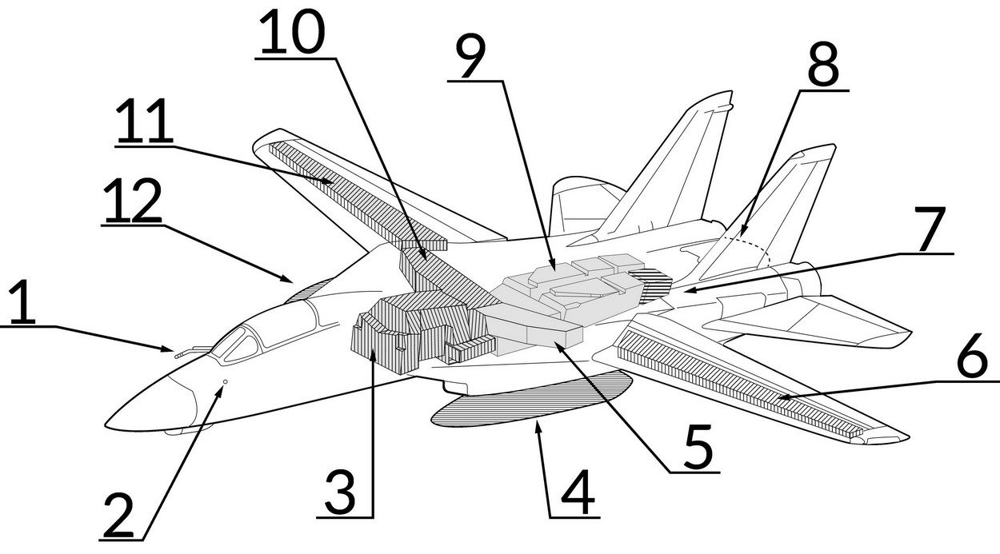
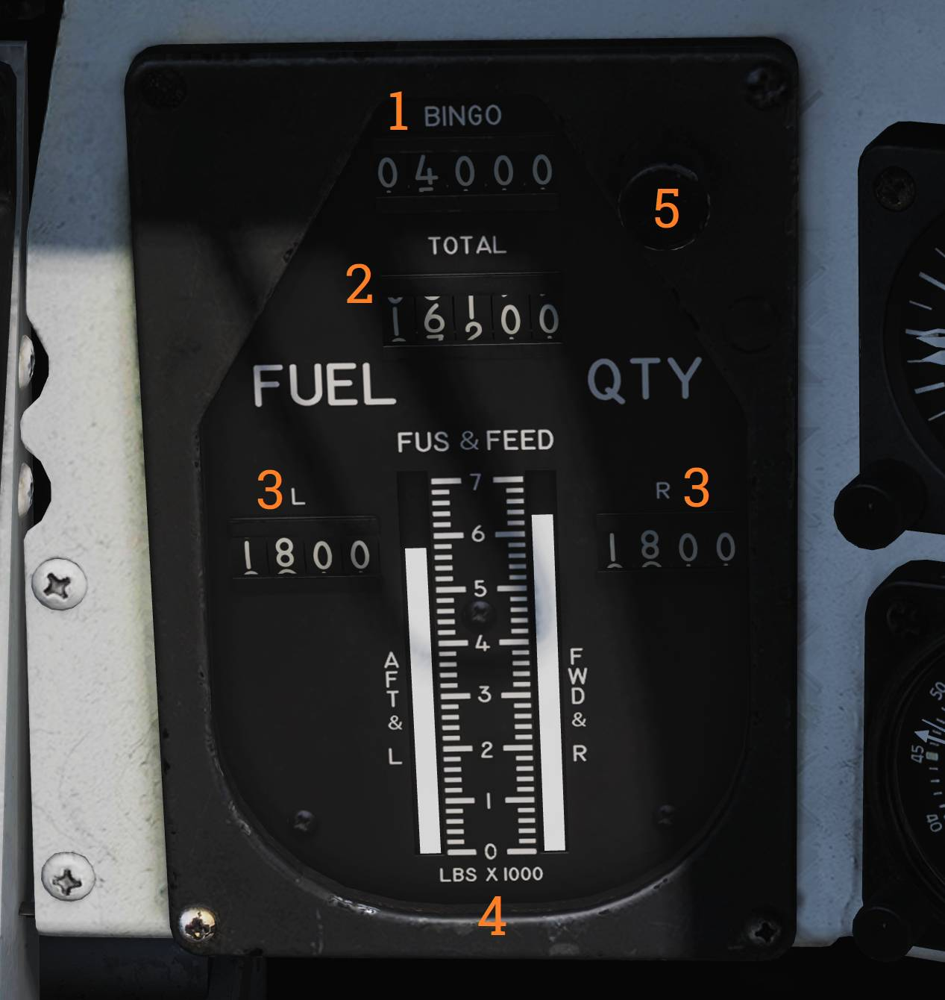

# Fuel System

_1. Refueling Probe, 2. Ground refueling Port (Right Side), 3. Forward Fuselage
Tank, 4. Left External Drop Tank, 5. Left Box Beam Tank, 6. Left Wing Tank, 7.
Vent Tank, 8. Fuel Dump Mast, 9. Aft Fuselage Tank, 10. Right Box Beam Tank, 11.
Right Wing Tank, 12. Right External Drop Tank._

The main fuel storage in the F-14 consists of two feed systems, one for each
engine. The right engine feed system consists of the right wing and right box
cells and the front fuselage cells while the left engine feed system consists of
the left wing and left box cells in addition to the aft fuselage cells. This
fact needs to be kept in mind when reading the fuel gauges.

The total useable fuel quantity is roughly 20,000 pounds distributed as in the
table below.

| Tank group       | Pounds |
| ---------------- | ------ |
| Forward Fuselage | 4,700  |
| Aft Fuselage     | 4,400  |
| Right Feed Group | 1,600  |
| Left Feed Group  | 1,500  |
| Internal Wings   | 4,000  |
| External Tanks   | 3,600  |

## Fuel Quantity Indicators and Controls

The fuel quantity indicator on the pilot right knee panel displays internal and
external fuel carried.

The uppermost indicator (<num>1</num>) displays currently set **BINGO** fuel
level, this quantity is set by rotating the knob (<num>5</num>) to desired
amount. This indicator and control activates the BINGO caution light when total
fuel level is below set amount.

The **TOTAL** (<num>2</num>) indicator displays total carried fuel.

The **L** and **R** (<num>3</num>) normally shows fuel carried in left and right
fuel feeds respectively. A rocker switch on the fuel management panel enables
selection of the wing internal tanks (**WING**) or external fuel tanks (**EXT**)
for display but is spring-loaded to return to showing the feed tanks (**FEED**)
automatically. When displaying wing internal tanks or external fuel tanks, the
left wing or left external tank is shown on the L counter and the right wing or
right external tank on the R counter.

The **FUS & FEED** tapes (fuselage and feed) shows the **AFT & L** (aft fuselage
and left feed) and **FWD & R** (forward fuselage and right feed) in thousands of
pounds.

Additionally the RIO has a total fuel quantity display on the right instrument
panel. This display counter can only show total fuel quantity. (See Fuel
Quantity Totalizer.)

The fuel management panel on the pilot’s left vertical console contains the
applicable controls for the fuel system.

The **QTY SEL** (<num>1</num>) rocker switch is detailed above under the
description above about the L & R fuel displays.

The **FEED** switch allows the pilot to correct fuel imbalances caused by single
engine operation or feed failures by selecting both engines to feed from either
the **FWD** (forward and right tanks) or **AFT** (aft and left tanks) instead of
from one feed system each as normal **NORM**. The switch guard locks the switch
to the NORM position when down.

The **WING/EXT TRANS** switch controls fuel transfer from the wing and external
tanks into the fuselage feed systems. The normal **AUTO** position enables this
transfer as soon the landing gear is retracted. The **ORIDE** position enables
this transfer regardless of landing gear position, enabling transfer when on the
ground or during a malfunction in the electrical system inhibiting landing gear
retraction detection. Additionally the **OFF** position disables this transfer
but can be overridden automatically to AUTO when the INST test is performed on
the MTS panel, the refuel probe is set to ALL EXTD or when dumping fuel.

The **DUMP** (<num>5</num>) switch enables fuel dump through the beaver tail
fuel dump mast, it also enables all fuel transfer systems, enabling dump of fuel
in wings and external tanks in addition to the fuselage. If there’s weight on
the wheels or the speed brake is not fully retracted the fuel dump is inhibited.

> 🟡 CAUTION: Even though technically possible to engage the afterburners after
> a fuel dump is in progress, this is not allowed due to the possibility of
> igniting the dumped fuel.

## In-Flight Refueling

The above panel also contains the control for the in-flight refueling system.

The **REFUEL PROBE** (<num>6</num>) switch controls the extension of the
refueling probe as well as setting up the fuel system to receive fuel. The two
extended positions (**EXTD**) are **ALL**, enabling refueling of all tanks,
including wings and external tanks and **FUS**, allowing refuel of only the
fuselage tanks. When selecting the **ALL** position the fuel feed from the wings
and external tanks are disabled to allow refueling of these tanks. **RET**
(Retract) retracts the refueling probe and resumes normal fuel system operation.

> 💡 Selecting **EXTD ALL** resets the **WING/EXT TRANS** switch to **AUTO**.

<iframe width="560" height="315" src="https://www.youtube.com/embed/f4y2oZ-7rM8?si=SArL4wXSpcNU-Rzj"
title="DCS World - F-14 Tomcat - Air to Air Refueling" frameborder="0"
allow="accelerometer; autoplay; clipboard-write; encrypted-media; gyroscope; picture-in-picture; web-share"
referrerpolicy="strict-origin-when-cross-origin" allowfullscreen></iframe>
