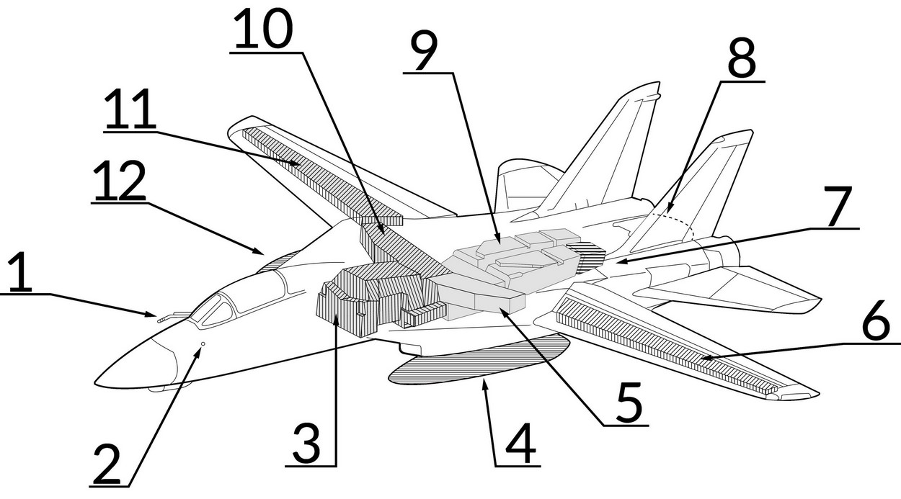
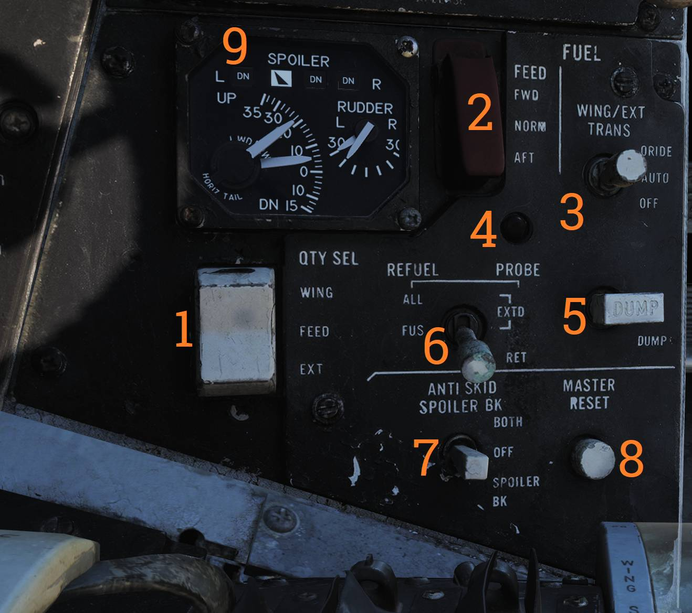

# 燃油系统

_1. 受油管, 2. 地面受油口（右侧）, 3. 前机身油箱, 4. 左副油箱,
    5. 左盒形梁油箱, 6. 左翼油箱, 7. 通气油箱, 8. 放油装置,
    9. 后机身油箱, 10. 右盒形梁油箱, 11. 右机翼油箱, 12. 右副油箱._

F-14 中主要用于储存燃油的为两个燃油供给系统，每台发动机各一个燃油供给系统。
右发动机燃油供给系统由右机翼油箱、右盒形梁油箱和前机身油箱组成，而左发动机燃油供给系统由左翼油箱、左盒形梁油箱以及后机身副油箱。
所以在进行油量表读数时，务必记住这一点。

如下表所示，飞机的可用燃油总量约为 20000 磅。

| 油箱分组     | 磅    |
| ------------ | ----- |
| 前机身油箱   | 4,700 |
| 后机身油箱   | 4,400 |
| 右供油油箱组 | 1,600 |
| 左供油油箱组 | 1,500 |
| 机翼油箱     | 4,000 |
| 副油箱       | 3,600 |

## 燃油量指示器和控制

位于飞行员驾驶舱中右膝仪表板上的燃油量指示器用于指示飞机内部油箱和副油箱中的燃油量。

燃油量指示器中，最上方的指示器（<num>1</num>）显示当前设置的 **BINGO** （反航）油量，通过转动指示器旁边的旋钮（<num>5</num>）来设定所需的值。
当剩余的燃油总量低于指示器中设定的值时，BINGO 注意灯就会亮起。

**TOTAL** （<num>2</num>）指示器显示飞机所有油箱中的燃油总量。

正常情况下， **L** 和 **R** (<num>3</num>) 分别显示左/右供油油箱组的燃油量。
燃油管理面板中的船形开关用于选择显示机翼油箱（**WING**）或副油箱（**EXT**）的燃油量，但船形开关由弹簧归中显示供油油箱组（**FEED**）的燃油量。
当指示器显示机翼油箱或副油箱油量时，L（左侧）计数器将指示左翼油箱或左侧副油箱中的燃油量，R（右侧）计数器则指示右翼油箱或右侧副油箱的燃油量。

**FUS & FEED** 带状指示器（机身油箱和供油油箱组）以千磅为单位显示
**AFT & L** （后机身油箱和左供油油箱组）以及 **FWD & R** （前机身油箱和右供油油箱组）的燃油量。

另外，RIO 驾驶舱中也含有一个燃油量指示器，指示器位于右仪表板中。这个指示器只能显示所有油箱的燃油总量。（详见燃油总量表）。

位于飞行员驾驶舱中左侧垂直控制台上包含有适用于燃油系统的控制开关和按钮。

**QTY SEL** （<num>1</num>）船形开关在上文关于 L & R 燃油量指示带的介绍中有详细说明。

飞行员可以使用 **FEED** 开关来通过选择 **FWD** 档位（前机身油箱和剩余右发供油所使用的油箱）或 **AFT** 档位（后机身油箱和剩余左发供油所使用的油箱）
修正由于单发停车或燃油供给管路故障所导致两侧油箱燃油量不平衡，而不是像 **NORM** 档位一样——左/右发动机燃油供给分别向对应的发动机输油。
当保护盖关闭时，这个开关会被保护盖锁定在 NORM 档位。

**WING/EXT TRANS** 开关用来控制机翼到发动机供油系统以及副油箱到发动机供油系统的燃油转输。一般情况下使用的 **AUTO** 档位将在起落架收上后立刻启用机翼/副油箱燃油转输。
开关拨动至 **ORIDE** 档位时，无论起落架当前的位置，机翼/副油箱的燃油转输都将被启用，绕过起落架收上检测从而允许当飞机处于地面或在输油系统中发生电气故障时启用机翼/副油箱燃油转输。
此外，开关位于 **OFF** 将禁用机翼/副油箱转输，但是当在 MTS（主测试）面板中选择 INST 档位进行测试、受油管设置为 ALL EXTD 或放油时，开关将被自动超控至 AUTO 档位。

使用 **DUMP** （<num>5</num>）开关可以通过河狸尾巴放油装置来将燃油放出，同时开关还会启用所有输油系统，使得除了机身油箱外，还能将机翼和副油箱中的燃油放出。
如果机轮负重或者减速板未完全收起，那么放油将被电子禁止。

> 🟡 注意: 尽管从技术上来说，放油过程中是可以开启加力燃烧室的，但是这样有可能会点燃放出的燃油，因此禁止在放油时进行加力燃烧。

## 空中受油

上文所讲的燃油管理面板还可以对空中受油系统进行控制。

**REFUEL PROBE** （<num>6</num>）开关用于控制受油管伸出以及设置燃油系统来进行接收。
两个伸出档位（**EXTD**）分别为 **ALL** 档位——启用所有油箱受油，包括机翼油箱和副油箱， **FUS** 档位——启用仅机身油箱受油。
开关位于 **ALL** 档位时，机翼和副油箱的输油将被禁用从而使所有油箱受油。开关位于 **ALL**（收起）档位时，受油管收起并恢复正常燃油系统运作。

> 💡 开关拨至 **EXTD ALL** 将复位 **WING/EXT TRANS** 开关至 **AUTO** 档位。
