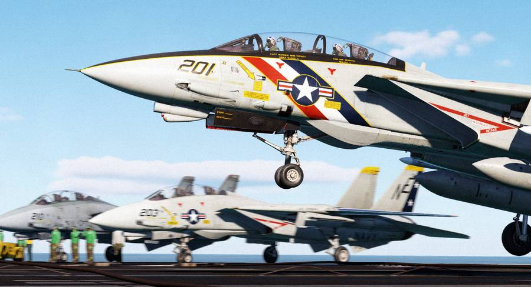

# Flight Controls and Gear

This chapter contains all necessary information about the
[flight controls](./flight_controls.md), the
[controlling computer system](./cadc.md), the
[wing sweep mechanism](./wing_sweep.md) and systems used on the ground such as
the [landing gear](./gear_ground_handling.md).

