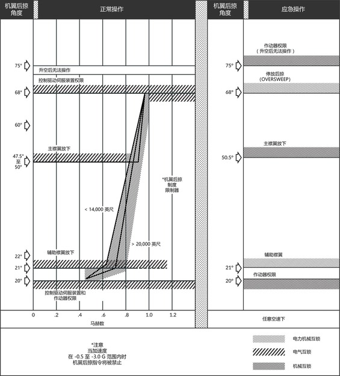
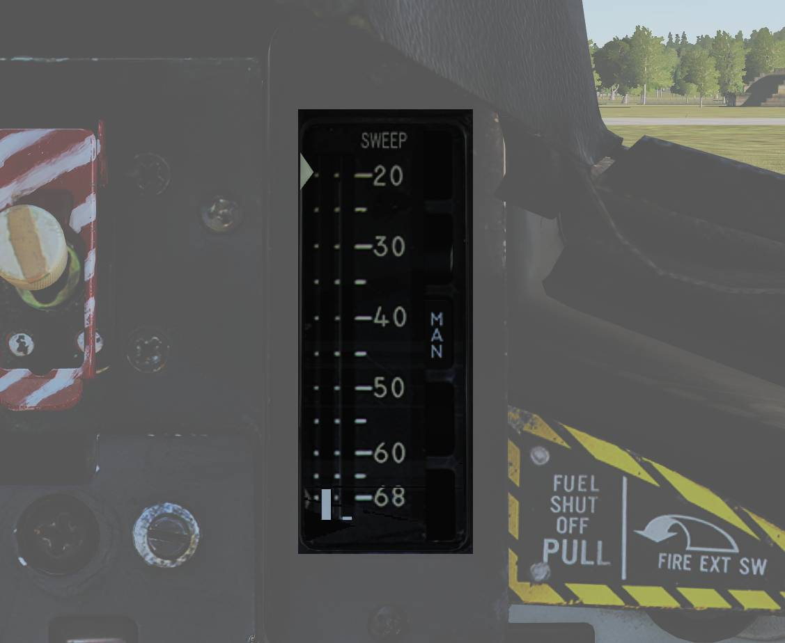

# 机翼后掠系统

机翼后掠制度根据马赫数和襟翼互锁来控制。

机翼后掠系统控制着 F-14 机翼的几何形状，机翼后掠可使机翼在空中从 20 度移动到 68 度。当在甲板上时，75° 的停放后掠可以让 F-14 的翼展进一步缩短至33英尺（约10米）。

机翼由液压-机械螺旋千斤顶作动器进行移动，且作动器之间为机械互联确保机翼之间保持同步。
两个主液压系统正常工作时，机翼后掠的最大变化速率大约为 15° 每秒。但负 G 或大量正 G 机动会影响实际的变化速率。

在正常工作时，CADC（中央大气数据计算机）根据当前马赫数通过机翼后掠程序来控制机翼的位置，这种工作模式被称为 AUTO 模式。
飞行员还可以手动选择机翼后掠的位置或选择 BOMB 模式，选择 BOMB 模式将设置机翼后掠至55°或根据机翼后掠程序更进一步后掠。
简而言之，CADC 机翼后掠程序决定了机翼的最小后掠角度。所有 CADC 后掠控制都通过电信号以及连接至机翼后掠作动器的两个独立通道（以增加控制余度）来完成。

ACM 面板旁的机翼后掠指示器用于指示当前指令的机翼后掠位置、CADC 程序设定的机翼后掠位置以及实际的机翼后掠位置。

## 应急模式

在正常模式下，机翼后掠通过电信号对机翼后掠进行控制，但在应急模式下，作为备用，仍然可以通过机械连接来控制机翼后掠。
机械控制通过油门右侧的应急机翼后掠手柄来完成。应急机翼后掠手柄与机翼后掠系统中的液压阀机械连接，从而提供机械备份控制。

通常，应急机翼后掠手柄由位于下方的伺服装置根据电子机翼后掠程序进行移动，来确保手柄处于正确的机翼后掠位置上。
如需断开电子系统并启用应急模式，首先需要打开手柄上保护盖，然后抽出手柄以获得额外的杠杆作用力。随后可以将手柄从连接到电力伺服装置的随动限位器中移出，移出限位器后使用手柄来手动控制机翼后掠的位置。

在应急模式下，飞行员必须确保遵循下表中的制度以避免损坏机翼：

| 空速（指示马赫数） | 最小后掠角度 |
| ------------------ | ------------ |
| 0.4                | 20°         |
| 0.7                | 25°         |
| 0.8                | 50°         |
| 0.9                | 60°         |
| 1.0                | 68°         |

如需返回正常工作模式，飞行员应将手柄调整到所需位置并按下，然后关闭保护盖。
接着，飞行员应该按下燃油管理面板中的 MASTER RESET 按钮，机翼后掠系统将设置后掠位置与手柄的位置保持一致。
这时，伺服装置将驱动至指令的位置，然后重新将手柄接入随动限位器内以恢复正常运行模式。

## 机翼停放后掠

紧急机翼后掠手柄还用于选择机翼的停放后掠位置。停放后掠仅在位于地面时使用，选择停放后掠其目的是为了减小翼展，便于在甲板上停放飞机。
由于机翼会掠过水平安定面上方，因此水平安定面权限系统将被启用并通过限制水平安定面的偏转来避免机翼和水平安定面相撞导致损坏。

如需将机翼设置为停放后掠，飞行员应将应急机翼后掠手柄移动至68°的位置，然后将手柄保持在抽出的位置。
将手柄保持在最大后掠位置将使机翼密封气囊放气，并激活水平安定面权限系统， **HZ TAIL AUTH** 注意灯亮起表示权限系统已激活。
当 **HZ TAIL AUTH** 注意灯熄灭，并且机翼后掠指示器种 **OVER** 标识旗出现时，停放后掠互锁将会解除，这时可以将手柄移动至 75° 并按下。

如需将机翼移出停放后掠，抽出手柄并向前移动至68°的位置处。这将使 **HZ TAIL AUTH** 注意灯再次亮起。
当机翼移出停放后掠时，注意灯以及机翼后掠指示器中的 **OVER** 标识旗将消失。

与标准的应急模式操作相同，将手柄移动至与随动限位器相同的位置上，然后按下 **MASTER RESET** 按钮。

## 控制开关/按钮和指示器

用于控制机翼后掠系统的控制开关（电力）位于右侧油门握把以及右侧油门握把右边（机械）。详见油门握把 和油门弧座 。

右侧油门握把上的机翼后掠苦力帽开关通常设置到 **AUTO** 档位，选择 AUTO 档位来启用 CADC 对机翼进行控制，AUTO 档位为苦力帽向上。
向下拨动苦力帽将机翼设置为 **BOMB** 档位，机翼将后掠到55°或往后。

苦力帽 **AFT** （向后）和 **FWD** （向前）档位用来从 CADC 制度的位置手动移动襟翼。

油门弧座右侧的应急机翼后掠手柄用于控制机械操控的应急模式，详细见上文中的应急模式。

ACM 面板右侧的机翼后掠指示器用于指示当前的机翼后掠位置。 左侧的指针指示了 CADC 制度的机翼后掠位置。左右两个垂直的指示带分别指示了机翼当前的指令位置和实际位置。

右侧的五个显示窗分别指示：

- **OFF:** 关闭，系统无法操作。
- **AUTO:** 自动，由 CADC 控制机翼后掠。
- **MAN:** 手动，通过右侧油门握把中的苦力帽手动控制机翼后掠。
- **EMER:** 应急，通过应急机翼后掠手柄控制机翼后掠。
- **OVER:** 停放后掠，机翼处于停放后掠位置。

相关的告警灯与提示灯位于垂直显示指示器（VDI） 和飞行员驾驶舱注意 - 提示灯面板中。

当两个机翼后掠电气通道都无法操作机翼后掠或使用应急机翼后掠模式时，VDI 右侧的 **WING SWEEP** 告警灯将会亮起。
如果未使用应急机翼后掠模式，但告警灯亮起，那么就表示电气系统可能不正常工作，此时应使用应急机翼后掠模式。

当至少一个电气机翼后掠通道无法使用时，飞行员驾驶从注意-提示灯光面板中的 **WING SWEEP** 提示灯将亮起。

## 机翼后掠系统测试

起飞前，可通过主测试面板在不移动机翼的情况下对机翼后掠系统进行测试。

如需进行测试，将机翼后掠模式设置为 **AUTO** ，然后按下 **MASTER RESET** 按钮。设置 **MASTER TEST** 旋钮拨至 **WG SWP** 档位。

机翼后掠指示器中的 CADC 指令后掠位置指示带将移动至 44° 的位置。
飞行员驾驶舱中 注意 - 提示灯面板 上的 **WING SWEEP** 和 **FLAP** 注意/提示灯以及垂直显示指示器（VDI）中的 **REDUCE SPEED** 告警灯将亮起。

> 💡 **WING SWEEP** 提示灯将在测试开始3秒后亮起，然后熄灭，然后在测试开始 8 秒后再次亮起。

当 CADC 指令后掠位置指示带向前移动到 20° 位置时，就表示测试结束，上述指示灯将熄灭。
现在 **MASTER TEST** 开关可以拨至 **OFF** 档位，并且测试已经完成。测试大约需要25秒来完成。

> 💡 测试过程中，**RUDDER AUTH** 和/或 **MACH TRIM** 提示灯可能会亮起，且驾驶杆可能会移动。这些是正常现象，可以忽略。

> 💡 主测试面板上的 WG SWP 测试尚未实装。
