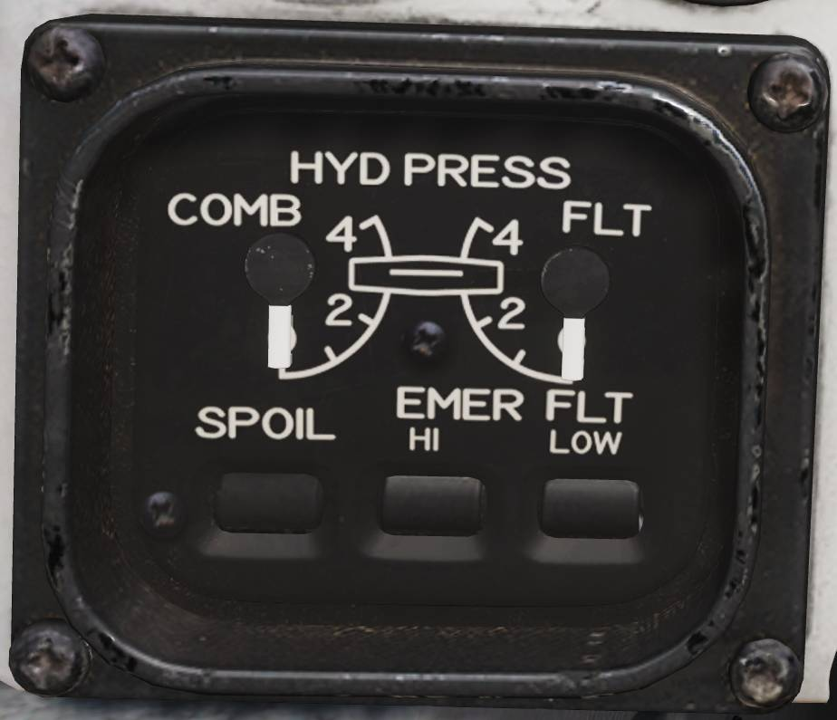
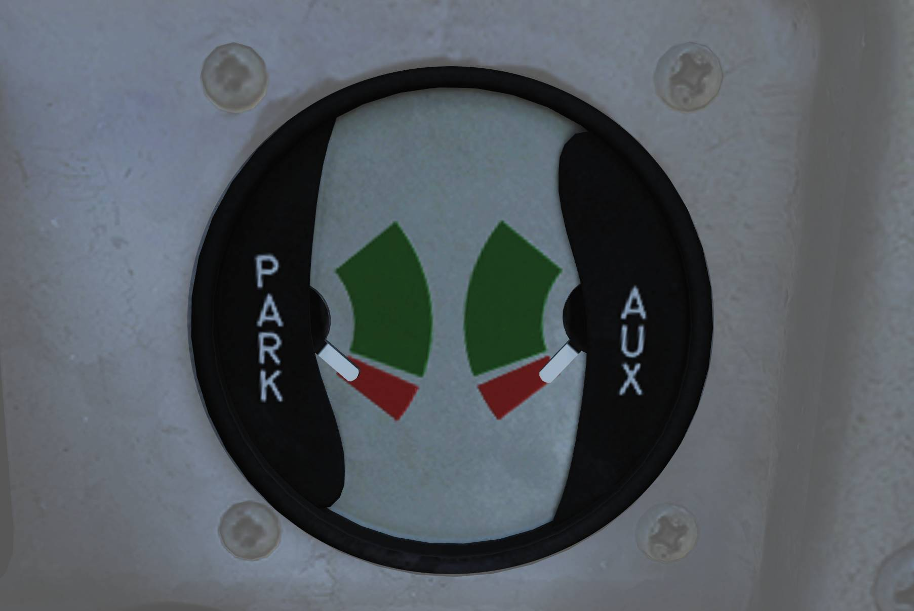

# 液压系统

F-14 有两个独立的液压系统，分别是飞行液压系统和联合液压系统。

两个系统都由连接到每台发动机的液压泵提供动力，飞行液压系统由右侧发动机提供动力，联合液压系统由左侧发动机提供动力。在正常运行时，两个液压系统的中的油液压力将被液压泵增压至大约 3000
psi。

两个液压系统为所有飞行操纵面提供动力，而联合液压系统同时也向一些二级系统提供动力，例如襟翼、起落架和受油管。
由此一来，两个系统就可以在另外一个系统发生故障的情况下独立地驱动操纵面运动。

此外，当升空时，可以通过起落架手柄旁的开关来从液压系统中隔离无关系统的液压。这样一来，即使被隔离的系统损坏，也不会影响到联合液压系统中压力或造成油液泄漏。
可以从联合液压系统中隔离开来的系统分别是：起落架、机轮刹车、防滑和前轮转向。起落架手柄处于放下档位时，这个开关将被机械锁定在关闭隔离档位。

如果只有一个液压泵失效，那么可以通过液压输送泵从没有失效的液压泵来对失效侧系统的液压进行增压。
液压输送泵是一种双向液压泵，液压输送泵可以用来对另一侧系统中的油液进行增压，如果向另一侧增压的系统中的油液压力（压强）在 3000
psi 左右，那么通过液压输送泵可以将失效侧系统的油液压力保持在 2400 和 2600
psi 之间。如果其中一个液压系统的油液压力低于 500
psi，那么输送泵将被关断以防止泵损坏，以及避免另一个正常工作的液压系统压力降低。液压输送泵可由飞行员手动关断。

如果两个液压泵都发生故障，那么飞行液压系统可以由一个被称为应急飞行液压泵的电动液压泵提供动力。
应急飞行液压泵能独立地驱动飞机尾部的操纵面，即使在两个主液压系统压力为零的情况下，应急飞行液压泵也能让飞机返回基地并着陆。如果两个主液压系统中的油液压力降低至 2100
psi 以下，那么电动液压泵将会自动启用，如果两个主液压系统中油液压力重新达到 2400
psi，那么电动液压泵将会关断。
自动启用电动液压泵时，备用飞行控制系统将以低速模式运行，但飞行员也可以手动切换至高速模式或低速模式。如果操纵面由应急飞行液压泵驱动，那么操纵面的偏转率会降低，且在低速模式下偏转率比高速模式下更低。

如果联合液压系统中的压力为零，那么飞行员可以通过手动液压泵来对受油管和机轮刹车蓄压器进行充压。这种方法主要用于在无动力地面作业时使用，但仍可作为备用液压泵在空中使用。

## 控制开关/按钮和指示器

**HYD PRESS** （液压指示器）由两个仪表组成 **COMB** ——联合液压系统， **FLT**
——飞行液压系统，液压读数单位为千 psi。标度中刻有当液压泵正常工作时的标称压力——3000
psi。

位于两个仪表下方的为标识旗，标识旗用来指示扰流板 **SPOIL**
的液压是否可用和应急飞行液压泵 **EMER FLT** 是否工作。
**HI**标识旗表示应急飞行液压泵以高速模式运行，**LOW**
标识旗表示应急飞行液压泵以低速模式运行。

**BRAKE PRESSURE** 应急刹车压力表显示了机轮刹车蓄压器中可用的油液压力。 **PARK**
指示停放刹车压力， **AUX** 辅助刹车蓄压器。绿色区域对应的压力范围大约 2150
psi 至 3000 psi，红色区域表示压力低于 2150 psi。

**HYD TRANSFER PUMP**
——液压输送泵开关——位于飞行员驾驶舱中右侧控制台的液压输送泵开关面板上。液压输送泵开关可以用来手动关断液压输送泵（
**SHUTOFF** 档位），但开关通常位于 **NORMAL**
档位来使液压输送泵在任意一侧液压泵出现故障时自动启动。开关被保护盖固定在 NORMAL 档位。

应急飞行液压泵通过主测试面板中的带保护盖开关来控制。保护盖关闭时，开关固定在
**(AUTO)LOW**
档位，选择 (AUTO)LOW 档位将允许应急飞行液压泵如上文所述自动启用，其它两个档位——
**HIGH** 和 **LOW**
档位——当保护盖升起时，这两个档位可用来手动起动应急飞行液压泵低速模式或高速模式。

注意 - 提示灯面板中唯一与液压系统相关的注意灯为 **HYD PRESS**
注意灯，注意灯亮起表示其中一个主液压系统中的油液压力低于 2100
psi。当两个主液压系统中的油液压力再次高于 2400 psi 时，注意灯将熄灭。
