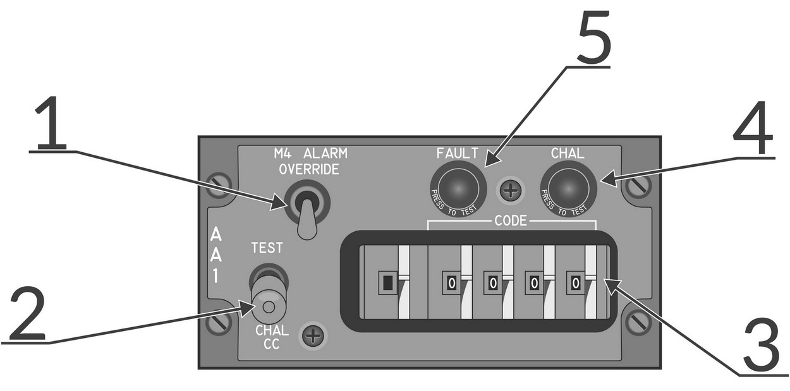

# 识别系统

## AN/APX-76 IFF 问询器

AN/APX-76
IFF（敌我识别系统）问询器集成进了 AN/AWG-9 运作之中。而问询器天线本身位于 AN/AWG-9 天线环架的平台上。

IFF 系统的工作原理是发射一个问询脉冲，然后监听应答机传回的脉冲。除了非加密民用模式外，AN/APX-76 还可以在加密的军用模式（mode
4）下进行问询。
由此一来，这样就可以确定目标在 mode4 问询下进行应答的是友机。

AN/APX-76 可以在搜索模式或 STT 模式中使用。如需启用问询，按下详细数据显示器面板中的 IFF 按钮，按下后将会启用问询器，按住 IFF 按钮最长只会启用问询器10秒。

启用 IFF 后，接收到的 IFF 应答结果将会叠加显示在 DDD 中的 AN/AWG-9 雷达接触上。友方目标将会显示两根横线，一个在雷达接触上方，一个在雷达接触的下方。
由于 AN/APX-76 是除 AWG-9 雷达之外的另一台次要模式雷达（应答机雷达），因此 IFF 可以时不时的探测到 AWG-9 没有探测到的目标。
在这种情况下， IFF 应答结果中不会有雷达接触符号。

在搜索模式下，IFF 返回会叠加显示在每个应答的目标上，而 STT 的话将会叠加显示在 STT 目标上。除此之外，如果在 TID 中选中了 STT 目标，DDD 将会从正常显示距离切换至 ±10
NM，以便当存在密集编队目标时，显示多个目标的应答结果。

### AA1 控制面板

 _AN/APX-76 问询器控制面板_

- **1. M4 ALARM OVERRIDE 开关**

  - 开关用来禁用 RIO 头戴中的模式 4 音调警告。 

- **2. TEST-CHAL CC 开关**

  - 开关弹簧归中，用来控制 IFF 问询和测试。
    - TEST: 短暂拨动至该档位，通过问询自身应答机来测试 AN/APX-76。如果设置了相同编码，DDD 中 3 和 4 海里处将显示两根实线。 
    - CHAL CC: 短暂拨动至该档位来开始一个 10 秒问询循环，DDD 仅显示模式和编码正确的回波。 

- **3. CODE 选择拨轮**

  - 拨轮用来控制问询使用的模式和编码。第一个拨轮设置模式，后四个拨轮设置编码。 

- **4. CHAL 灯**

  - 灯光指示问询动作正在进行中。

- **5. FAULT 灯**

  - 灯光指示 AN/APX-76 出现故障。
