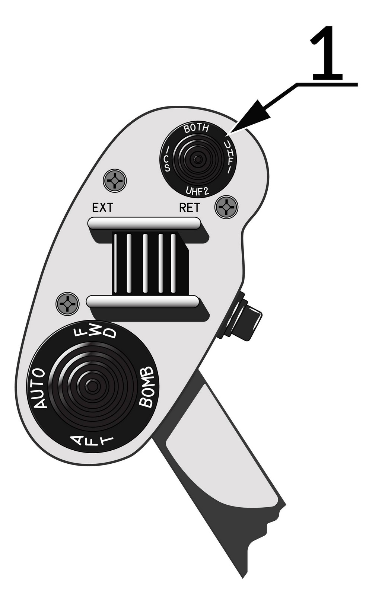

# ICS - 机内通话系统

ICS 提供机组成员之间的正常、备用或应急通信。ICS 还可以合并和放大从其他电子接收设备（ECM、响尾蛇音调、IFF/SIF、雷达高度表和无线电话音等）接收到的音频信号。
飞行员和 RIO 左侧控制台上有相同的 ICS 控制面板。
ICS 由四个放大器组成，每个驾驶舱中有两个放大器，ICS 在正常运行期间允许双工操作。
如果一个放大器失效，可以通过选择 ICS 控制面板上的 B/U（备用）或 EMER（紧急）档位来绕过故障放大器。选择备用和应急档位可使 ICS 继续运行。

> 💡 如果一个驾驶舱内的两个放大器同时失效, 那么将无法进行机内通话。

> 💡 通过选择在各自 ICS 控制面板上的 EMER 档位来使用另一机组成员的放大器，玩家可以收听通常仅在另一驾驶舱播放的音频 (如响尾蛇音调或 ALQ-126 PRF)，但玩家无法控制收听音频的音量。

外部机内通话器连接处位于前轮轮舱中。当飞行员 ICS 开关设置为 HOT MIC 时，地面人员可以与驾驶舱内进行通话。
在 DCS 中，通过激活 ICS PTT 时，在无线电通信菜单中选择地勤通信菜单来实现与地勤联系。

|  |  |
| ------------------------------------------------------------- | --------------------------------------------------- |

飞行员无线电台 ICS 按钮允许允许使用内话和电台工作模式。设置到 ICS 时，若国内选择开关选择 COLD MIC，那么系统将超控 UHF/VHF 通信。
在 BOTH 档位，将指令电台工作，但该功能在 DCS 无功能。UHF 1 档位将通过 ARC-159 电台传声，UHF 2 档位启动 ARC-182 电台进行传声。

VOL 控制旋钮用来控制该驾驶舱的内话音量。其他驾驶舱的音量不受影响。

放大器选择旋钮有三个档位：B/U –（备用）、NORM – （正常）和 EMER – （应急）。B/U 档位用于绕过失效的放大器并在该驾驶舱使用备用输出放大器。NORM 档位当所有放大器都正常工作时使用。
EMER 用于绕过失效放大器并使用另一驾驶舱的输入放大器。
无法使用 HOT MIC。注意当前驾驶舱放大器选择旋钮位于 EMER 档位时，飞行员将无法听到发动机失速/超温警告音和响尾蛇音调。

功能选择旋钮有多个档位来设置电台和内话音频。RADIO OVERRIDE 减小非关键无线电音量，以便在紧急情况下强化机内通话。
设置 HOT MIC 档位无需按键的机内通话，而 COLD MIC 需要飞行员按下内侧油门握把上的 ICS 开关或 RIO 踩下左侧脚踏板上的开关时，才进行机内通话。

如果 ICS 控制开关选择了 COLD MIC，RIO 可使用 ICS 按钮（左侧脚踏板）进行机内通话，同时将超控 UHF 通信。
RIO 的 MIC 开关（右侧脚踏板），允许使用 通信/TACAN 指令面板 中选择的 UHF 1 或 UHF 2 无线电台进行传输。注意 BOTH 档位在 DCS 中无功能。

> 💡 玩家在 DCS 中为两个 RIO 踏板绑定轴控制后，便可使用脚舵外设触发上述功能。
