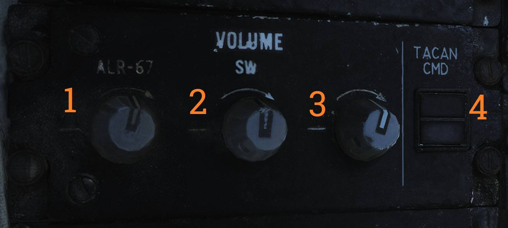
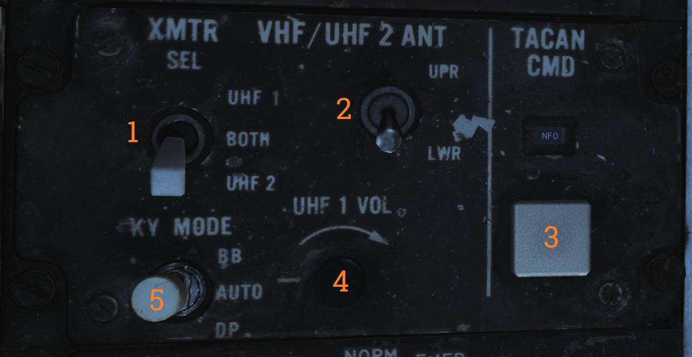

# 通信系统

## 天线

四个 VHF/UHF/L 波段刀状天线为 VHF/UHF 话音，UHF 数据链路，TACAN 和敌我识别系统/选择识别装置（APX-72）运行提供全方位覆盖。
TACAN 和 VHF/UHF 2 话音通信使用其中一组天线; UHF 1 话音通信，数据链路和 IFF 应答机使用另一组天线。
相关天线位置参阅总体布置图。IFF 问询器（APX-76）天线集成在 AWG-9 WCS 天线内。

每个单独的系统通过同轴开关和双工器（diplexer）连接到上部或下部天线的合适的部分。飞机没有自动作动功能，RIO 必须手动使用通信/TACAN 指令面板上的 V/UHF 2 ANT 开关选择上部或下部天线。
数据链路（DIL）天线同样需要手动选择。
数据链路所使用的上部或下部天线是通过 DATA LINK 控制面板中的 ANTENNA 开关来选择的。
UHF 1 话音通信 ARC-159 天线与 DIL 天线系统共用，并且 UHF 1 话音始终使用与 ANTENNA 开关选择相反的天线。

上部 V/UHF 2/TACAN 天线是座舱盖后龟甲上的第一根天线，下部天线嵌入左侧腹鳍的底部。一次只使用一个天线。
在天线之间自动切换可防止丢失 TACAN 信息。如果信号丢失或太弱而无法保持接收机信号接收，TACAN 会每隔6秒自动在两个天线之间切换以寻求更强的信号。

在此切换和搜索期间，记忆回路保持距离跟踪8到12秒、方位跟踪8秒。IFF 天线波瓣开关由 RIO 右侧控制台上的 IFF ANT 开关控制。AUTO 档位，波瓣开关使收发器在上部下部天线之间切换。
LWR（下部）档位，仅下部天线用来接收和传输信号。 上部天线略微向前倾斜; 下部天线略微向后倾斜。

> 💡 在现实生活中，通常需要选择 LWR 来改善地面站台的接收。 然而，由于 DCS 的限制，未对天线切换进行建模，因此无功能。
> 对于玩家来说，天线的使用是自动化的和/或忽略的。 所有电台和无线电通话功能通过 PTT 来控制。

## 飞行员音量 / TACAN 指令面板

飞行员左侧控制台上的音量 / TACAN 指令面板有三个音量控制旋钮，用于调节 ALR-67，响尾蛇（SW）和 V/UHF 2 的音量。

| 控制/指示器                   | 功能                                                        |
| ----------------------------- | ----------------------------------------------------------- |
| **ALR-67 音量控制**           | 用于控制飞行员头戴中 ALR-67 的音量。                        |
| **SW（响尾蛇）音量控制**      | 控制飞行员头戴内响尾蛇音调的音量。                          |
| **V/UHF 2 音量控制**          | 控制飞行员头戴中 V/UHF 2（AN/ARC-182） 无线电台的音频音量。 |
| **TACAN CMD 按钮开关/显示窗** | 用于指定或显示控制 TACAN 设备的机组人员。                   |

## RIO 通信/ TACAN 指令面板

允许 RIO 单独选择UHF 1（AN/ARC-159）或 V/UHF 2（AN/ARC-182），或是选择两个无线电台同时进行传输。

> 💡 BOTH 在 DCS 中无功能。

- V/UHF 2 ANT 开关允许选择使用上部或下部天线来尽可能减少两个无线电台或与数据链路之间的干扰。
  建议选用相反的天线、频率间隔大于55 MHz 或关闭其中一个无线电台。
  此外，RIO 可以在 DATA LINK 面板中选择 UHF 1 和 DIL 运行所使用的上部或下部天线。
- TACAN CMD 按钮用于在飞行员和 RIO 之间移交 TACAN 控制权。选择对 TACAN 进行控制时，拥有控制权的机组人员（飞行员或 RIO）的指示灯将会亮起。
- UHF 1 VOL 控制旋钮允许 RIO 调节头戴中 ARC 159 UHF 1 无线电台的音量。KY MODE 开关只在安装了 KY-58 时有效。

> 💡 Heatblur 所开发的 F-14 型号仅使用 KY-28。

| 控制/指示器                   | 功能                                                                                                                                                           |
| ----------------------------- | -------------------------------------------------------------------------------------------------------------------------------------------------------------- |
| **XMTR SEL 开关**             | 选择用于通信的 VHF/UHF 无线电台。
UHF 1 - 选择 ARC-159 UHF 1 无线电台。
V/UHF 2 - 选择 ARC-182 VHF/UHF 无线电台。
Both - 同时选择两台无线电。（在DCS中无功能） |
| **V/UHF 2 ANT 开关**          | UPR - 为 V/UHF 2 选择上部天线。 LWR - 为 V/UHF 2 选择下部天线。                                                                                                |
| **TACAN CMD 按钮开关/显示窗** | 用于指定或显示控制 TACAN 设备的成员。                                                                                                                          |
| **UHF 1 VOL 控制旋钮**        | 控制 RIO 头戴中的 UHF 1（AN/ARC-159）音频音量。                                                                                                                |
| **KY MODE 开关**              | KY-28 无功能。                                                                                                                                                 |

## UHF 1 和 V/UHF 2 中读取（保存）预设波道

1. MODE 选择- T/R 或 T/R&G。
2. 频率模式选择旋钮 - PRESET。
3. CHAN SEL 旋钮 - 选择所需的波道。
4. 频率模式选择旋钮 - READ。
5. 频率选择选择旋钮 - 调到所需的频率。
6. 频率模式选择旋钮 - LOAD（频率已存储到选择的波道中）。
7. 频率模式选择旋钮 - READ，确认频率显示。
8. 后续波道输入重复第二步至第七步。

## AN/ARC-159 和 AN/ARC-182 远程显示器

飞行员和 RIO 都拥有显示当前无线电频率或波道的的远程显示器。飞行员驾驶舱中的包含 UHF 1 及 V/UHF 2 的远程显示器，而 RIO 驾驶舱中只有 UHF 1 远程显示器。

|  |  |
| -------------------------------------------------------------------- | ------------------------------------------------------------------ |

| 控制/指示器                               | 功能                                                                                                                |
| ----------------------------------------- | ------------------------------------------------------------------------------------------------------------------- |
| **UHF 1 波道/频率远程显示器（飞行员）**   | 用于显示 UHF 1 无线电的频率或所选波道。 TEST - 启动显示器的测试，若无故障那么将显示888.888。 BRT - 控制显示亮度。   |
| **V/UHF 2 波道/频率远程显示器（飞行员）** | 用于显示 V/UHF 2 无线电的频率或所选波道。 TEST - 启动显示器的测试，若无故障那么将显示888.888。 BRT - 控制显示亮度。 |
| **UHF 1 波道/频率远程显示器（RIO）**      | 用于显示 UHF 1 无线电的频率或所选波道。 TEST - 启动显示器的测试，若无故障那么将显示888.888。 BRT - 控制显示亮度。   |
