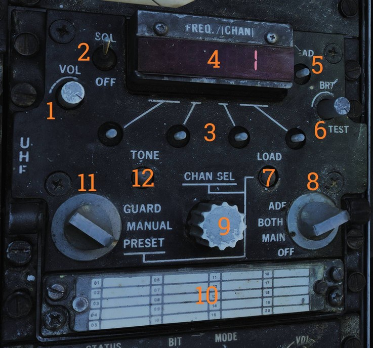

# AN/ARC-159（UHF 1）无线电台

UHF 1（ARC-159）无线电台提供空空和空面话音通信。UHF 1 无线电台的频率为 225.000 - 399.975 MHz。
该设备允许在20个预设波道上的任意一个或在救生频率（243.000 MHz）上以 AM 模式收发。救生频率可与其它任意已选频率同时守听。
ARC-159 通过手动调整 25-KHz拨动开关可能有7000个可用频率。ARC-159 为固态，自主装置，无线电输出的平均功率为10瓦。
所有用于无线电台操作的控制开关/旋钮位于无线电台前方的面板中。无线电台位于飞行员驾驶舱中左侧控制台上。

> 💡 注意：在模拟的 F-14 版本中 UHF 1 (ARC-159) 的 ADF 档位无功能；使用 V/UHF 2 ARC-182 的 DF 模式。

| 控制/指示器            | 功能                                                                                                                                                                                                                                                                                                                                                   |
| ---------------------- | ------------------------------------------------------------------------------------------------------------------------------------------------------------------------------------------------------------------------------------------------------------------------------------------------------------------------------------------------------ |
| **VOL 控制**           | 控制飞行员头戴中 UHF 1 的音量。                                                                                                                                                                                                                                                                                                                        |
| **SQL（静噪）开关**    | 开启或关闭无线电静噪（未收到载波时消除杂音）。                                                                                                                                                                                                                                                                                                         |
| **频率调谐开关**       | 当模式选择旋钮设置为 MANUAL 时使用四个频率调谐开关来调谐收发器。
左边的开关控制百位和十位数，从左往右第二位控制个位，右侧开关分别控制百分之一和千分之一。开关向前拨动频率增加，向后拨动则会减少。                                                                                                                                                       |
| **FREQ/(CHAN) 显示窗** | 模式选择旋钮位于 MANUAL 时显示频率，位于 PRESET 档位时显示 UHF 预设波道。                                                                                                                                                                                                                                                                              |
| **READ 开关**          | 拨动开关后显示窗将显示预设波道的频率。                                                                                                                                                                                                                                                                                                                 |
| **BRT/TEST 旋钮**      | 控制 FREQ/(CHAN) 显示窗的亮度。转到最大亮度来显示888.888测试。                                                                                                                                                                                                                                                                                         |
| **LOAD 按钮**          | 按下按钮将显示窗的频率保存至当前选择的预设波道。                                                                                                                                                                                                                                                                                                       |
| **功能选择旋钮**       | ADF – UHF 1 (ARC-159) 的 ADF 无功能；使用 V/UHF 2 ARC-182 的 DF 模式。
BOTH – 接通主无线电收发器和救生波道接收机。
MAIN – 主收发器已接通并且可以正常收发。用传声器按键通话开关选择传输和接收。
OFF – 关闭 UHF 1 无线电台。                                                                                                                         |
| **CHAN SEL 旋钮**      | 当模式选择旋钮设置为 PRESET 时，用来选择20个预设波道中的任意一个。                                                                                                                                                                                                                                                                                     |
| **频率表**             | 用来记录预设波道的频率。在 DCS 中，任务编辑器中预设的频率会自动显示在频率表中。                                                                                                                                                                                                                                                                        |
| **模式选择旋钮**       | GUARD – 接通主无线电收发器，并转到救生频率243.0 MHz进行传输和接收。在这个档位，预设与手动选择频率将不可用。
MANUAL – 频率拨动开关用来将主收发器调谐至频率范围内的任一频率（7000个可用）。所选的频率将显示在显示窗中。在这个档位，PRESET 选择不可用。 
PRESET – 使用 CHAN SEL 旋钮将收发器调谐至20个预设波道中的任一波道。显示窗将会显示已选的波道。 |
| **TONE 按钮**          | 按住按钮将会在当前无线电频率或波道上发送一个单音（频率为 1020 Hz）。                                                                                                                                                                                                                                                                                   |

> 💡 UHF 通信会干扰 D/L，这可能导致 TILT 告警灯亮起、自动驾驶中 ACL 或 VEC/PCD 模式断开。
> 数据链路对 UHF 的干扰则可能导致在 D/L 回复信息时听见啁啾声。注意：
> 尽管DCS中未实现切换天线，但仍然建议使用频率的间隔大于55MHz，必要时关闭 UHF 1或 V/UHF 2无线电台中的一个，以免互相干扰。

> 💡 UHF 1和 V/UHF 2 无线电台在同频率下工作传输时可能导致出现干扰哨声。有此反馈是正常情况，这是由于两个无线电台过于接近且工作在同一频率，RF 互相干扰引起的。
