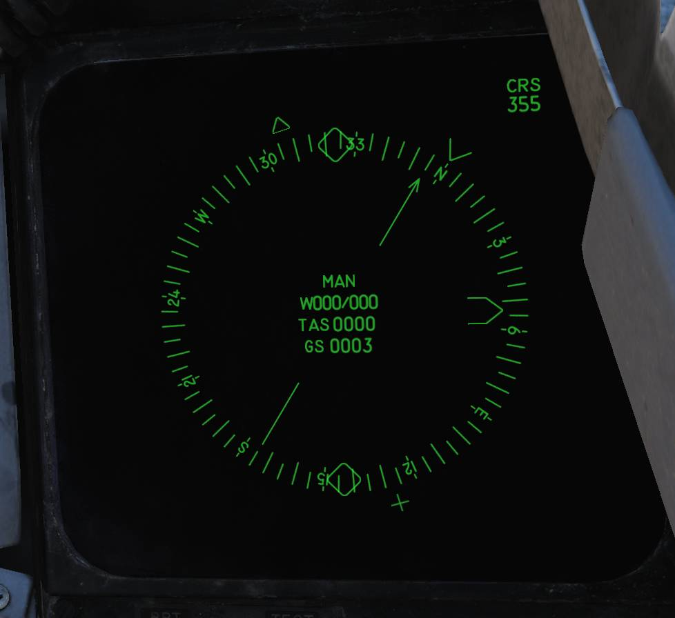
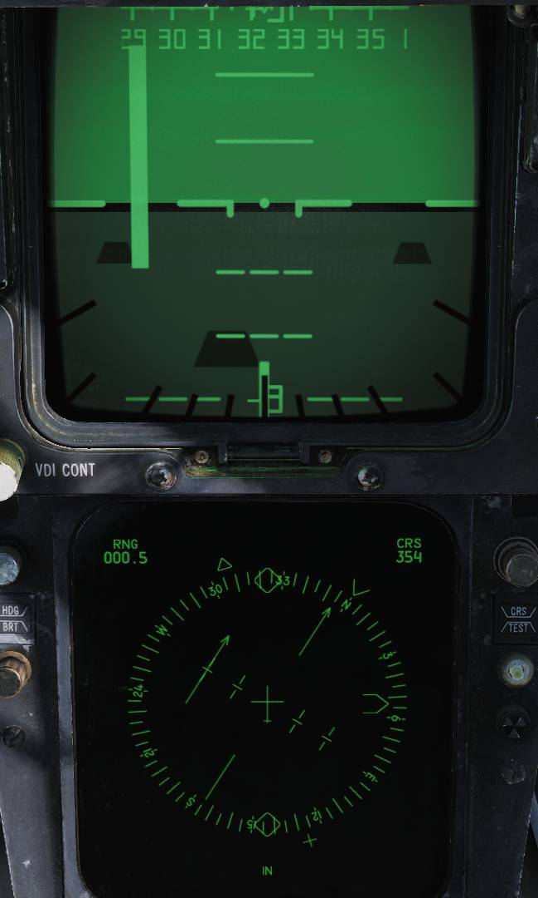

# 导航系统

## WCS 计算机

WCS 或称为武器控制系统计算机和 CSDC 使用存储在磁带上的数个对准子程序来执行必要的计算来进行 INS 对准。

这些存储好的对准子程序在 WCS 计算机中被称为 SMAL 单模式对准（Single Mode Alignment）程序。对准开始后，子程序将从磁带中被加载到计算机的破坏性读出存储器中。

该流程被称为“磁带读入”，由 TID 中的 “M” 表示。在 IMU 平台对准过程中，WCS 将与 CSDC 进行通信以处理特定的 CSDC 导航子程序。

## IMU 平台对准

当选择对准模式后，IMU 平台首先使用加速度计输出来竖立至粗对准位置，并将给出一个代表飞机航向的自真北的角位移。该角位移被称为漂移角。
CSDC 将在对准过程中向 WCS 发送惯性速度数据。

第二阶段——精对准——使用陀螺仪漂移的精确测量值来计算飞机的真航向。由于地球的自转，这是可能的。对准不会使用磁航向，并且整个过程仅依赖于测量 3D 空间内平台的非惯性运动。

WCS 计算用于平台对准的项目和估算漂移角的值，然后将该数据发送到 CSDC。CSDC 在 CSDC 惯性方程中使用这些校正项来生成平台施矩的脉冲，然后传输至 IMU 。
反过来，CSDC 从 IMU 接收速度信息并将新的惯性速度数据发送到 WCS 对准进程，然后重复此循环。数据交换直到进入 INS 模式。

平台调平过程是由 CSDC 根据从 CSDC 发送到 IMU 的 IMU 加速度计非水平指示（off-level indications）生成的脉冲施矩来完成的。
在每次数据交换时，WCS 会计算先前和当前漂移角之间的误差值（Δ）。该误差值在对准开始时最大，在对准结束时最小。

当 Δ 接近零并且沿平台 X、Y 轴测得的速度接近零时，对准完成。平台对准所需的变量因素将连续计算、更新并保存为校正数据。
对准完成后，系统即可进入 INS 模式。
最后使用的校正数据和漂移角在进入 INS 模式时存储在 CSDC 中。当处于 INS 模式中，WCS 将接受来自 CSDC 的速度、位置数据以及漂移角。

## 导航模式

有三种导航数据模式源可用于通用导航：

1. **INS** - IMU 对准完成后，由 RIO 设置的主要导航模式。 IMU 是提供速度数据的主要传感器，用于计算所有惯性输出。此模式中 IMU 为俯仰和横滚数据的数据源。
2. **IMU/AM** - 可以由 RIO 选择或在 CSDC 认为 IMU 惯性速度数据不可靠时自动进入的备用模式。在此模式中，来自 CADC 的真空速和输入或存储的风速/风向组合起来提供给通用导航所需的地速和真航向。
此模式中 IMU 为俯仰和横滚数据的数据源。
3. **AHRS/AM** - 一种更进一步的降级模式，可以由 RIO 选择，或在 CSDC 检测到 INS 完全失效时自动进入。在此模式下，航向是从磁航向加减上输入或存储的磁差（MAG VAR）得出的。
前述的航向，CADC 的 TAS（真空速），以及输入或存储的风速/风向都用于通用导航。此模式中 AHRS 是俯仰和横滚数据的数据源。

## 导航计算

CSDC 和 WCS 都能够读出当前所选的导航模式。CSDC 向 WCS 发送支持通用导航计算所需的导航数据参数（来自 CADC 的真空速，经纬度，惯性速度，真航向等）。
WCS 使用存储和输入的导航数据（基于当前导航模式）来执行所需的导航计算。 WCS 还执行额外的计算，以便为机组提供：

- 当前经纬度
- 姿态
- 真航向和磁航向
- 本机的地速和地面航迹
- 存储和显示三个导航点，固定点（FP）、起始点（IP）、地面/水面目标（ST）、基地（HB）、防御点和敌对区域的能力
- 距离，方位，指令航线，指令航向和到所选目标的剩余时间
- 计算出的风速和风向
- 计算出的磁差
- 连续监测设备状态，并在发生故障时通过提示灯和在 TID 上显示失效部件对应的的缩写来通知机组的能力
- 部分系统失效后的备用导航模式
- 备份当前位置

## 显示

导航信息可以显示在 TID、HSD、多功能显示指示器（MDI）、HUD 和 VDI 中，具体取决于飞行员和 RIO 选择的模式。
如果发生 IMU 或导航计算机发生故障，则可使用两种备用模式：IMU 大气数据（IMU/AM）或 AHRS 大气数据（AHRS/AM）。

### 导航控制

使用导航控制、数据读数面板和计算机位址面板来控制 INS。详见 战术信息显示器（TID）与相关控制开关/按钮 、相关控制和 计算机位址面板（CAP） 。

所需运行模式、对准模式和目标点都可以在导航控制与数据读数面板（译注：TID 屏幕的边框）进行选择。
CAP 可以用来输入导航数据并将所选的信息显示在 TID 中。CAP 下方的 CATEGORY 旋钮的档位决定 MESSAGE 按钮的功能。
用于导航的类为 NAV 和 TAC DATA。导航控制与数据读数面板中的 STBY/READY 提示灯指示对准程序和导航系统的状态。

导航系统主要部件的故障指示灯位于两个驾驶舱内的注意-提示面板上，但是 NAV COMP 和 IMU 提示灯仅在 RIO 驾驶舱中的注意-提示面板上显示。

飞行员显示器控制面板或多功能显示指示器控制面板来控制飞行员的显示器（HUD、VDI 和 HSD）和 RIO 的多功能显示指示器。

> 💡 CAP 操作详见 计算机位址面板（CAP）。

#### 导航类

如果 CATEGORY 旋钮位于 NAV 类，那么 MESSAGE 显示窗会显示以下信息：

|                          |                       |
| ------------------------ | --------------------- |
| OWN A/C              | TACAN FIX         |
| STORED HDG ALIGN | RDR FIX           |
|                          | VIS FIX           |
| WIND SPD HDG         | FIX ENABLE        |
|                          | MAG VAR (HDG) |

每个窗口都有其对应的按钮。按下按钮后会告知 WCS 计算机使用滚筒上的哪一个功能。如果按下 OWN A/C，WIND 或 MAG VAR 的话，那么数据可以输入或将其显示出来。

TID 屏幕中显示了本机空速和磁航向。如果使用 TID 光标选中本机数据文件，显示航向将为磁航向。
如果通过 CAP 选择（选中） OWN A/C 按钮，那么 RIO 可以按下相应的前缀按钮将本机真航向、航速（地速）、高度或航线显示在 TID 中，例如：

1. 按下 LAT 或 LONG 按钮将显示本机经纬度。
2. 按下 SPD 按钮显示地速和磁航线。
3. 按下 HDG 前缀按钮后显示 真空速与真航向。
4. 按下 ALT 按钮后 姿态将显示在左侧 TID 读数中（右侧为空白）。
5. 按下 WIND 按钮后，TID 显示当前风速（左侧读数）以及磁方位（右侧读数）。
6. 按下 MAG VAR 按钮用于显示和输入磁差（MAG VAR）。

按下相应的前缀按钮并输入所需的值来改变本机经纬度、真航向或高度。数据会在输入期间显示在 TID 中上部的读数中（缓冲寄存器）。
同时，现有的数据将显示在缓冲寄存器下方的左右侧读数中。如果数据无误，RIO 可以按下 ENTER 按钮，接着新的数值将会显示在读数中。

按下 WIND 按钮来改变风向风速数据，然后按下 SPD 和 HDG 前缀按钮以及相应的数字：速度的单位为节（0 至 512）或磁方向的度数（000 至 359）。
多功能显示指示器的 WIND 方向数据读数始终为真航向。

> 💡 在 INS 模式下，风向风速是持续计算和更新的。即使系统接受数值输入，风向风速计算也不会采用手动输入的数据。

按下 MAG VAR 按钮后，左侧读数会交替显示 计算出的 MAG VAR（vC）和 手动输入的 MAG VAR（vM），右侧读数会显示 磁航向（MH）。这两个值每2秒交替显示一次。
CAP 中的 符号/方向按钮，加号（+）为向东偏移，减号（-）为向西偏移。

按下 MAG VAR 按钮来手动输入 MAG VAR。按下 HDG，然后按下 E 或 W，接着输入偏移的角度，角度的精度为 0.1 度，然后按下 ENTER 。即使想输入的值为0，也需要输入十分之一度（译注：0.0）。
TID 显示的内容（包括 NAV GRID）会适当移动。计算出的磁差是通过将 IMU 的真航向 与 AHRS 的磁航向进行比较，在 AWG-9 中不断计算得出的。这个差值将会保存为 计算出的 MAG VAR。
下表列出了使用 MAG VAR 源的计算机显示和 CAP 输入。

AWG-9 计算机将对比计算出的 MAG VAR 和 手动输入的 MAG VAR。两者相差超过一定值，那么 TID 和 HSD 中导航系统模式缩写 IN 或 IM 和缩写 MV 将会交替显示。
当差值在 5° 以下时缩写消失。

| 条件                                             | MAG VAR 源                          |
| ------------------------------------------------ | ----------------------------------- |
| 已选择 COMP 模式。                               | 手动输入的 MAG VAR (vM)。           |
| 选择 AHRS 后，RIO 更新 手动输入的 MAG VAR。      | 手动输入的 MAG VAR (vM)。           |
| IMU 或 AHRS 故障后 RIO 更新 手动输入的 MAG VAR。 | 手动输入的 MAG VAR (vM)。           |
| 其它情况。                                       | 当前或最后的计算出的 MAG VAR (vC)。 |

如果选择了 AHRS/AM，且没有更新磁差（或重新输入了相同的值），则会使用最新的 vC。

> 💡 当在磁干扰附近时使用 SLAVED 或 COMP 工作模式，例如在航母上，应该会出现缩写 MV。

下表列出了飞行中显示缩写 MV 的误差源分析和应对方法。

| 步骤 | 条件                                                       | 操作                                                                                   | 结果                                                                                                                                                   |
| ---- | ---------------------------------------------------------- | -------------------------------------------------------------------------------------- | ------------------------------------------------------------------------------------------------------------------------------------------------------ |
| 1    | TID 中缩写 MV 与选择的导航模式交替显示，没有故障灯会亮起。 | 重新输入最新正确的 MAG VAR。                                                           | 缩写 MV 应该消失。                                                                                                                                     |
| 2    | 缩写 MV 在执行第一步后仍然显示。                           | 在 INS、IMU/AM 或 SLAVED COMPASS 模式下和水平匀速飞行时，对比 VDIG 与 备用罗盘的航向。 | 如果航向相同，那么问题可能出在 IMU。继续第三步。                                                                                                       |
| 3    | IMU 疑似为 vC 的误差源。                                   | 飞行员将模式选择开关转至 COMP 模式并重新对比航向。                                     | 如果航向仍然相同，则代表 IMU 输出的航向是错误的。                                                                                                      |
| 4    | IMU 输出航向为错误的。                                     | RIO 选择 AHRS/AM 并输入正确的 MAG VAR。                                                | 缩写 MV 应该消失。                                                                                                                                     |
| 5    | 第二步中 VDIG 与 备用罗盘航向不一致。                      | 按下 HDG 旋钮/按钮 来同步 AHRS。
如果不行则把 AHRS 设置为 COMP 模式。                   | 如果切换至 COMP 模式，所有计算机和显示器都将使用 IMU 真航向以及手动输入的 MAG VAR。
缩写 MV 可能不会消失并且使用 MAD 的 BDHI 根据故障可能会变得不准确。 |

#### 战术数据类

如果 CATEGORY 旋钮位于 TAC DATA 类，那么 MESSAGE 显示窗将显示以下内容：

|                  |                  |
| ---------------- | ---------------- |
| WAY PT 1 | HOME BASE    |
| WAY PT 2 | DEF PT       |
| WAY PT 3 | HOST AREA    |
| FIX PT       | SURF TGT     |
| IP               | PT TO PT |

除了 PT TO PT FUNCTION 外，这个类中的各个功能都有相应的 TID 符号。
按下任意 MESSAGE 按钮，TID 符号高亮并且激活的 MESSAGE 按钮也会亮起，来表示成功选中。之后 RIO 就可以使用需要选中来使用的功能。
按下相应的前缀按钮可以在 TID 中显示选中点的对应所选前缀的数据。另外，可以通过按下 LAT、LONG 或 ALT 前缀数字按钮来输入选中点的所需的经纬度和高度数值。
和之前一样，现有的数据会在缓冲寄存器下方的左右侧读数种显示。如果新数据无误，RIO 可以按下 ENTER 键输入，新的值将显示在左右侧读数中。

### 导航注意灯

除了上面提到的 NAV COMP、AHRS 和 IMU 提示灯外，RIO 注意/提示灯面板还包含两个与导航系统运行有关的提示灯——C&D HOT 和 AWG-9 COND。
这两个中任意一个亮起都可能意味着导航降级运行，并且需要对 WCS 做进一步的调查。

## 雷达高度计系统（AN/APN-194）

雷达高度计为测量飞机下方地面/水面或地形间距的低空（0到5000英尺）、脉冲、测距雷达。雷达高度计通过从发射天线发射到地球表面的短 RF 脉宽以及测量 RF 能量返回接收天线的时间来获取高度信息。
高度以英尺 AGL 为单位连续的显示在仪表中以供飞行员查看。
如果在 PDCP 中选择了 LDG 或 T.O. 模式，那么雷达高度将会显示在 HUD 中（显示范围为 0到1400英尺）。

雷达高度计有两种运行模式。在搜索模式中，系统将连续检查距离增量，直到在高度区间内搜索到返回信号。当探测到返回信号时，系统将切换至跟踪模式并且跟踪返回的信号以便提供不间断的高度信息。

如果离开跟踪模式，那么雷达高度计将会显示 OFF 警示旗并且指针会隐藏在遮盖下方。高度计停止工作直到接收到返回信号，在接收到信号后高度表将重新显示离地高度。
系统可靠的运行高度区间为0到5000英尺，这使得位于低空时高度控制更精确。除非反射的信号太弱，否则系统可以在 45° 坡度以及俯仰角内正常运行。

雷达高度计系统包括高度指示器（高度表）、指示器中的状态灯、低高度警告音、前舱下方的雷达收发器、位于机身蒙皮上 TCS 两侧的两根天线（发射和接收）。
在下降高度过程中，如果飞机越过设定的警报高度时，机组将会听到警告音。当飞机低于这个高度，位于雷达高度表中的低高度告警灯将会保持亮起。

> 💡 如果雷达高度不可靠，则仅显示 OFF 警示旗。

雷达高度计有3分钟最短预热时间。在预热期间，应忽略故障指示和错误读数。

### 雷达高度表

雷达高度计系统唯一的控制开关/按钮位于飞行员仪表板中的 :ref:`RADALT` 处。
雷达高度表通过一个单转刻度盘来显示离地球表面高度，刻度显示标定为0-5000英尺，并且高度越低刻度划分越精细，以便飞机在低空飞行时提供更精确的读数。
高度表左下方的旋钮为集电源开关、自检开关和低高度限制游标控制为一体的控制旋钮。

### 高度表自检

按住控制旋钮来接通自检回路，按下后绿色自检灯将亮起，此时高度表的读数在 100 ± 10英尺，并且 HUD 中的高度标尺应显示在100英尺左右。
如果高度指针低于低高度限制游标，那么将会触发音频和视觉警告。只需再次松开控制旋钮即可恢复正常运行。

### 低高度警告音频

低高度警告音为 1000 Hz 的单音，调制为每秒脉冲数为二，持续3秒的警告音。当飞机下降到低高度限制游标下时，两名机组成员都将会听到这个单音。

## 导航系统集成

### 导航系统导航模式

F-14 拥有3种导航模式:

1. **惯性导航模式 (INS)**

   - 由 INS 使用 IMU（和 PSU）以及 CSDC 来实现。
   - INS 向机组乘员提供本机位置、速度、姿态以及航向信息。

2. **惯性测量装置/大气数据(IMU/AM)**

   - 用作备用导航模式，且进入此模式后，INS 平台航向对准精度会永久降级。

3. **AHRS/大气数据(AHRS/AM)**
   - 此模式使用 AHRS 姿态和航向信息从而代替使用 IMU，并且也是用作 INS 模式和 IMU/AM 模式都失效时的额外备用模式。

### 惯性导航模式

- 应在执行对准后进入 INS 模式。
- READY 提示灯在 GND 和 CVA 对准模式亮起，并且如果位于 CAT 对准模式，在弹射后也将保持亮起，则表示对准已完成。
- 如果选择了 INS 模式的话，那么 STBY 和 READY 提示灯都将会熄灭。
  但是，如果在插入符变成菱形符号前选择了 INS 模式，那么 STBY 和 READY 提示灯将亮起并且系统将恢复到 IMU/AM 备用模式。

#### 在 INS 模式中，IMU 和 CSDC 提供以下输出

- 飞机经纬度
- 飞机磁航向或真航向（取决于 CAP 中选择的前缀按钮）
- 系统高度（阻尼气压惯性高度）
- 平台漂移角
- 速度分量 (x, y, z)
- 垂直加速度
- 飞机磁航向来源于 AHRS。如果 AHRS 失效，磁航向将由真航向加减去 MAG VAR 得出。
- TID 中可显示的可用读数为经纬度、地速、地面航迹、真空速、风向风速、MAG VAR、高度、飞机真航向或磁航向。
- WCS 计算机在真北坐标系中计算转向并使用从 AHRS 输入的磁航向来更新数值。
- 风向风速由计算惯性速度和大气数据速度之间的差得出。
- WCS 和 CSDC 同时还提供显示机组乘员所需的转向与提示功能。
- 可用的目标或导航点为航路点（1、2、3）、固定点、基地、地面/水面目标和起始点，这些目标/导航点都可以使用 TID 中的 DEST 旋钮来进行指定。
- RIO 可以使用 CAP 或 线缆、RF 数据链路的数据链路信息（位于甲板上时）输入导航点（经纬度）。
- 设置的航线（航向和选择的导航点）、距离、方位以及到点剩余时间都是根据大圆计算得出的。

> 💡 如果 INS 失效，那么 RIO 应验证计算出的 MAG VAR 和 WIND 数据，并按需通过手动输入来更新数据。

### IMU/AM 导航模式

- 如果 CSDC 中的导航计算机部分失效或是探测到 IMU 某个故障，那么将会自动进入 IMU/AM 模式。
- 故障指示由 STBY 和 READY 提示灯亮起以及 RIO 注意-提示面板中的 NAV COMP 提示灯指示。
- TID 和 HSD 中的缩写 IN 变换为 IM 表示已切换至 IMU/AM 模式。RIO 应使用 NAV MODE 旋钮选择 IMU/AM 模式来使 STBY 和 READY 提示灯熄灭。
- 可以通过 NAV MODE 旋钮选择 IMU/AM 手动进入 IMU/AM 模式。
- 如果在选择 IMU/AM 模式前旋钮转至 OFF 档位，那么计算机大约在3到5分钟内无法进入 IMU/AM 模式。在关闭后为了让 IMU 调平，这是必要的。在这3到5分钟的时间内，飞机必须在地面保持静止或水平匀速飞行。
- 在 IMU 调平前，计算机将会使用 AHRS/AM 模式。如果 IMU 调平完毕（即，粗对准完成），那么选择 IMU/AM 模式后将会立刻进入该模式。

> 💡 如果 RIO 在对准进度超过粗对准时并且无 NAV COMP 故障选择了 IMU/AM，那么 READY 提示灯将会闪烁，
> READY 提示灯闪烁表示如果未在5秒内返回 INS 模式的话，在没有完成新的对准前无法重新进入 INS 模式。

- WCS 计算机在 IMU/AM 模式中使用 IMU 的航向信息与 CADC 的真空速执行航位推算导航。
  在备用模式中执行的通用导航功能与 INS 模式中的相同。但由于可用的速度与航向信息不佳，所以计算机输出精度会降低。
- 风向风速可从 INS 模式中最后计算出的风向风速或通过手动输入的风向风速数据来获取。IMU 航向同样以最后计算出的 INS 航向或通过 CAP 手动输入的真航向为基准。

> 💡 在进入 IMU/AM 模式后，检查风向风速和 MAG VAR 数值。如果出现缩写 MV，输入本机真航向。如果风向风速错误，手动更新。

#### IMU 复位流程

1. NAV MODE 旋钮 - OFF，等待几秒。
2. NAV MODE 旋钮 - IMU。
3. 水平直线飞行5分钟。
4. 核实缩写 IM。

### AHRS/大气数据模式

- AHRS/AM 为另一种备用导航模式。它通过导航计算机数值或 RIO 手动输入数据来获取飞机最后已知位置并使用。
- 使用 NAV MODE 旋钮切换至 AHRS/AM 档位或当 IMU 失效时自动进入 AHRS/AM。
  STBY 和 READY 提示灯和 IMU 提示灯亮起表示 IMU 故障。此外，TID 中的导航系统状态缩写将改变为 AH。

> 🟡 警告: 当导航系统处于 IMU/AM 模式时，即使 IMU 量化器故障和 NAV COMP 提示灯亮起，IMU 失效时系统也不会自动切换至 AHRS/AM 模式。
> 因为 VDIG/TID/DDD 正在显示无效的 IMU 姿态，所以 RIO 应将 NAV MODE 旋钮转至 AHRS/AM 模式。

> 💡 尽管当 IMU 失效时导航模式自动切换至 AHRS，STBY 和 READY 提示灯也会保持亮起直到 RIO 使用 NAV MODE 旋钮选择了 AHRS/AM 模式。

- 使用 NAV MODE 旋钮选择 AHRS/AM 模式后，AHRS 将代替 IMU 平台提供 DR（航位推算）导航所需的航向信息，
  和在 IMU/AM 模式下一样，CSDC 将提供气压高度、垂直速率和真空速 。
- 使用 CAP 来更新风向风速以及磁差。

AHRS 可以使用罗盘控制面板来选择三个模式中任意一个子航向模式来运行：

- **SLAVED** - 磁北为基准（磁通量），航向陀螺隶属磁通量，可靠的磁航向基准可用时使用。
- **DG** - 自由陀螺仪， 补偿由于地球而产生的漂移（极地行动），磁北基准不可靠时使用。
- **COMP** - 直接磁北航向基准（磁通量），无阻尼陀螺。在此模式中 HUD、VDI、HSD 和 多功能显示指示器自动使用 手动输入的磁差（vM）。
- RIO 可以从 INS 或 IMU/AM 模式切换至 AHRS/AM 模式进行比较，不必担心精度降低，因为 AHRS 是一套独立的系统。
- 由于在 INS 和 IMU/AM 模式中都使用 IMU，所以无法做到相同精度，且会导致 IMU 精度永久降低。
- 在 IMU 失效的情况下，即使导航控制与数据读数面板中的 NAV MODE 旋钮处于 INS 档位，
  只要 WCS 计算机接收到从 AHRS 发送的航向和从 CADC 发送的空速，导航计算机就将会自动以 AHRS/AM 模式运行。

> 💡 如果使用 AHRS/AM 模式起飞，则必须通过 CAP 手动输入 MAG VAR 和 WIND 来进行正确的导航计算。

- 当平台已对准并且选择了 AHRS/AM 导航模式，SYBT 提示灯熄灭，但 READY 保持亮起，这表示可按需选择惯导模式。
  用于显示的功能和输出的计算与 INS 模式中一样，只是由于一些计算中使用了不同的输入，可能会出现导航性能降低。

### 转向

这里有两种基本的转向类型：导航和攻击。攻击转向模式将会在“武器系统和武器使用总览”中介绍。

- 导航转向是在大圆航线/等角航线至地球表面上的固定点或用作为所选航线/航向的偏差上进行计算。通常来说，大圆计算用于长距离，等角航线用于短距离（距离接近大圆航线时使用）。
- 用于转向的点可以为 RIO 选择的目标（三个航路点、固定点、起始点、地面/水面目标、基地），TACAN 台，ADF 信息，ACLS 信息 或 数据链路航路点。

### 飞行模式和转向子模式

飞行员可以在飞行员显示器控制面板中选择五个中任意一个 VDIG 显示信息（HUD 模式）。这五个飞行模式选择开关为垂直排列，互斥的旋钮：

- 起飞（T.O.）
- 巡航（CRUISE）
- 空对空（A/A）
- 空对地（A/G）
- 降落（LDG）

> 💡 打开 ACM 保护盖将超控除了 T.O. 和 LDG 模式外的所有模式。

- 除了 VDIG 显示外，选择的飞行模式还会控制 AFCS，武器以及 WCS 逻辑。除了高度和垂直速率指示等基本数据外，VDIG 信息同时还提供转向提示。

在各个飞行模式中，飞行员可以选择以下五个中任意一个转向指令：

- TACAN (TACAN)
- 目标（DEST）
- AWL/PCD
- 引导航向（VEC）
- 手动（MAN）
- 五个模式选择开关横向排列在 PDCP 底部。这些转向模式决定了飞行员 HSD 和 RIO 多功能显示指示器的显示信息。
- 在垂直面板中，HSD 和 多功能显示指示器显示转向至所选点。
- 当飞行员将 HSD MODE 开关拨至 NAV 档位时，HSD 将显示五个子模式中所选子模式的信息。
- RIO 同样可以通过将他的多功能显示指示器控制面板中的 MODE 开关拨至 NAV 档位来显示信息。
  同样，当选择 LDG 时，飞行员可以通过 PDCP 中的开关选择单独在 HUD 和 VDI 中显示 ICLS 或 ACL 信息。
  HUD 选择 ICLS（SPN-41/ARA-63），VDI 选择 D/L 为常见做法。

武器系统和武器使用总览章节详细讲述了 A/A（空对空）和 A/G（空对地）模式。

> 💡 导航控制与数据读数面板中的 STEERING 指示器为 RIO 提供了读数来告知 RIO ，飞行员所选的转向子模式。

### 起飞转向

- 在显示器控制面板按下 T.O. 按钮进进入起飞转向模式。VDIG 将会在左侧显示垂直速率指示，HUD 右侧将显示高度标尺。
- 起飞前，飞行员根据已知的航向参考来检查 HUD 和 VDI 顶部的磁航向（即 跑道朝向和航母上最重要的 BRC，这是因为航母本身磁畸变很大）。垂直速率表应该用于验证飞机在起飞后建立正爬升率。
- 起飞后，导航计算机正常计算转向所需的风向风速和磁差。在备用模式中，WCS 使用最后计算出的或 RIO 手动输入的风向风速和磁差。

#### 起飞-TACAN 转向

- 无论是在起飞、巡航或降落中，TACAN 转向子模式功能都相同——为飞行员提供 TACAN 偏差。
- 飞行员可以通过 HSD 上的 CRS 旋钮来设置航线或 TACAN 径向线。HUD、VDI、HSD 和 多功能显示指示器都可显示 TACAN。
HSD 和 ECMD 显示 TACAN 距离和所选 TACAN 台的相对方位。
- 在 PDCP 中按下 TACAN 按钮来进入 TACAN 子模式。选择了 TACAN 航线后，HUD 和 VDI 将显示 TACAN 偏差符号、TO - FROM 符号。
TACAN 偏差符号表示航线是朝向还是远离 TACAN 台。
- HSD 和 多功能显示指示器中，偏差指针上的箭头指向与 TACAN 航线方向相同，这表示航线朝向塔康台，相反的，如果指针指向反方向则表示航线远离塔康台。
在 HUD 中，虚线表示 FRPM，实线则表示 TO。在 VDI 中，黑线表示 FROM，高亮线表示 TO。
- HUD 中，视场中偏差符号移动3°（线性）则所选 TACAN 径向线对应移动6°。这些限制可防止符号离开视场或干扰到左右侧的标尺。在 VDI 中，偏差符号按比例移动，移动 1.5 英寸（线性）为6°偏差。

#### 起飞 手动 转向

- 手动转向模式类似于起飞模式。按下 MAN 按钮来进入此模式，并使用 HSD 上的 CRS 旋钮来选择所需的航线。之后，VDI 中将显示导航系统的指令航向（在磁航向标尺下方的小菱形）。

### 巡航转向

- 按下 PDCP 中的 CRUISE 按钮来进入巡航模式。巡航中有四种转向子模式可用：TACAN、目标、手动 和 引导航向。
虽然说可在显示器控制面板按下 AWL/PCD 转向按钮，但是在巡航模式中这个子模式是无功能的。

> 💡 如果在 CRUISE 模式中选择了 AWL/PCD，那么它将会禁止显示其它转向提示。

#### 巡航 TACAN 转向

- 这个子模式和 TACAN 转向模式功能相同——为机组提供与 起飞-TACAN-转向 同样的读数和显示。

#### 巡航 目标 转向

- 在 PDCP 中按下 DEST 按钮来进入 巡航 目标 转向模式。
- 这将在 VDI 和 HSD 中显示到 RIO 所选航路点的指令航向符号，航路点由 RIO 在 导航控制与数据读数面板中选择。
- RIO 可通过选中 TID 中的点并输入新数据来改变目标的经纬度。

> 💡 通过 RIO 使用 TID DEST 旋钮选择 MAN 档位来转向至防御点。此选项在 TARPS 中不可用。

- 在目标转向子模式中，目标由 RIO 来选择，并且目标将在 HSD 的底部正中间与 NAV MODE 正在使用的导航模式交替显示。

 _选择 手动转向模式 时，ECMD 显示巡航导航。_

 _选择 TACAN 转向时，VDI 和 HSD 显示巡航导航。_

 _选择航路点1为目标时，HSD 显示巡航导航。_

### 降落转向模式

- 在 PDCP 中按下 LDG 按钮来进入降落转向模式。
- 通常在盘旋等待航线的某处接通 LDG 模式。在触地复飞、复飞以及脱钩时，飞行员可以在 PDCP 中按下 T.O. 按钮来接通起飞转向模式。
- 降落模式符号通常与起飞模式符号相同。例如 HUD 中额外的迎角误差符号（括号-E，显示飞机机翼的指向而不是速度矢量）和速度矢量符号，以及 VDI 中俯仰梯度抬高5°。

> 💡 降落模式中所有子模式下，当接收到 D/L 复飞消息时，VDIG 将显示脱离符号。

- 降落模式中有三个可用转向子模式: TACAN、VEC 和 AWL/PCD。
- LDG 模式中选择 TACAN 或 VEC，HUD、VDI 以及 HSD 和 CRUISE 模式中的显示大致相同，除开 LDG 模式下 HUD 显示还包括了速度矢量符号、雷达高度符号以及垂直速率指示符。

#### AWL 转向

位于盘旋等待区时 ARA-63 有可用的 ICLS 信息，那么飞行员可以选择 AWL/PCD 子模式。应将显示器控制面板中 HUD 和 VDI 的 AWL 开关拨至 ILS 档位。

然后 HUD 和 VDI 将提由 ICLS 驱动的供垂直（航向道）、横向（下滑道）精确航线矢量符号（交叉十字）。
在 HUD 中，精确航线矢量的偏转不会超过2°。同样在 VDI 中偏转不超过1.5°。
在 LDG 模式中 AWL/PCD 子模式下，如果 PDCP 中 HSD 设置为 NAV 档位，那么将会额外显示 TACAN 信息。

在截获窗口中（下滑道），飞行员可以继续让 ILS 显示，或者，如果 SPN-42 数据链路的 ACL 信息可用，他可以使用 AWL 开关选择 ACL 来单独显示在 VDI 或 HUD 中或两者都显示。
ACL 显示使用和 ICLS 同样的精确航线矢量符，但是这些符号改为由 SPN-42 数据链路驱动。
在着舰的第五边时，常见的显示组合为 HUD 显示 ILS，VDI 显示 ACL。如果有效的 ACL 数据可用，可以通过 AFCS 控制面板中的 VEC/PCD/ACL 开关选择 ACL 来接通 AFCS。

 _TACAN 设置为目标源，HUD 显示为降落模式。_

 _AWL/PCD 设置为目标源，HUD 显示为降落模式，ACL 为显示精确航线矢量符。_

 _AWL/PCD 设置为目标源，VDI 显示为降落模式，ILS（ICLS）为显示精确航线矢量符。_
