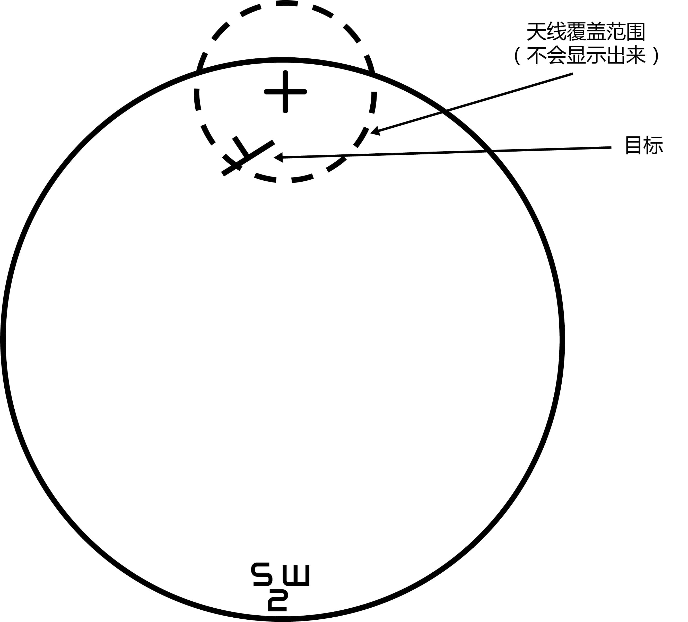
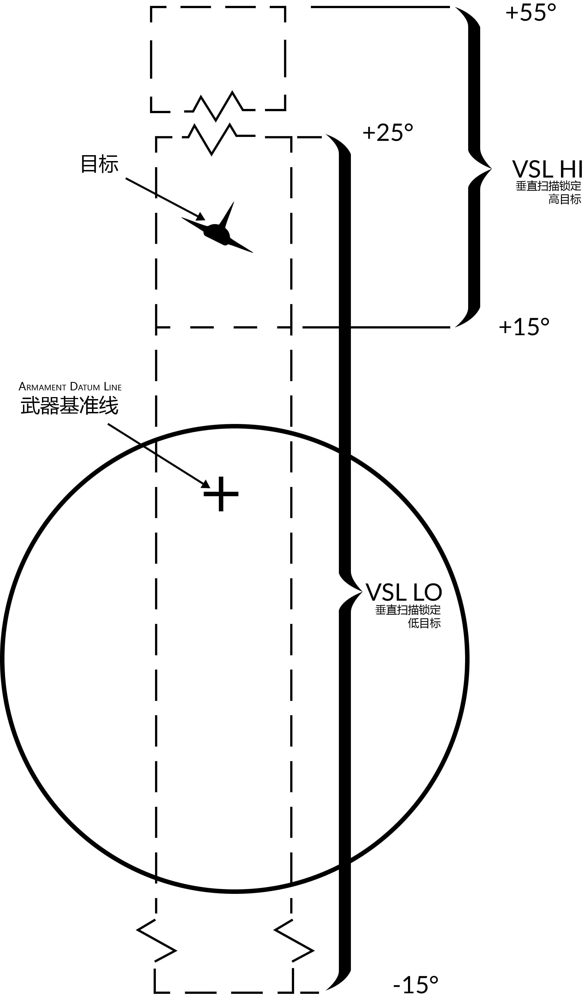
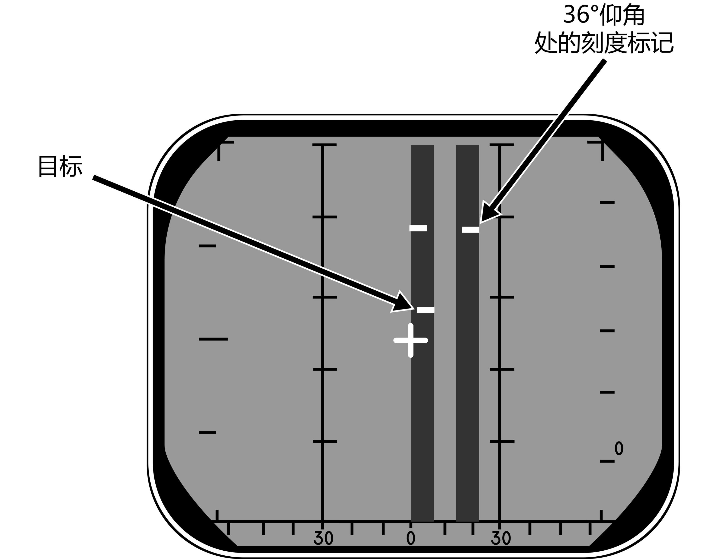

# ACM 模式

AN/AWG-9 雷达拥有三种不同的 ACM 截获模式。飞行员锁定模式（PLM）、垂直扫描锁定模式（VSL）和手动快速锁定（MRL）。

ACM 模式是以优先级顺序列出的，优先级较高的模式会超控其它优先级较低的模式。
这意味着 PLM 模式始终超控 VSL 以及优先级更低的模式，VSL 模式超控 PAL 和优先级更低的模式，但是不会超控 PLM，依此类推。

除了 PLM 模式外，所有 ACM 模式可以通过 RIO 按下并释放 HCU 扳机第一段来退出，PLM 模式将一直启用直到飞行员释放 PLM 按钮。

<iframe width="560" height="315" src="https://www.youtube.com/embed/Ujk4hL_EnUc?si=khwLvLn6hHSDWm9m" title="DCS World - F-14 Tomcat - Front Seat - ACM - Radar Acquisition Modes" frameborder="0" allow="accelerometer; autoplay; clipboard-write; encrypted-media; gyroscope; picture-in-picture; web-share" referrerpolicy="strict-origin-when-cross-origin" allowfullscreen></iframe>

## 飞行员锁定模式 (PLM)

PLM 是 ACM 模式中优先级最高的模式，将始终会超控其它雷达模式，飞行员需要通过按下右发油门握把上的 PLM 按钮时来启用 PLM 模式。
按下 PLM 按钮将会指令天线对准武器基准线（ADL），并使雷达尝试锁定5海里内的首个看到的目标。

因此，使用 PLM 的方法就是飞行员将 HUD 中的 ADL 标记对准目标处，然后按下 PLM 按钮直到目标锁定。
PLM 将会保持启用直到探测到目标并转换至脉冲 STT，或直到飞行员松开 PLM 按钮使雷达转换回脉冲搜索。

## 垂直扫描锁定模式（VSL）

VSL 模式可以由飞行员或者 RIO 启用，VSL 模式用于锁定飞机当前航向上仰角 -15° 到 +55° 的目标。RIO 可以使用传感器控制面板上 VSL 开关选择 VSL 模式。
RIO 可以通过将传感器控制面板中的 VSL 开关拨至 VSL HI（高目标）档位或 VSL LO（低目标）档位并松开来选择这两个子模式。
除了在 A/G 模式下，飞行员可以使用目标指定开关 UP 或 DN 分别启用 VSL HI 或 VSL LO。

启用 VSL 将命令天线以 5° 宽方位进行扫描。如果启用 VSL HI，那么垂直扫描的覆盖区间将为 +15° 到 +55°；
如果启用 VSL LO，那么垂直扫描的覆盖区间将为 -15° 到 +25°。VSL 通过随天线视线移动的菱形在 HUD 中指示出来，菱形用来指示天线视线当前所处的位置。

当探测到5海里内的目标时，雷达将转换至脉冲 STT 模式，否则将继续执行 VSL 直到选择其它模式。

## 飞行员自动锁定模式（PAL）

在 A/G 模式以外时，飞行员可通过使用目标指定开关选择 DES 档位来启用 PAL 模式。

PAL 模式将指令天线进行 8 线 ±20° 栅状扫描，并锁定15海里内探测到的第一个目标。
PAL 模式由 HUD 中，随天线视线移动的菱形指示，菱形用来指示天线实现当前的位置。

## 手动快速锁定（MRL）

手动快速锁定模式（MRL）允许 RIO 在天线环架极限内快速锁定一个5海里内的目标。
按下 HCU 控制杆右侧的 MRL 按钮将会命令雷达启用1线、锁定距离为5海里内的目标的超级搜索。

HCU 控制杆用来控制超级搜索栅状扫描的方位和仰角（X 轴控制方位，Y 轴控制仰角）。
DDD 中将会显示超级搜索的栅状扫描，DDD 显示的标度为5海里，并且在栅状扫描的边缘处还显示了两个刻度标记，刻度标记用来指示当前天线的仰角。

当 DDD 中显示出目标时，RIO 可按下扳机第二段来截获目标并转换至脉冲 STT。
如果在进入 MRL 后 RIO 仅按下扳机第一段并松开，那么雷达将会返回脉冲搜索模式。
