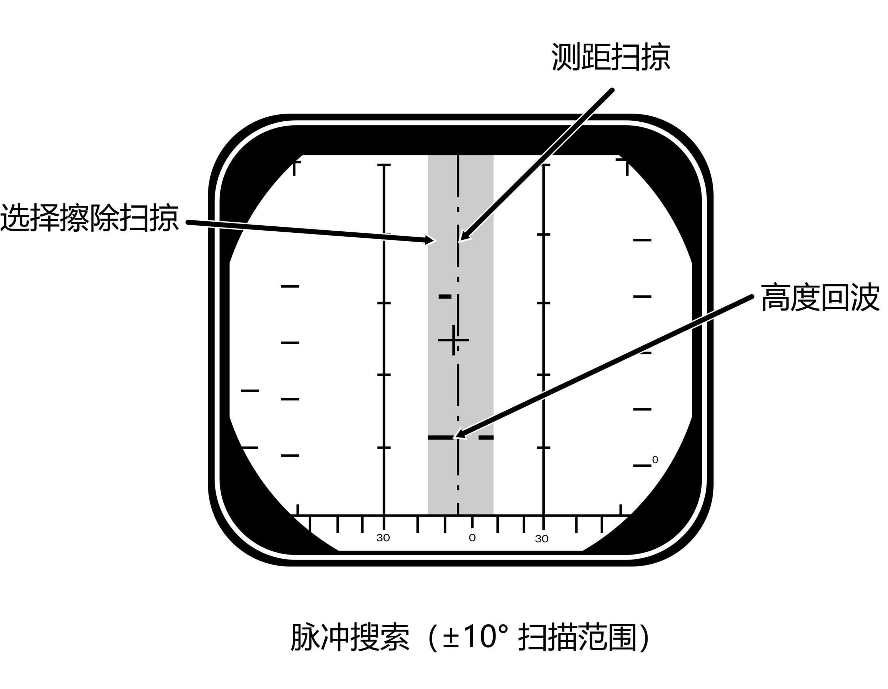
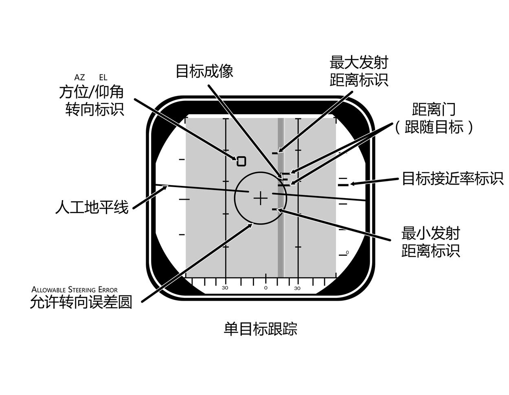
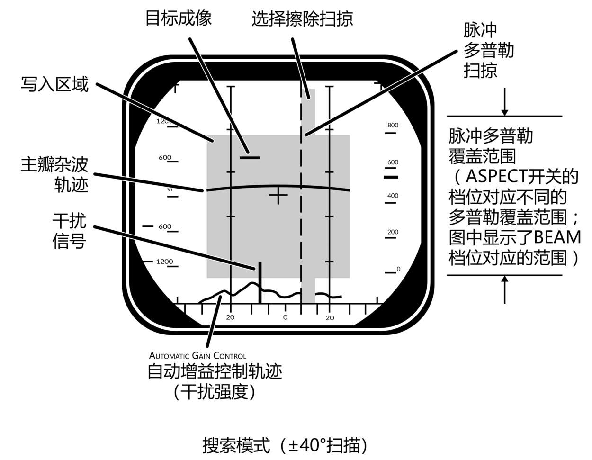
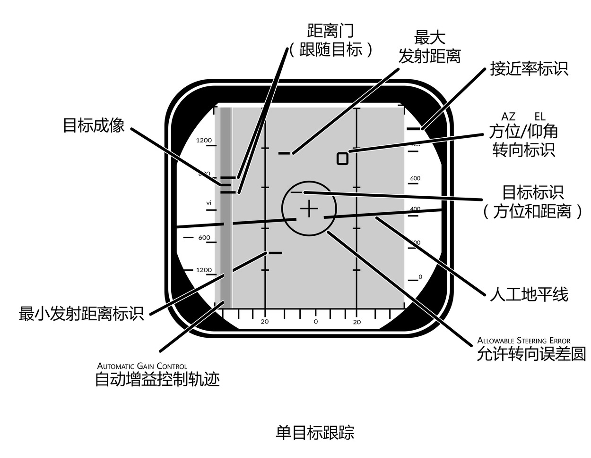

# 总体雷达操作

AN/AWG-9 雷达有两种基本的工作模式：脉冲模式和脉冲多普勒模式，两种模式各有其优缺点。
下表列出了两种模式下的不同功能，可用的武器投放方式、预期探测距离和目标数据。

| 模式           | 功能                                     | 武器能力                                                                          | 探测距离 |
| -------------- | ---------------------------------------- | --------------------------------------------------------------------------------- | -------- |
| **脉冲**       |                                          |                                                                                   |          |
| 脉冲搜索       | 中距离搜索与探测，次要空对地。           | 瞄准轴模式发射导弹。                                                              | 60海里   |
| 脉冲 STT       | 近距离到中距离单目标跟踪和导弹发射。     | 可使用航炮和使用 CW 为 AIM-7 制导以及使用主动模式发射的 AIM-54。                  | 50海里   |
| **脉冲多普勒** |                                          |                                                                                   |          |
| 脉冲多普勒搜索 | 远距离搜索和探测                         | 瞄准轴模式发射导弹。                                                              | 110海里  |
| 边搜索边测距   | 远距离搜索、探测和测距。                 | 瞄准轴模式发射导弹。                                                              | 90海里   |
| 边扫描边跟踪   | 远距离搜索、探测、多目标跟踪，导弹制导。 | AIM-54，多目标攻击能力。                                                          | 90 海里  |
| 脉冲多普勒 STT | 远距离单目标跟踪以及导弹制导。           | 航炮和所有导弹。使用 PD 和 CW 为 AIM-7 提供制导，使用 PD 和 AIM-54 主动模式发射。 | 90nm     |

> 💡 探测距离参考为雷达截面积（RCS）5平方米的目标。

## 脉冲模式

在脉冲模式下，AN/AWG-9 不使用脉冲多普勒滤波器，这意味着脉冲模式可以用于探测各个态势的目标，也可以用于基本的地形测绘。脉冲模式的优点是，目标不需要与本机有一定的相对速度才会被视为目标，因此目标进行侧飞机动（译注：3/9线机动）并不会使雷达失去对目标的跟踪。
但脉冲模式的缺点是雷达难以区分地面杂波与真实目标回波，这意味着敌机可以利用地形隐蔽在杂波之中。
由于没有多普勒滤波器，区分背景噪声和真实目标的难度大大增加，这就导致了脉冲模式的探测距离要比脉冲多普勒模式缩短不少。

AN/AWG-9 雷达拥有两个脉冲模式，分别是：脉冲搜索模式和脉冲单目标跟踪（P STT）模式。

### 脉冲搜索 (PULSE SRCH)

脉冲搜索模式主要用于搜索和寻找探测距离内的空中目标。

脉冲模式可以用作为基本的地形测绘模式，地形测绘对于导航和导航更新来说十分有用，同时，地形测绘也可以在紧急情况下用于探测更大的地面/水面目标，例如舰船。
请记住，AWG-9 雷达并非为了地形测绘而生，真正的空对面雷达的性能远胜于 AWG-9。

在脉冲模式下，雷达无法区分目标并生成跟踪符号，这表示 WCS 不会生成跟踪文件并显示任何符号在 TID 中。同样，在脉冲搜索模式下是无法为导弹提供制导的。

在脉冲模式下，DDD 将会在所选的标度显示雷达成像来指示目标的方位和距离，在搜索模式下可以通过选择 HCU 控制杆功能为 RDR 模式以及 HCU 控制杆来转换至 P STT 模式。
脉冲模式下，可以使用传感器控制面板中的 STAB 开关来选择相对地面或相对飞机稳定模式。

### 脉冲单目标跟踪（P STT）

脉冲单目标跟踪模式用于跟踪单个目标，与脉冲搜索模式相同，此时雷达不易受到侧飞机动的影响，但是对地面杂波敏感。
STT 模式下，雷达使用距离门来跟踪目标，这意味着雷达不易受地面杂波的影响，但是目标太接近地面的话，地面回波进入距离门中很可能会导致锁定震荡。

由于只能在脉冲多普勒模式下发送导弹制导指令，脉冲 STT 模式仅限于使用 CW 模式发射 AIM-7，以及以主动模式发射 AIM-54 导弹，从而限制了导弹的射程。
在 ACM 距离内，脉冲模式可以使用 ASPECT 开关来设置以目标的何种态势进行跟踪，ASPECT 开关只是为了应对不同的对抗措施而进行设置。
例如，如果将 ASPECT 开关设置为 NOSE 的话，雷达将回波质心设置在目标前部（机头），远离发射到目标后发的箔条，从而不易受到箔条的干扰。

如果 DDD 面板上的 ANT
TRK 和 RDROT 指示灯亮起表示雷达成功锁定目标，这意味着雷达天线正在跟踪这个目标且目标处于跟踪门内。
如果目标干扰的强度足够，导致无法进行距离跟踪，那么雷达将转换为干扰源角跟踪，干扰源角跟踪时，DDD 中 JAT 指示灯将会亮起，RDROT 指示灯将会熄灭。
当在足够近的距离雷达可以再次进行距离跟踪后，雷达将会转换为距离跟踪。

在 P STT 模式下，DDD 的显示类似于脉冲搜索模式，只不过天线是锁定目标而不是进行扫描。
此外，如果选择了有效的导弹，DDD 还将在目标的周围显示距离门、右侧标度中的接近率符号和可用于 P STT 的攻击符号。

## 脉冲多普勒模式

在脉冲多普勒模式下，AN/AWG-9 雷达使用多普勒滤波器过滤掉不需要的回波来增强对目标的探测，从而提高探测的距离。
脉冲多普勒模式的有点在上述中已经提到：可以探测到距离更远的目标、几乎不受地面回波影响和向 AIM-7 和 AIM-54 发送制导指令。
AIM-54 可以在 TWS 和 STT 模式下发射，而 AIM-7 只能在 STT 模式下发射。PD 模式最大的缺点是容易受到目标进行侧飞机动的影响，当目标的接近率接近为0的时候，目标将会被过滤。

AN/AWG-9 雷达的脉冲多普勒模式有：脉冲多普勒搜索，边搜索边测距，边扫描边跟踪以及脉冲多普勒 STT 模式。
三种搜索模式有相同的 DDD 符号显示，三种模式的区别在于，脉冲多普勒搜索模式的探测距离略胜于另外两种模式，这是因为其他两种搜索模式需要处理 FM 测距来启用跟踪目标的距离指示。

### 脉冲多普勒搜索模式

脉冲多普勒搜索模式下，DDD 以方位和接近率（接近速度）显示回波，这表示仅在 DDD 进行读数的话，RIO 只能识别目标的接近速度和方位。
需要注意的是 DDD 屏幕中显示的目标接近率是相对于地面的（减去本机的空速），而不是相对本机的接近率。
这就意味着正前方的目标笔直向雷达移动，DDD 将显示目标真空速，目标真空速随目标态势和雷达天线的方位变化。这样做的原因是由于雷达本身只读取相对空速，之后再通过减去本机空速修改显示在 DDD 中。

用来指示雷达回波强度的 AGC 轨迹将显示在 DDD 显示屏底部边缘处，从而使 RIO 通过回波的强度来识别正在对雷达进行干扰的目标。
如果一个目标的干扰强度超过设定的干扰阈值的话（通过 DDD 中的 JAM/JET 旋钮设定），那么在 TID 中会显示干扰源射线来指示正在对雷达进行干扰的目标。

DDD 面板中的 Vc 开关可以用来设置 DDD 中显示的标度（显示的接近率区域）。开关拨到 X-4 档位时，接近率标度被设置为800节离开到4000节接近。
拨动开关至 NORM 档位则会将接近率标尺区间设置为200节离开到1000节接近。开关拨动到 VID 档位则会将标度设置为50节离开到250节接近。
多普勒滤波器的工作区间也可以通过位于同一面板中的 ASPECT 开关进行设置，开关在 NOSE 档位时，
接近率处理窗口为600节离开到1800节接近，BEAM 档位为1200节离开到1200节接近，TAIL 档位为1800节离开到600节接近。
ASPECT 开关可使 RIO 在已知目标接近率的情况下对多普勒滤波器进行最佳处理，ASPECT 开关会影响到整个雷达的滤波处理，而 Vc 开关不会，Vc 开关只影响 DDD 的显示。

由于雷达操作多普勒滤波器的机制，雷达会有两个盲区。包含了大部分地速为零的地面物体的回波——主瓣杂波（MLC）区是其中一个盲区，MLC 滤波为以本机地速为中心，滤波区间宽266节（±133节）。
当目标在进行上述机动时，目标与地面的地速一致，故会被作为地面杂波滤除，这就是为什么目标可以通过侧飞机动摆脱雷达的搜索
（译注：以本机地速为中心的意思是，忽略高度差的情况下，雷达正前方地面的接近率等于本机的地速，换句话说就是地面始终以与本机相同的地速接近本机，
正如前所述，目标相对于地面的接近率为0或足够接近，会被雷达当做主瓣杂波滤除，所以才说滤波以本机地速为中心，
简单理解就是地速在0±133节内的目标，开启 MLC 滤波器时是无法显示出来的）。
但是，这种情况只会出现在雷达下视中，因为当雷达天线上视天空时不会出现地面回波，因此可以关闭滤波器。
如果 DDD 面板中的 MLC 滤波器开关位于 AUTO 档位，且雷达天线仰角高于地平线3°以上时，那么雷达将会自动关闭 MLC 滤波器。
滤波器也可以由 RIO 手动关闭，但是如果天线下视，在 RWS 和 TWS 模式下，可能会导致显示器无法使用，这是因为所有地面回波将会发送至计算机用于跟踪。
无论在哪种情况，一旦关闭 MLC 滤波器且目标位于雷达上方，那么目标将无法使用侧飞机动来摆脱 AN/AWG-9 雷达的探测。

第二个滤波器，也就是第二个盲区——零多普勒滤波器。零多普勒滤波盲区以本机地速的负接近率周围为中心，这表示滤波区域内的目标正以和本机相同的速度离开。
零多普勒盲区是因为硬件限制而导致的，如果没有多普勒频移的话，多普勒雷达就无法探测到目标。
零多普勒导致的结果是，盲区的区间宽200节，这意味着雷达无法探测到相对本机地速±100节的目标（目标飞离本机）。这就表示在追逐飞离本机的目标时，可能需要使用脉冲模式。

由于本机相对目标的空速随方位变化，上述的两个滤波器滤波区间随态势变化。
比如说位于45° 的目标的相对空速将会小于位于0°的目标，这是因为本机的速度矢量会略微偏离目标。
由于地面回波的观测速度随方位的变化而变化，这就是为什么 DDD 中主瓣杂波轨迹会呈现为曲线的原因。

目标地速为900节，本机空速为1200节。详细信息参照下表，视线角速度是目标与本机的相对角速度之和。

| 编号 | 视线角度 | 视线角速度 | 目标航向 |
| ---- | -------- | ---------- | -------- |
| 1    | 60°      | 1490       | 180°     |
| 2    | 45°      | 1500       | 120°     |
| 3    | 30°      | 1428       | 100°     |
| 4    | 0°       | 1200       | 90°      |
| 5    | 30°      | 672        | 80°      |
| 6    | 45°      | 210        | 60°      |
| 7    | 60°      | -300       | 0°       |

> 💡 位置 <num>4</num>
> 的目标正在侧对本机或正在进行 "侧飞机动" ，使其消失在 MLC 滤波或者 MLC 地面回波内。在禁用 MLC 滤波器且雷达上视的情况下，目标将会可见。

此外，在所有脉冲多普勒搜索模式下，雷达仅使用相对地面稳定，因此 STAB 开关在脉冲多普勒搜索模式下是无效的。

### 脉冲多普勒搜索 (PD SRCH)

脉冲多普勒搜索模式主要作为预警模式使用。脉冲多普勒搜索模式是所有搜索模式下，探测距离最远的搜索模式，
但是在脉冲多普勒搜索模式下无法向 RIO 提供距离，只能显示接近率。所以 TID 中不会显示任何跟踪信息。

### 边搜索边测距（RWS）

在边搜索边测距模式下，增加了频率调制测距模式（FM 测距），这可使雷达能够测量除接目标近率外还可测量跟踪目标的距离。但是，这种额外的数据测量意味着雷达有效探测距离会要缩短一些。
DDD 中的成像显示与脉冲多普勒搜索模式下一致，但不同的是，在 RWS 模式下，TID 也将会显示跟踪符号，这是因为目标在被雷达扫描到时将会立刻被作为一个跟踪，并显示其位置和高度。
DDD 中的目标最多显示两秒，或显示目标直到天线再次以相同的扫描线和在同样的方位扫描到目标+2秒为止，如果目标没有被再次探测到，目标将会被移除。TID 中最多可同时显示48个跟踪。

### 边扫描边跟踪（TWS）

边扫描边跟踪模式同 RWS 模式一样使用 FM 测距，所以相对脉冲多普勒搜索模式的探测距离缩减是一样的，并且 DDD 显示也和脉冲多普勒搜索一致。
和 RWS 模式的主要区别在于，在 TWS 模式下，计算机可以建立跟踪文件并同时跟踪最多24个目标，并在 TID 中显示最多18个跟踪。

由于计算这些跟踪的计算机程序需要将跟踪刷新时间设置为2秒，所以在 TWS 模式下雷达的可用的扫描方位角与扫描线数为 2-线扫描 ±40° 或 4-线扫描 ±20°。
进入 TWS 时，计算机将会自动选择 4-线扫描 ±20°，除非将扫描范围设置为 2-线扫描 ±40°，否则计算机不会考虑 RIO 设置的扫描范围。

TWS 模式也是唯一一个可以为 AIM-54 提供制导来攻击多个目标的模式（最多六个目标），并且一旦雷达探测到可攻击的目标，计算机将会根据最佳导弹发射顺序来为目标分配导弹优先级序号。

TWS 包含有两个子模式，它们分别是 TWS AUTO（自动）和 TWS
MANUAL（手动），两个子模式由 RIO 在 DDD 面板上通过对应的按钮进行选择。两个子模式的区别在于，在 TWS
AUTO 模式下，一旦目标跟踪存在，扫描范围和栅状扫描的方位和仰角将由计算机接管。WCS 计算机将会自动尝试最佳化扫描范围和方位以便最大限度的跟踪优先的目标。如果在发射 AIM-54 前未选择 TWS
AUTO 模式，那么 WCS 将会在第一枚 AIM-54 发射后超控先前所选的 TWS
MANUAL 并进入 TWS AUTO 模式。

TWS 模式下，飞行员通过导航提示转向至跟踪目标的计算出的质心，并且这个质心同样会以 小X 状的十字显示在 TID 中。

更多有关 TWS 标识符和导弹引导的信息，详情参见 TWS 和 TID 标识符。

### 脉冲多普勒单目标跟踪（PD STT）

脉冲多普勒 STT 模式与脉冲 STT 模式相似。就像其它脉冲多普勒模式对比脉冲模式一样，脉冲多普勒 STT 相比脉冲 STT 来说，既有优点也有缺点。
这意味着，虽然脉冲多普勒 STT 模式可以更好的跟踪接近地面的目标，但是这个模式容易受到侧飞机动的影响。

DDD 中的脉冲多普勒 STT 显示和脉冲 STT 显示相似，除了在脉冲多普勒 STT 模式下，目标回波将和天线方位被移动到了屏幕左侧，并且生成出的合成目标标记是显示在正确的方位上的。
这样一来，就和其他仅显示接近率的脉冲多普勒模式不同，合成目标的距离还可以被显示出来。
在脉冲多普勒 STT 模式下， DDD 中的其它标识符和脉冲 STT 模式下的一致。

不像脉冲 STT 模式，AN/AWG-9 雷达可以在脉冲多普勒 STT 模式下向导弹发送制导指令，从而使 AIM-7 和 AIM-54 在脉冲多普勒模式下发射。
脉冲多普勒 STT 模式是导弹发射距离最远的模式，但缺点是，AIM-54 在这个模式下发射，一次只能攻击一个目标。

## RDR 模式下的 HCU 控制杆

当在不同搜索模式下使用 AN/AWG-9 雷达时，在 HCU 功能按钮选择 RDR 模式时可以使用 HCU 手动选定 DDD 中的目标来 STT 锁定。

当 HCU 功能按键选择 RDR 模式下，按下 HCU 扳机第一段将会在 DDD 中显示截获门，并启用雷达超级搜索模式。
在超级搜索模式下，天线在截获门周围以选定的扫描线数和±10°扫描方位角进行栅状扫描。

截获门可以通过 HCU 偏转至探测到的目标上，控制杆向左/向右控制截获门方位偏转，控制杆向上/向下根据选择的是脉冲或还是脉冲多普勒模式，用来控制距离或接近率偏转。
接着，使用 HCU 控制杆中的 ELEV 拨轮来微调天线仰角，直到将截获门置于目标回波上方。届时 RIO 可以按下 HCU 扳机第二段来指令雷达在指定的方位门、距离门/速度门和仰角尝试锁定。

如果雷达成功锁定一个目标，那么雷达将会转换至相应的 STT 模式，DDD 中对应的指示灯也将会亮起。
如果从脉冲搜索转换至 STT，那么将使用脉冲 STT 模式；如果从任何脉冲多普勒搜索模式转换至 STT，那么将使用脉冲多普勒 STT。

## 过渡模式

过渡模式是用于从搜索模式、ACM 模式、通过 TCS 或两个 STT 模式之间过渡的模式。

### 两种 STT 模式之间的转换

在有需要的情况下，可以按下相应按钮在脉冲 STT 和脉冲多普勒 STT 之间切换。如果切换失败，雷达会恢复到 STT 相应的搜索模式。
（如果选择切换到脉冲 STT 模式，失败后会恢复为脉冲搜索模式，反之亦然。）

### 切换回搜索模式

如果 RIO 向切换回搜索模式，那么 RIO 需要按下扳机第一段并释放，这将会使雷达返回脉冲搜索模式（如果在脉冲 STT 模式下）和脉冲多普勒模式（如果在脉冲多普勒 STT 下）。

如果雷达在 STT 模式下失去目标锁定并且无法重新截获的话，就像 RIO 通过按下扳机第一段一样，雷达将返回 STT 相应的搜索模式。

当处在 VSL 或 MRL 模式时也可以通过这个方法来返回搜索模式，由于 PLM 优先级最高，
所以取消选择 PLM 模式的唯一方法是锁定目标后切换到脉冲 STT 模式然后返回搜索模式或者飞行员再次按下 PLM 按钮来告知雷达返回脉冲搜索模式。

## TWS STT 截获

在 TWS 模式下，RIO 可以通过在 TID 中选中一个跟踪，接着在 DDD 面板中按下脉冲 STT 按钮或脉冲多普勒 STT 按钮来尝试进行 STT 锁定。
按下脉冲 STT 按钮或脉冲多普勒 STT 按钮后 WCS 计算机将指令天线以超级搜索模式在选中目标的方位门、距离门/速度门和仰角上尝试锁定目标（前提是雷达探测到目标）。

与手动控制 HCU 来锁定目标不同，这个过程是完全自动的，但是其锁定目标的成功率也低于手动控制 HCU 来锁定目标。
