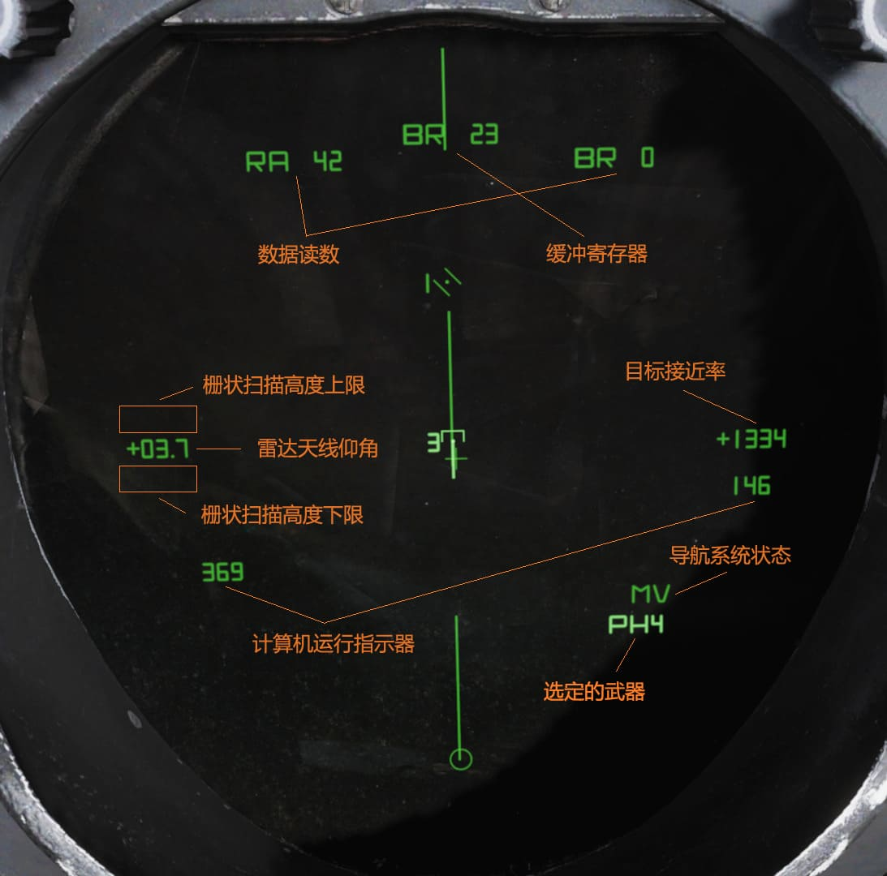
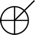
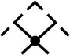
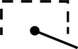
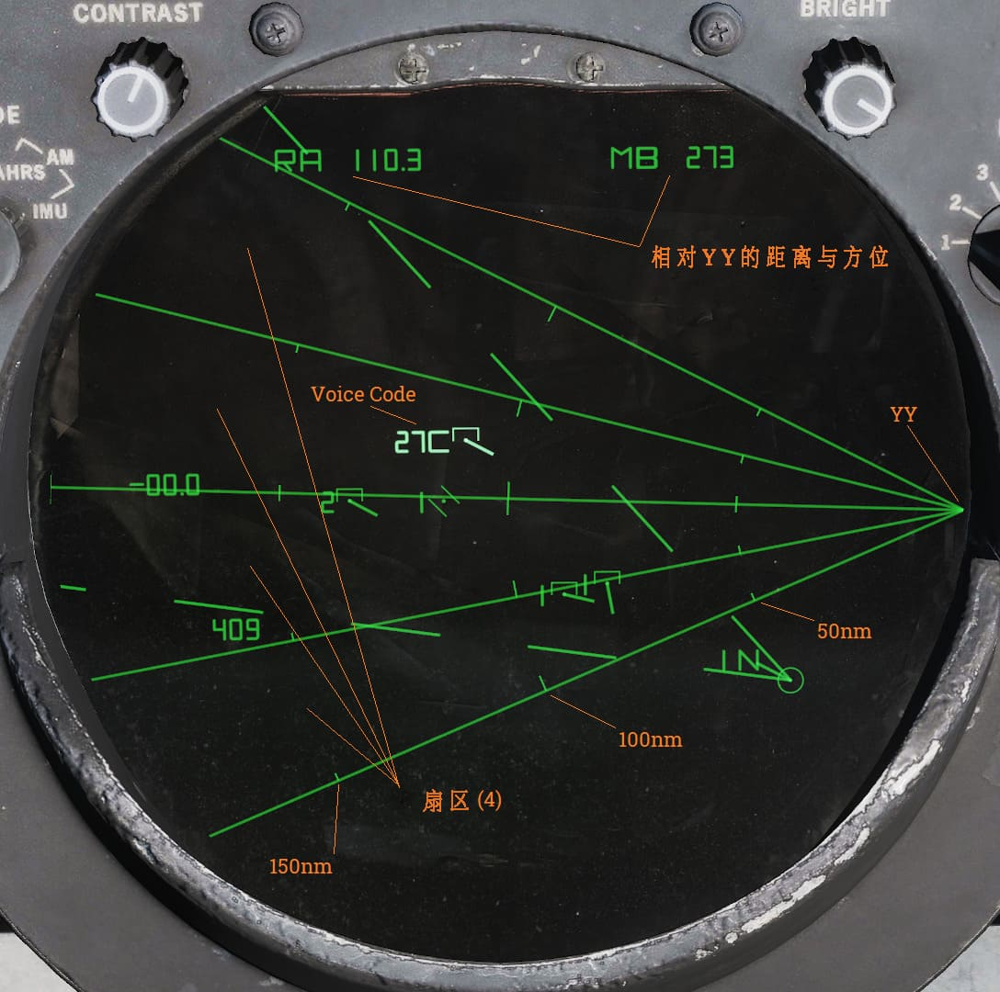
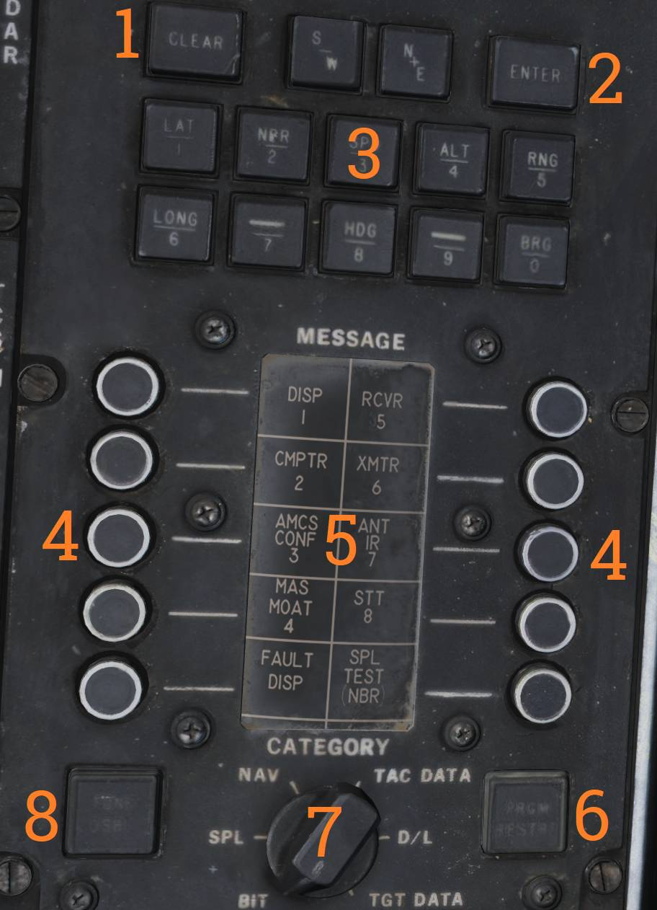
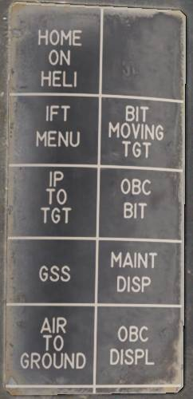
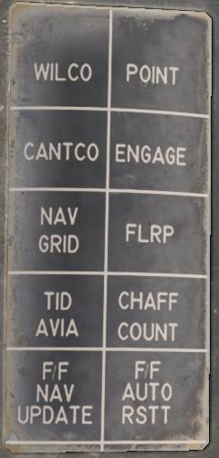
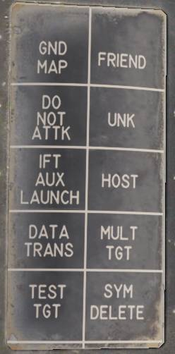
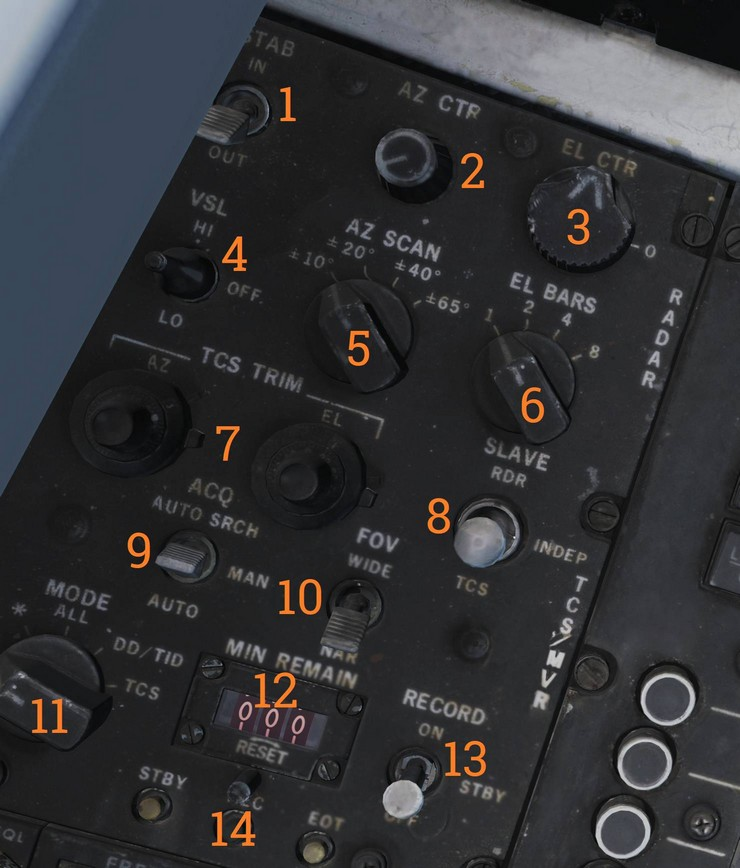

# 雷达面板

AN/AWG-9 武器控制系统（WCS）是一个包含了 F-14 的主要传感器和计算机的综合系统，WCS 系统在空对空任务和空对地任务中提供了目标探测、跟踪和攻击的能力。

## 详细数据显示器（DDD）及控制面板

DDD 是 AN/AWG-9 系统中雷达部分的主要显示器和主要控制面板。
除了位于传感器控制面板上的扫描范围和相对地面稳定控制开关以外，DDD 中包括了所有雷达的控制开关/按钮。

### TGTS 开关、MLC 开关、AGC 开关 和 PARAMP 开关

位于 DDD 面板左上部分包含有4个开关(<num>1</num>-<num>4</num>)，它们分别用于控制参数放大，主瓣杂波（MLC）抑制和目标大小参数。

**TGTS** （目标）开关可以选择预计目标的大小，WCS 会根据设置的目标大小来计算导弹发射区，并设置雷达中目标跟踪的参数。
同时 TGTS 开关还设定发送导弹 ATC（主动制导转交指令）的距离， **SMALL** 为 6海里 发送、 **NORM** 10海里 发送和 **LARGE** 13海里 发送。
如果开关选择的预计目标大小错误，就有可能会对目标跟踪和攻击产生负面影响。

**MLC** 开关用于控制在脉冲多普勒模式下系统如何抑制雷达系统中的主瓣杂波（MLC）。
OUT 档位将关闭抑制系统，IN 档位则开启。
在 AUTO 档位中，如果雷达天线仰角高于地平线3°以上，那么将会自动禁用 MLC 滤波器。

**AGC** 开关用于控制在脉冲多普勒模式下的自动增益控制，使用这个开关来控制用于 AGC（自动增益控制）的时间常数。
一般情况下（NORM 档位）AGC 使用更长的时间常数来计算用于放大的平均值。
如果雷达在有干扰的环境中或者有严重杂波的情况下，将 AGC 设置为更快的时间常数来缓解这些因素，但设置为快速同时也会使得雷达对真目标的灵敏度降低。

**PARAMP** ，参数放大器开关可以手动控制参数放大器，参数放大器用于在所有雷达模式下放大回波较弱的目标。
通常来说，WCS 会根据距离来控制何时使用 PARAMP，但是如果跟踪了一个回波异常强的目标，那么可使用开关来禁用 PARAMP 来减轻背景噪声的影响。
如果将开关手动设置为关闭，那么探测距离会缩短大约35%左右。

> 💡 目前 AGC、PARAMP 和 TGTS 开关在 DCS 中无功能。

### AWG - 9 雷达距离选择和跟踪指示

在 DDD 面板中的上部中央部分，包含了用于在搜索模式下设置雷达距离的控制按钮以及指示器。
在这些控制按钮和指示器的下方还拥有在单目标跟踪（STT）模式下的雷达跟踪指示器。

六个圆形按钮（<num>8</num> ）分别标记了 **5, 10, 20, 50, 100 和 200** ，这些按钮用于在脉冲模式和在 IFF 问询时选择所需的雷达显示距离，这些按钮的设置同时会影响飞行员目标距离显示的标度。
这六个按钮互斥，因为一次只能选择一个显示距离。在脉冲搜索模式下，通过上述按钮进行选择会影响雷达的 PRF 以及 DDD 中的显示标度，如果设置为20海里及以上的显示距离，那么将会启用脉冲压缩。

**距离显示滚筒** （<num>7</num>），距离显示滚筒中显示了雷达在脉冲模式下当前 DDD 中的雷达显示标度，使用脉冲多普勒模式时滚筒为空白。
在 STT 模式下进行 IFF 问询时，这个指示器还将显示±10。

在距离显示滚筒下方的是四个雷达跟踪指示灯，这些指示灯用来指示雷达在 STT 模式下如何跟踪目标。

- **ANT TRK** （天线跟踪指示灯）：指示灯亮起表示雷达正在跟踪目标来获得目标的方位和仰角的角度（方向）。
- **RDROT** （雷达截获目标指示灯）：指示灯亮起表示目标在距离内或速度门内，并且目标正在距离门或速度门内被雷达跟踪中。
- **JAT** （干扰源角跟踪指示灯）：这个指示灯亮起表示天线正在跟踪干扰源的方位和仰角的角度。
- **IROT** （红外捕获目标指示灯）指示灯亮起表示系统正在通过 TCS 跟踪目标来获得目标方位和仰角的角度，IROT 名称是早期 F-14A 中的 IRST 系统继承而来。

### IR AUDIO 控制

IR AUDIO 控制旋钮（<num>10</num>-<num>12</num>）位于 DDD 面板的右上部，这些控制旋钮被用于与原始的红外传感器一起使用，在模拟的 F-14 型号中是无功能的。

## 雷达和导弹频率选择拨轮

DDD 面板右上角的拨轮用于控制 AN/AWG-9 雷达发射器的频率（ <num>13</num> ），导弹控制波道则用于与 AIM-7 和 AIM-54 一起使用（ <num>14</num> ）。
调整这些拨轮来避免受到其它装备了 AN/AWG-9 飞机的或其它外部干扰源的干扰。
由于导弹需要进行调谐，在 AIM-7 准备好后，WCS 将会读取 AIM-7 的导弹波道，在准备好 AIM-7 后变更波道不会起到任何作用，除非重新开始导弹的准备程序。

> 💡 目前在 DCS 中尚未模拟。

### 雷达模式选择按钮

DDD 面板的右下部包含有显示模式、雷达模式和 DDD 本身滚筒指示器的控制开关与按钮。显示模式按钮 （<num>15</num>）用于选择当前 DDD 选定的显示模式。
**RDR** （雷达模式），通常选择雷达模式来使用。
**IR** 模式由于没有安装 IR 系统，所以 IR 模式是无功能的。
**IFF** 按钮按下后将在 IFF 本身的两种运行模式下的其中一种来启用 IFF 问询器，详情参见总体设计和系统概述的 IFF 部分。

雷达模式按钮（ <num>16</num> ）用来选择 AN/AWG-9 雷达的运行模式。
两个 STT 按钮——脉冲多普勒单目标跟踪（ **PD STT** ）和脉冲单目标跟踪（ **P STT** ）——如果可用，这两个按钮可用来选择 STT 的模式。
同时这两个按钮还用于自动尝试锁定至 TID 中选中的目标或用于在两个 STT 模式之间进行切换。脉冲多普勒搜索按钮（ **PD SRCH** ）用于选择雷达 PD SEARCH 模式。
边搜索边测距按钮（ **RWS** ）用于选择雷达 RWS 模式。
两个边扫描边跟踪按钮（ **TWS AUTO** 和 **TWS MAN** ）用于选择雷达使用与之对应的 TWS 模式运行。脉冲搜索按钮（ **PULSE SRCH** ）用于选择雷达脉冲搜索模式。

**滚筒指示器** （ <num>17</num> ），滚筒指示器指示了当前所选的雷达模式。
除了显示 TWS MAN，TWS AUTO，RWS 指代各自的模式外，滚筒指示器还可以显示 MRL（手动快速锁定）、A-G （空对地）、VSL（垂直扫描锁定）、
OPTTRK（TCS 跟踪）、PLM（飞行员锁定模式）、PULSE（脉冲搜索模式和脉冲 STT 模式）、PD（脉冲多普勒搜索模式和脉冲多普勒 STT 模式）和PAL（飞行员自动锁定模式）。

### Aspect 和 Vc 开关

在 DDD 的两边是 ASPECT 开关和 VC 开关。
**VC** 开关（ <num>18</num> ）用于控制在脉冲多普勒搜索模式下 DDD 上显示的目标接近率标度。
开关拨到 X-4 档位时，接近率标尺区间被设置为800节离开到4000节接近，拨到 NORM 档位时，接近率标度将设置为200节离开至1000节接近，
VID 档位则将接近率标度设置为50节离开至250节接近。

**ASPECT** 开关（ <num>21</num> ）将根据雷达模式控制两种不同的功能。
在脉冲多普勒搜索模式中，ASPECT 开关用来控制雷达的接近率处理窗口，NOSE 档位将设置为600节离开至1800节接近，
BEAM 档位将设置为1200节接近至1200节离开，TAIL 档位将设置为1800节离开至600节接近。
在短脉冲 STT 模式下，开关不同的档位将系统跟踪模式设置为对应的回波边缘和回波质心来减轻对抗措施对例如箔条和特定干扰模式的影响。

### 仰角指示器

仰角指示器标度—— **EL** （ <num>22</num> ）——这个指示器用于指示传感器的仰角。左侧（ **RDR** ）的指针指示当前实际的雷达天线的仰角。
左侧的指针将会随天线在雷达搜索模式下的移动而移动。

如果将 HCU 设置为 RDR 模式，右侧（IR/TV/EC）指针将指示当前设置的天线栅状扫描中心的仰角。
由于指针可使 RIO 在最终返回到搜索模式时设置需要使用的天线的仰角中心，IR/TV/EC 指针在 STT 模式下显得十分有用。

如果设置 HCU 为 IR/TV 模式，那么右侧指针会显示当前 TCS 的仰角。

### 反干扰模式控制按钮

面板的左下角含有三个反干扰模式按钮。这些按钮的功能用于反制各种影响系统的干扰。（尚未实装）

### 雷达和 DDD 控制旋钮

在 DDD 面板上装有八个不同的旋钮，分别用来控制不同的 DDD 和雷达功能。
坐落于 DDD 左上角的是 **PULSE VIDEO** 控制旋钮（ <num>5</num> ），这一旋钮用来控制 DDD 在脉冲模式下的视频强度。
旋钮只对 DDD 产生影响，不会影响雷达本身。

位于 DDD 右上方的是 **BRIGHT** 控制旋钮（ <num>9</num> ），它通过调节偏振滤光镜来机械控制 DDD 的亮度，主要用于低亮度条件下。

位于 DDD 的左下方的是 **PULSE GAIN** 控制旋钮（ <num>20</num> ），这个旋钮用来控制在脉冲模式下的雷达增益。
调整旋钮会直接影响雷达的增益。一般情况，将旋钮保持在顺时针旋转最大档位的限位机构，转动到限位机构来使 WCS 来自动控制脉冲增益。

位于 DDD 的右下方的是 **ERASE** 控制旋钮（ <num>19</num> ），这个旋钮用来控制 DDD 中擦除波束的强度。
擦除波束会连续擦除 DDD 上的目标指示，因此这个旋钮的设置将会影响到探测到的目标的余像在 DDD 上的残留时间。

位于 DDD 面板的左侧的分别是 PD THRLD（ <num>26</num> ）、JAM/JET（ <num>24</num> ）和 ACM THRLD（ <num>25</num> ）控制旋钮。
脉冲多普勒阈值旋钮（**PD THRLD**）用于控制一个回波视为一个接触的阈值，接触将会显示在 DDD 中，并在 RWS 模式和 TWS 模式下，在 TID 中显示出接触。
**CLEAR** 旋钮控制着 CLEAR 区域（回波净区）阈值（DDD 的上半部分），**CLUTTER** 旋钮控制着 CLUTTER 区域（杂波区）的阈值（DDD 的下半部分）。
在一般情况下，将旋钮顺时针转动到位于 NORM 档位的限位机构中，使 WCS 自动控制阈值。

**JAM/JET** 旋钮用来设置干扰强度的阈值，高于设定值的辐射源将被视为干扰机并在 TID 中使用干扰源射线将其指示出来。
**ACM THRLD** 旋钮可以用来设置 ACM 距离内将回波视为目标的阈值。在一般情况下，将旋钮逆时针转动至限位机构中，使 WCS 自动控制阈值。

> 💡 JAM/JET 和 ACM THRLD 旋钮的功能尚未实装至 DCS 中。

## 详细数据显示器

| 模式           | 搜索                                                          | STT                                                     |
| -------------- | ------------------------------------------------------------- | ------------------------------------------------------- |
| **脉冲**       |           |           |
| **脉冲多普勒** |  |  |

根据雷达模式的不同， **DDD** 屏幕本身可以显示仅雷达回波数据或雷达回波及其标识符。

在脉冲搜索模式下，屏幕中仅显示雷达回波以及可视化雷达扫掠与擦除扫掠。在此模式下，屏幕中会显示距离与方位。
在脉冲多普勒模式下，屏幕底部还会增加一个 AGC TRACE，AGC TRACE 显示了探测到的目标的预测干扰强度。在此模式下，屏幕中会显示接近率与方位。

在两种 STT 模式下，除了目标的回波外，屏幕还将显示跟踪门（距离或速度门）、位于右侧的接近率指示和攻击标识符（如果在空对空模式下并且已选择了导弹）。

在脉冲 STT 模式下，目标标识显示在正确的方位和距离上，而在脉冲多普勒 STT 模式下，目标标识将移动至屏幕左侧，而不是在正确的方位上生成目标标识。
在脉冲多普勒 STT 模式下，还增加显示了 AGC TRACE 来表示干扰强度。有关攻击标识符，详情参阅 VDIG 部分。

> 💡 AGC TRACE 尚未实装。

在脉冲搜索模式下，当 IFF 问询器被启动后，IFF 信息将会叠加显示在正常雷达回波上。
在脉冲多普勒搜索模式下，当显示 IFF 信息时，DDD 显示标度将切换至先前设置距离标度来显示距离和方位，
在 PD STT 模式下，如果在 TID 选中了目标，当显示 IFF 应答结果时，那么 DDD 显示标度将切换至目标为中心 ±10 标度。

## 战术信息显示器（TID）与相关控制开关/按钮

TID 是 WCS 的主要数据显示器。TID 向 RIO 显示战术信息，显示的战术信息用来识别和选择用于 F-14 “雄猫”上的远程武器的目标。
将 TID 想象成一张俯视地图，所有显示出的跟踪以及符号都会以相对应的坐标显示在这张地图中，但是 TID 不会显示出地面/水面地物（地图）。
同时 TID 还作为次要角色用于显示输入数据至 WCS、导航、INS 对准和机上检查（OBC）。

### TID 显示控制旋钮

在 TID 的上方边缘处包含有两个显示控制旋钮（<num>2</num> & <num>4</num>）。
左边的旋钮用于控制 TCS 的显示对比度，右边的旋钮用来控制 TID 的整体亮度。两个旋钮的设定一般根据使用习惯和当前环境光来调整。

### INS 和导航控制开关/按钮

位于 TID 左上角的是 INS 状态指示器（ <num>1</num> ），状态指示器用来指示 INS 的状态和对准状态。

TID 的两侧包含有两个旋钮。左侧的旋钮（ <num>12</num> ）用来控制和选择使用 INS 或 AHRS 模式。同时这个旋钮还用于进行 INS 对准。

右侧的旋钮（<num>6</num>）用来控制在飞行员选择目标转向时，转向的目标源。旋钮用来在存储在 WCS 中的不同的航路点之间进行选择。
MAN 档位仅用于在飞机挂载了 TARPS 时使用。

在 TID 右上方位于边缘处、右侧旋钮一旁的是读数滚筒（<num>5</num>）。读数滚筒用于指示当前提供给飞行员的转向信息的类型。

读数滚筒可显示的转向信息类型有：目标（DEST）、数据链路指令航向（D/L）、计算出的拦截转向（LD CLSN）、恒定角度拦截转向（CLSN），
计算出的追踪转向（LD PURST），追踪转向（PURST），塔康（TACAN）和手动设置指令航向（MAN）。

### TID 数据读数滚筒

在 TID 的上方是数据读数指示器滚筒（<num>3</num>）。数据读数指示器用于在 TID 文本读数中指示数据的来源。
可显示的读数分别为：导航系统中不同的航路点（WAY PT、ST、FIX PT、IP 和 HB）、本机（OWN A/C）、首要目标（TGT 1）和 SYMBOL。

当在 TID 中选中一个符号，但数据读数指示器中显示 SYMBOL 时，则表示选中的符号在滚筒中没有其对应的指示器文字。
在上述情况下，指示器上也会显示为空白，TID 上也不会显示任何符号。数据源没有对应的指示器文字以及在 TID 中没有对应符号时，滚筒显示为空白。

### TRACK HOLD 按钮与 CLSN 按钮

在上述 TID 两侧选择旋钮下方的是两个带有指示灯光的按钮，TID 每侧各一个按钮。绿色灯光亮起表示已选择按钮。

在 TID 左侧的是 **TRACK HOLD** 按钮（<num>11</num>），TRACK HOLD 按钮用于启用跟踪保持功能。
通常，在 TWS 模式下，TID 中的目标会在最后一次观测到后开始保留在屏幕中14秒。
按下跟踪保持功能会将所有目标保留的时间延长至2分钟。
如果再次按下 TRACK HOLD 按钮，那么保留的时间将会恢复至标准的14秒一个周期，在14秒过后如果没再次观测到目标，那么目标将会被丢弃。

在 TID 右侧的是 **CLSN** 按钮（<num>7</num>），CLSN 按钮用于启用恒定角度拦截转向至当前跟踪的目标或质心（如果在 TWS 模式下时）。
除了飞行员选择了 ACM 模式外，按下恒定角度拦截转向按钮将超控当前提供给飞行员的转向信息。

### TID 控制面板

在 TID 的下方是 TID 控制面板（<num>8</num>）。TID 控制面板上有8个按钮，分别用于选择在 TID 中显示的标识符，绿色灯光亮起表示已启用按钮。
TID 控制面板上还包含有两个选择旋钮，分别控制这显示标度和 TID 模式。这些按钮分别是：

| 控制/指示器 | 功能                                                                                                                                              |
| ----------- | ------------------------------------------------------------------------------------------------------------------------------------------------- |
| RID DISABLE | 尚未实装。                                                                                                                                        |
| ALT NUM     | 高度数字按钮，启用显示跟踪符号左侧的跟踪高度。目标高度数值单位为万英尺，比如说显示数字为1，表示目标高度在5000到15000英尺之间。                    |
| SYM ELEM    | 符号补充标识，启用显示所有用于跟踪和航路点的补充标识符。如果关闭这个按钮，那么所有跟踪和航路点都将在 TID 中以一个点显示出来。                     |
| DATA LINK   | 数据链路按钮，启用显示数据链路跟踪。                                                                                                              |
| JAM STROBE  | 干扰源射线按钮，启用在 TID 中显示干扰源射线。启用后，将显示超出 DDD 中设定的 JAM/JET 阈值的对雷达进行干扰的目标。尚未实装。                       |
| NON-ATTK    | 不可攻击按钮，用来启用和禁用显示不能攻击的目标。如，友军飞机。                                                                                    |
| VEL VECTOR  | 速度矢量按钮，启用显示目标的速度矢量。                                                                                                            |
| LAUNCH ZONE | 发射区按钮，根据所选的导弹的类型启用显示武器发射区。发射区代替了相关目标中的速度矢量。发射区功能会由 WCS 在目标进入最大发射距离剩60秒时自动启用。 |

TID 面板中左侧选择旋钮用来控制 TID 显示模式（ <num>10</num>）。

**GND STAB** （相对地面稳定）模式下，TID 显示是相对地面稳定的，这意味着当飞机在显示器中移动时，显示是固定的。
在相对地面稳定模式下，显示器正上方为真北。

**A/C STAB** （相对飞机稳定）模式下，TID 显示是相对本机稳定的，这意味着显示会跟随本机一起移动，本机将保持显示在显示器中。在相对飞机稳定模式下，显示器正上方为本机航向。

**ATTK** （攻击）的功能与 A/C STAB 相同，但不同的是叠加显示了攻击转向标识符。

**TV** 档位用于选择在 TID 中显示 TCS 视频。选择 TV 档位后，将禁用 TID 和 HSD 上的常规战术信息显示。

右侧的选择旋钮用来设置 TID 的显示标度，将显示的直径设置为选定的距离（<num>9</num>）。
可用的显示距离分别为25海里、50海里、100海里、200海里和400海里，更远的显示距离可用于显示雷达探测距离外的数据链路信息。

### TID 数据读数

| 指示器               | 功能                                                                                                                                                                                             |
| -------------------- | ------------------------------------------------------------------------------------------------------------------------------------------------------------------------------------------------ |
| **缓冲寄存器**       | 显示当前 RIO 正在输入至 WCS 中的数据。该功能在 CAP 部分有进一步的说明。                                                                                                                          |
| **数据读数**         | 读数为显示 WCS 中的数据用于读数，例如，显示的读数可以是选中的跟踪的或本机的数据。这个功能在 CAP 部分有进一步的描述。                                                                             |
| **计算机运行指示器** | 读数显示 WCS 程序正在循环运行着。这个读数应该是连续地循环地数字，如果不是，则表示 WCS 计算机锁死或者死机。                                                                                       |
| **雷达天线仰角**     | 这个读数，如果在 STT 模式中，那么将显示当前 AN/AWG-9 雷达天线的仰角，或是如果在搜索模式下，则将显示栅状扫描中心的仰角。                                                                          |
| **栅状扫描极限**     | 读数显示在设定的 TID 显示距离中，当前所选栅状扫描的高度极限。                                                                                                                                    |
| **导航系统状态**     | 读数显示当前导航系统的状态，IN 表示 INS，AH 表示 AHRS，如果手动输入的磁差和计算出的磁差的差超过一定值，那么 MV 将会和当前的状态交替显示。                                                        |
| **目标接近率**       | 读数以接近率最近的10节的倍数显示 STT 目标的或 TWS 模式下选中的目标的接近率。数字旁的＋号代表跟踪正在接近本机，﹣号代表跟踪正在离开本机。                                                         |
| **选定的武器**       | 读数显示当前选择的空对空武器，G 表示航炮，SW 表示”响尾蛇”导弹，SP 表示”麻雀”导弹，PH 表示”不死鸟”导弹。SP 和 PH 同时还将指示所选的导弹类型，准备好发射的数量。在空对地模式下，读数为空白。 |

### TID 标识符

| 标识                                       | 形状                                                  | 功能                                                                                                                                                                                                                                                                                                                                                                                                                                                                                                                                                              |
| ------------------------------------------ | ----------------------------------------------------- | ----------------------------------------------------------------------------------------------------------------------------------------------------------------------------------------------------------------------------------------------------------------------------------------------------------------------------------------------------------------------------------------------------------------------------------------------------------------------------------------------------------------------------------------------------------------- |
| **中心点**                                 |   | 用于标记符号的坐标，所有符号最基本的组成部分，用于对应一个坐标。                                                                                                                                                                                                                                                                                                                                                                                                                                                                                                  |
| **本机**                                   |   | 代表本机的符号。天线扫描极限和干扰源射线都从这个符号延伸。在 GND STAB 模式下，符号会在 TID 中移动并显示速度矢量。在 A/C STAB 模式和 ATTK 模式下这个符号是固定不动的。如果本机符号移动到了 TID 显示距离外，那么显示器的中心将延伸出一条线至屏幕边缘，来指示本机符号的方向。显示延伸线可能是 TID 偏置功能或由于本机符号在相对地面稳定模式下在屏幕中移动导致的。                                                                                                                                                                                                     |
| **TID 光标**                               |  | 用作选中光标的圆环。在 TID 模式下，由 HUC 控制。按下扳机第一段启用符号显示，按下扳机第一段同时还将启用 HCU 来移动光标。
光标的位置是通过偏转控制杆来设置的。这表示控制杆偏转的位置始终对应光标在 TID 中的位置，这使得 RIO 可以通过肌肉记忆来提高选中符号的速度。如果一个符号位于光标中心0.125英寸的范围内，按下 HCU 扳机第二段将选中一个最近的符号。选中的符号将会高亮来指示已选中。
如果不是选中符号而是空白，那么光标将会固定在选中的位置并高亮来指示选中了光标所处的位置。如需在选中了空白位置（或释放选中的位置）后重新启用光标选中功能，按下扳机第一段并释放。 |
| **TWS 转向质心**                           |  | TWS 跟踪的转向质心由 WCS 选择来用于武器攻击。                                                                                                                                                                                                                                                                                                                                                                                                                                                                                                                     |
| **不明机载传感器目标**                     |   | RWS、TWS 和 STT 模式下的不明传感器跟踪。                                                                                                                                                                                                                                                                                                                                                                                                                                                                                                                          |
| **敌机机载传感器目标**                     |   | TWS 和 STT 模式下，由 RIO 指定为敌机的跟踪。                                                                                                                                                                                                                                                                                                                                                                                                                                                                                                                      |
| **友机机载传感器目标**                     |   | TWS 或 STT 模式下，由 RIO 标记为友机的跟踪。                                                                                                                                                                                                                                                                                                                                                                                                                                                                                                                      |
| **角跟踪的雷达目标**                       |   | 仅能够角跟踪的目标（干扰中的目标）。                                                                                                                                                                                                                                                                                                                                                                                                                                                                                                                              |
| **带有通过高度差测距的，角跟踪的雷达目标** |   | 仅角跟踪的雷达目标，通过高度差测距来计算离本机的距离。                                                                                                                                                                                                                                                                                                                                                                                                                                                                                                            |
| **TCS 角跟踪目标**                         |  | 通过 TCS 角跟踪的目标。                                                                                                                                                                                                                                                                                                                                                                                                                                                                                                                                           |
| **带有高度差测距的 TCS 角跟踪的目标**      |  | 通过 TCS 进行角跟踪的目标，通过角度差测距计算离本机的距离。                                                                                                                                                                                                                                                                                                                                                                                                                                                                                                       |
| **不明数据链路目标**                       |  | 数据源识别为不明的数据链路跟踪。                                                                                                                                                                                                                                                                                                                                                                                                                                                                                                                                  |
| **敌机数据链路目标**                       |  | 数据源识别为敌机的数据链路跟踪。                                                                                                                                                                                                                                                                                                                                                                                                                                                                                                                                  |
| **友机数据链路目标**                       |  | 数据源识别为友机的数据链路跟踪。                                                                                                                                                                                                                                                                                                                                                                                                                                                                                                                                  |

| **手动输入的参考点** |                                                       |                                                      |
| -------------------- | ----------------------------------------------------- | ---------------------------------------------------- |
| **基地**             |  | 用来表示基地，航母或机场的航路点。                   |
| **航路点**           |  | WCS 导航航路点，由数字指示航路点1、2和3。            |
| **防御点**           |  | 用来显示需要保护的区域的航路点。                     |
| **固定点**           |  | 常规的固定点航路点。                                 |
| **敌对区域**         |  | 表示敌对区域的航路点。                               |
| **地面/水面目标**    |  | 用于代表地面/水面目标的航路点。                      |
| **IP**               |  | 用于空对地攻击的航路点，详情参考 计算机起始点模式 。 |

| **数据链路航路点** |                                                       |                                     |
| ------------------ | ----------------------------------------------------- | ----------------------------------- |
| **基地**           |  | 表示基地的数据链路航路点。          |
| **航路点**         |  | 数据链路通用航路点。                |
| **数据链路固定点** |  | 表示固定的数据链路航路点。          |
| **地面/水面目标**  |  | 表示地面/水面目标的数据链路航路点。 |

| **位置符号修饰符**                                                                                                                                                                                                                                                                                                              |                                                       |                                                                                                                                                                                                                                                                                                                                                                                                                     |
| ------------------------------------------------------------------------------------------------------------------------------------------------------------------------------------------------------------------------------------------------------------------------------------------------------------------------------- | ----------------------------------------------------- | ------------------------------------------------------------------------------------------------------------------------------------------------------------------------------------------------------------------------------------------------------------------------------------------------------------------------------------------------------------------------------------------------------------------- |
| **强制攻击**                                                                                                                                                                                                                                                                                                                    |  | 通过 RIO 选择强制攻击一个 TWS 跟踪时的附加标识符（穿过中心点的一根横线）。仅能通过这种方式指定一个目标为强制攻击，强制攻击的目标始终会被分配发射序号。                                                                                                                                                                                                                                                              |
| **数据链路待摧毁目标**                                                                                                                                                                                                                                                                                                          |  | 由数据链路数据源指定为待摧毁的数据链路跟踪上的附加标识符（穿过中心点的一根横线）。不会影响 WCS 中的目标优先级。                                                                                                                                                                                                                                                                                                     |
| **禁止攻击**                                                                                                                                                                                                                                                                                                                    |  | 一个 TWS 跟踪或数据链路跟踪上的附加标识符（穿过中心点的垂线），附加符号表示跟踪被指定为禁止攻击（通过 RIO）或取消攻击（通过数据链路）。
如果是由 RIO 设置的话，那么将从 WCS 目标的优先级中移除该目标。                                                                                                                                                                                                               |
| **多目标**                                                                                                                                                                                                                                                                                                                      |  | 表示一个 TWS 跟踪或数据链路跟踪中有多个目标的附加标识符。可以通过数据链路接收或者通过 RIO 手动设置。                                                                                                                                                                                                                                                                                                                |
| **数据链路待问询目标**                                                                                                                                                                                                                                                                                                          |  | 一个数据链路跟踪上由数据链路指令进行目视识别目标的附加标识符（顶点位于中心的的小 V）。                                                                                                                                                                                                                                                                                                                              |
| **外推跟踪**                                                                                                                                                                                                                                                                                                                    |  | TWS 或 STT 跟踪上的附加标识符（中心位于中心点的小 X），符号表示在8秒内目标没有被更新。跟踪将在14秒后或2分钟后（如果启用跟踪保持功能）删除。                                                                                                                                                                                                                                                                         |
| **选中的符号**                                                                                                                                                                                                                                                                                                                  | 符号高亮                                              | 当通过 HCU 或 CAP 选中符号时，符号高亮表示已选中。                                                                                                                                                                                                                                                                                                                                                                  |
| **导弹正在攻击的目标**                                                                                                                                                                                                                                                                                                          | 跟踪符号高亮                                          | TWS 和 STT 模式下，在计算出的导弹飞行时间+15秒内，本机攻击的跟踪符号将高亮显示表示正在用导弹攻击目标。                                                                                                                                                                                                                                                                                                              |
| **目标位于最佳导弹发射区内**                                                                                                                                                                                                                                                                                                    | 跟踪符号闪烁                                          | TWS 模式或 STT 模式下的符号中，当到最佳导弹发射区时间小于8秒时，跟踪的发射区和发射序号将会闪烁。                                                                                                                                                                                                                                                                                                                    |
| **高度数字**                                                                                                                                                                                                                                                                                                                    |  | 当选择在跟踪符号左侧显示高度数字时，高度数字用来指示跟踪的高度（高度显示为跟踪最近的万英尺高度）。以数字4为例，4表示跟踪高度在35000英尺到45000英尺之间。高度数字在雷达或数据链路跟踪符号中可用。                                                                                                                                                                                                                    |
| **发射序号**                                                                                                                                                                                                                                                                                                                    |  | 当在 TWS 模式下，序号用于表示 AIM-54 “不死鸟”的目标优先级。下一枚发射的导弹目标为1号优先级跟踪，导弹发射后跟踪的需要将被移除来让其它5个跟踪的序号前进一来为下一次发射做好准备。
如果设置了目标为强制攻击，那么将强制 WCS 始终将强制的目标算入优先级内。按下 NEXT LAUNCH 开关将自动设置选中的目标为1号优先级目标。                                                                                                  |
| **命中时间（TTI）**                                                                                                                                                                                                                                                                                                             |  | AIM-54 发射后，跟踪的发射序号将由 TTI 或称为命中时间指示替代显示出来，TTI 显示了 WCS 计算出的导弹拦截跟踪目标的剩余时间。
当发出 AIM-54 导引头开机指令时，TTI 数字将会闪烁表示导引头已开机。（译注：这里的导引头开机表示导弹从半主动雷达制导切换至主动雷达制导）。                                                                                                                                                   |
| **速度矢量**                                                                                                                                                                                                                                                                                                                    |  | 当启用显示速度矢量时，速度矢量将从跟踪的中心点延伸出来。速度矢量的方向表示跟踪的航向，速度矢量线的长度表示跟踪的速度，可指示的最高速度为1800节，TID 中线的长度为1.5英寸。
TID 显示模式在相对地面稳定模式下时，速度矢量的方向表示跟踪的真航向，速度矢量中线的长度表示跟踪的地速。
TID 显示模式在相对飞机稳定模式和攻击模式下时，速度矢量的方向表示跟踪的相对航向（相对本机），速度矢量线的长度表示跟踪相对本机的速度。 |
| **发射区矢量**                                                                                                                                                                                                                                                                                                                  |  |  _TUMR（到最小发射距离的时间），TUOR（到最佳发射距离的时间）和 TUIR（到发射距离内/最大发射距离的时间）_ 发射区矢量标识符由 RIO 手动启用或当到最大发射距离的时间小于60秒时启用，标识符启用后将替换正常跟踪速度矢量。                                                                                                                                                |
| 在发射区矢量中，跟踪符号的速度矢量线的长度表示到 Rmin 的时间，到 Rmin 最长时间限制为180秒（速度矢量线显示的长度为1.5英寸）。
当到 Rmin 时间少于180秒时，速度矢量线的长度缩短，同时向跟踪的中心点移动（代表 Rmin）。如果速度矢量线的长度为0，则表示到达 AIM-54 的 Rmin。                                                          |                                                       |                                                                                                                                                                                                                                                                                                                                                                                                                     |
| 同时还有第二个点在这条速度矢量线中，速度矢量线的末端到第二个点的距离表示到 Rmax 的时间（又称为到发射距离内时间）。
也就是说，当速度矢量线缩短至第二个点时（速度矢量末端到达第二个点），则表示玩家处在 Rmax 了（到目标的最大发射距离）。
当玩家超过 Rmax（即，到 Rmax 的时间，又称为到发射距离内时间为负数）后，第二个点将会消失。 |                                                       |                                                                                                                                                                                                                                                                                                                                                                                                                     |
| 发射区速度矢量中的粗线条（框）表示最佳导弹发射距离。当速度矢量末端到达这跟粗线时，表示到最佳发射距离的时间还剩8秒。                                                                                                                                                                                                             |                                                       |                                                                                                                                                                                                                                                                                                                                                                                                                     |
| **干扰源射线**                                                                                                                                                                                                                                                                                                                  |  | 从本机符号延伸至 TID 屏幕边缘的线，线条用来指示超过设定的 JAM/JET 阈值的干扰机。                                                                                                                                                                                                                                                                                                                                    |
| **雷达天线栅状扫描方位角限制**                                                                                                                                                                                                                                                                                                  |  | 表示雷达栅状扫描中，扫描方位角的限制，在屏幕中由两条从本机符号延伸出的虚线表示。
在所有雷达模式下，每根虚线中的单根实线和实线之间间断部分都表示为20海里。在 STT 模式下，两条线将汇聚为单个跟踪射线来指示天线正在跟踪单个目标。                                                                                                                                                                                       |
| **数据链路干扰源射线**                                                                                                                                                                                                                                                                                                          |  | 通过数据链路接收到的干扰源射线，数据链路干扰源射线由数据链路点指向干扰机方向的线条指示。                                                                                                                                                                                                                                                                                                                            |
| **数据链路光标**                                                                                                                                                                                                                                                                                                                |  | 在数据链路跟踪周围的高亮光标（光环），高亮光标用来指示数据链路的操作员对特定的跟踪重点关注。                                                                                                                                                                                                                                                                                                                        |
| **数据链路优先攻击目标**                                                                                                                                                                                                                                                                                                        |  | 数据链路跟踪中附加的标识符，这个标识符用于指示必须被摧毁的目标。标识符不会影响 WCS 中的优先级序号。                                                                                                                                                                                                                                                                                                                 |
| **人工地平线**                                                                                                                                                                                                                                                                                                                  |  | TID 中的人工地平线符号表示飞机的横滚和俯仰。地平线转动表示飞机正在横滚，在显示器中垂直方向上的偏转则表示俯仰发生变化。                                                                                                                                                                                                                                                                                              |
| **转向引导符号**                                                                                                                                                                                                                                                                                                                |  | 转向引导符号表示最佳导弹发射方向的转向误差。飞行员应尽可能将这个符号保持在 ASE 圆环的中心，并在发射导弹时也将这个符号保持在 ASE 圆环内。                                                                                                                                                                                                                                                                            |
| **允许转向误差圆环**                                                                                                                                                                                                                                                                                                            |  | ASE 圆环用于指示发射导弹的允许转向误差。圆环的大小随攻击路线、模式和所选的导弹而变化。                                                                                                                                                                                                                                                                                                                              |
| **脱离指示**                                                                                                                                                                                                                                                                                                                    |  | 当目标的距离小于最小导弹或航炮发射距离时，TID 中心会出现一个大叉。                                                                                                                                                                                                                                                                                                                                                  |

> 💡 其中一些符号对应的功能尚未实装至 DCS 中。

## 导航指令与控制网格（NAV GRID）

导航指令与控制网格或称为 **NAV GRID** 旨在从共同的固定参考点更简单的导航或进行 CAP 任务。
NAV GRID 可使 TID 显示选中/跟踪相对被设定好的参考点的方位和距离，这个参考点称为 **YY** 。
当 NAV GRID 启用时，对于选中和本机来说，显示的距离和方位都是相对于 **YY** 的。此外，它还会显示出一个网格，网格由从 YY 延伸至设定的威胁轴线构成。
网格本身就是为了快速获取位置参考，同时对选中的目标精确读数。这就是 NAV GRID 命名的由来。

最后，它还能够显示称为 **Voice Codes** 的东西。如果选择了 **ALT NUM** ，
那么 TID 中的高度数字会与 Voice Codes 循环显示。
它以10为单位显示目标相对于 **YY** 方位（15为方位150）后面的字母表示距离。**A** 表示0-49海里，**B** 表示50-99海里，依此类推。

标准的 NAV GRID 显示模式为 **GND STAB** 并且在此模式下可使得网格可见。
如果选择 **A/C STAB** 或 **ATTK** 显示模式，则仅显示 **Voice Code**，但除了常规功能外， **本机符号** 将始终显示其 **Voice Code** 。

默认情况下网格原点 **YY** 被置于 TID 屏幕的边缘，并朝设定的威胁轴线向外延伸。
网格可以设置显示1到6个扇区，并且每个扇区都有轮廓线，这就表示一个扇区将显示两根轮廓线来指示扇区的极限，6个扇区则有7根轮廓线。
扇区的大小取决于全部网格覆盖范围，覆盖范围最高可达180度，然后根据选择的扇区数来划分。沿着扇区分界线每间隔50海里有个刻度标记，50海里的标记比100海里的稍短一点。

RIO 可以正常的通过 HCU 来偏置相对地面稳定视图及网格。要复位偏置的话，转至任何相对稳定模式然后返回
**GND STAB** 。

虽然此功能最初的目的是为了舰队防御，但在 DCS 中将 **YY** 设为靶眼时，可以很好的作为一个参考。唯一真正的限制是，网格仅沿威胁轴线显示，而不显示 GRID 周围。

## 操作

### NAV GRID 进入

|                                                                                                         |                                                                                      |                                                                                       |
| ------------------------------------------------------------------------------------------------------- | ------------------------------------------------------------------------------------ | ------------------------------------------------------------------------------------- |
| 1.                                                                                                      | 设置 TID MODE 旋钮至**GND STAB**。                                                   |                                                                                       |
| 2.                                                                                                      | 在**CAP CATEGORY** 旋钮选择 **D/L** 。                                               |                                                                                       |
| 3.                                                                                                      | 选择**CAP MESSAGE** 按钮对应 **NAV GRID** 。                                         |                                                                                       |
| 4.                                                                                                      | 在 CAP 中使用**ALT/4** 按钮输入网格覆盖范围的角度。                                  | 点击**CLEAR** ， **ALT/4** 并输入网格覆盖范围的角度接着按下 **ENTER** 。              |
| 5.                                                                                                      | 使用 CAP 中的**NBR/2** 按钮输入网格扇区数。                                          | 按下**CLEAR** ， **NBR/2** 接着输入扇区数，然后按下 **ENTER** 。                      |
| 6.                                                                                                      | 使用**LAT/1** 和 **LONG/6** 或 **RNG/5** 和 **BRG/0** CAP 按钮来输入 **YY** 的位置。 | 按下**CLEAR** ， **LAT/1** 然后输入纬度，接着按下 **ENTER** 。                        |
| 同上使用**LONG/6** 输入经度，或使用 **RNG/5** 和 **BRG/0** 从本机位置输入 **YY** 相对本机的距离和方位。 |                                                                                      |                                                                                       |
| 7.                                                                                                      | 使用**HDG/8** CAP 按钮输入威胁轴线。                                                 | 按下**CLEAR** ， **HDG/8** 然后输入 从 **YY** 延伸出的威胁轴线，然后按下 **ENTER** 。 |

> 💡
>
> - 首先按下 **CLEAR** 以确保复位先前选择的读数，这是为了方便随后按下前缀可以设置新读数用于显示和输入数据，而不是将新数据输入至之前选择的读数中。详情请参阅 计算机位址面板（CAP） 。
> - 在 **NAV GRID** 中 没有任何选中时， **NAV GRID** 的读数也可以修改和显示，即 **OWN A/C** 为选中。
> - 从战术信息显示器（ **GND STAB** ）进入 **NAV GRID** ，请勿尝试在对准过程中进入。

### NAV GRID 退出

- 如需退出 NAV GRID，取消选择 **CAP** 中 **D/L** 类对应的 **CAP MESSAGE** 按钮 **NAV GRID** 。

### DCS 中的 NAV GIRD

在 DCS 中热车重生时， **YY** 将会设置为任务中玩家加入阵营的靶眼，并且按以下顺序设置威胁轴线从 **YY** 延伸到第一个有效航路点：
**HA** ， **DP** ， **ST** ， **FP** ， **3** ， **2** ， **1** 和 **HB** 或如果当前没有上述航路点的话，就会设置到本机重生位置。

和 Jester 一起冷启动时必须通过指令菜单来让他调整这些参数。他可以用和输入航路点同样的方法来输入 **YY** 。

人类 RIO 他/她必须手动输入 YY。

## 手控装置（HCU）

手控装置（HCU）控制杆和面板上相应的控制开关/按钮是控制 RIO WCS 显示器的主要输入元件。除了控制杆和面板上的控制开关/按钮外，HCU 面板中还包括了 WCS 的和 TCS 的电源控制以及指示灯。

### HCU 电源控制和指示灯

位于 HCU 面板上部边缘的是 IR/TV 超温指示灯(<num>2</num>)、电源复位指示灯(<num>4</num>)和 WCS 电源指示灯（ 6 ）。
当 IR/TV 开关处于 STBY 档位或者 ON 档位时，IR/TV 电源指示灯亮起表示 TCS 还未准备就绪，当 TCS 准备就绪后，
如果开关仍处于 STBY 档位，那么指示灯将保持亮起，如果将开关拨动到 ON 档位，那么则指示灯将会熄灭。
电源复位指示灯亮起表示一个或多个二次电源因为故障使电源保护回路跳闸而无法工作。
WCS 电源指示灯亮起表示 WCS 系统当前处于待机或者开关处于 ON 档位但雷达还未准备好进行发射。
在启动过程中，在雷达启动计时器计时结束前，指示灯将保持熄灭。如需复位雷达，将开关拨动至 STANDBY 档位再拨动至 ON。

位于 HCU 左上角的 **IR/TV** 开关(<num>1</num>)控制着 TCS 的电源。当开关拨到（STBY）档位时，启动系统但是不开启传感器。开关拨动至 ON 档位时启用传感器运行。
需要注意的是，只有当 WCS 控制开关处于 STBY 档位或者 XMT 档位时，才能启用 IR/TV 开关。
**WCS XMT** 开关(<num>7</num>)控制着 WCS 计算机系统和系统相应的显示器（DDD 和 TID）的电源，以及禁止或允许雷达发射。
当开关拨至 STBY 档位时将会开始向所有包括显示器在内的 WCS 系统供电，同时开始雷达预热程序。显示器预热需要30秒钟，雷达需要3分钟预热后才可以运行。
在机轮不负重、雷达计时结束（预热）的情况下，WCS 控制开关拨至 ON 档位将启用雷达发射。

在 HCU 面板中上部的两个按钮分别是 **灯光测试** (<num>3</num>)和 **电源复位** (<num>5</num>)按钮。
按下灯光测试（LIGHT TEST）按钮后会启用所有 WCS 系统的灯光与指示器进行测试。电源复位（PWR RESER）按钮按下后将复位二次电源的保护回路来重新启用二次电源，同时电源复位按钮还可以复位导弹供电。
需要注意的是，只有在保护回路中故障保护跳闸仍然存在、电源复位指示灯亮起时才按下此按钮。

### HCU 模式按钮

HCU 控制杆左侧的是四个带有指示灯的、互斥的 HCU 模式按钮(<num>12</num>)，模式按钮中的绿色灯光亮起表示已启用选择的模式。
按下 **IR/TV** 按钮来选择 TCS 模式，进入 TCS 模式来允许使用 HCU 控制杆和控制开关/按钮来对 TCS 进行控制。
按下 **RDR** 按钮将进入雷达模式，进入雷达模式后可以使用 HCU 控制杆来控制 DDD 中的雷达截获光标，使用雷达截获光标来从雷达搜索模式转换至 STT 模式。
按下 **DDD CURSOR** 按钮将进入 DDD 光标模式，在 DDD 光标模式下，使用 HCU 控制杆和控制开关/按钮来控制 DDD 光标，
当使用雷达进行地形测绘时，使用 DDD 光标来指定地面坐标。DDD 光标模式用于雷达导航更新或在 DDD 雷达显示器中选择一个用作为航路点的位置。
按下 **TID CURSOR** 按钮将进入 TID 光标模式，在 TID 光标模式下，使用 HCU 控制杆和控制开关/按钮来控制 TID 光标选中（选择）TID 中的标识符用于标识符控制和数据读数。

### HCU 控制杆

在 HCU 控制杆上的控制开关/按钮包括：扳机(<num>11</num>)、仰角游标控制(<num>10</num>)、
OFFSET 按钮(<num>9</num>)和 MRL 按钮(<num>8</num>)。
HCU 控制杆的扳机有两个档位，按下扳机第一段和按下扳机第二段。
按下 **扳机第一段** 将启用在所选模式下的光标显示，但当模式按钮选择 TCS，也就是 IR/TV 模式时除外，在 IR/TV 模式下，按下扳机第一段将启用控制杆控制 TCS 仰角和方位控制。
在雷达模式下，除了显示光标外，按下扳机第一段还启用了超级搜索截获模式（详情参阅雷达过渡模式）。
 **按下扳机第二段** ，如果目标在 TCS 的截获门内，那么按下扳机第二段将告知 TCS 锁定 TCS 模式下的目标。
 在雷达模式下，按下按下扳机第二段将告知雷达尝试锁定在设定的方位下，处在雷达距离门/速度门内的目标。在 DDD 和 TID 模式下，
 按下扳机第二段将标记当前光标的位置，或是如果在 TID 模式下，将尝试选中在显示器中距离光标中心0.125英寸内的符号（如果符号存在）。

**仰角游标** 控制是一个位于 HCU 控制杆左侧的一个拨轮，拨轮用于在 TCS 或者雷达模式下，±4° 微调传感器仰角来截获目标，微调是基于正常传感器仰角控制进行偏转的。
控制杆顶部的 **OFFSET** 按钮用来偏置任何 TID 中的显示，移动本机符号至光标选中点的话（如果存在），那么其余的符号将会相对本机符号一并移动。
通过选择另一个 TID 显示模式再返回原来的显示模式来复位偏置功能，所有符号将会返回原位。
位于 HUC 控制杆右侧的 **MRL** 按钮可以用来启用用于目标截获的手动快速锁定模式（MRL），详情参阅 手动快速锁定（MRL）。

根据 HCU 模式的不同 **控制杆** 的功能也有所不同。不变的是只有在按下扳机第一段才启用控制杆，并且所有模式下控制杆控制传感器或光标的绝对位置，这表示传感器或光标始终会移动至控制杆偏转的位置。
在 TCS 模式下，控制杆的 X 轴（上/下）控制着 TCS 视线的仰角，Y 轴（左/右）控制着 TCS 视线的方位。
在雷达模式下，控制杆 X 轴控制着 DDD 雷达截获门的距离或接近率，Y 轴控制着雷达截获的方位门。在两种光标模式下，控制杆 X 轴控制着光标的上/下移动，Y 轴控制着光标的左/右移动。

### 计算机位址面板（CAP）

计算机位址面板（CAP）是 RIO 用于控制和输入数据至/从 WCS 计算机读数的主要接口。

### 数字键盘 (3)

CAP 的上半部分包含了一个数字键盘，以及用于清除输入（CLEAR）、确认输入（ENTER）以及两个用于选择坐标的前缀的 S/W 和 N/E 按钮。
一些数字键还有附加的功能，带有附加功能都按键用来选择用于数据显示和/或输入的前缀。包含附加功能的按键及其表示的含义分别为：

| 数字键 | 功能                                                   |
| -----: | ------------------------------------------------------ |
|      1 | LAT - 纬度——选择纬度用于显示和输入。                 |
|      2 | NBR - 数值——用于 IFT（飞行训练）和 BIT（机内自检）。 |
|      3 | SPD - 速度——选择速度用于显示和输入。                 |
|      4 | ALT - 高度——选择高度用于显示和输入。                 |
|      5 | RNG - 距离——选择距离用于显示和输入。                 |
|      6 | LONG - 经度——选择经度用于显示和输入。                |
|      8 | HDG - 航向——选择航向用于显示和输入。                 |
|      0 | BRG - 方位——选择方位用于显示和输入。                 |

其中的一些附加功能的按键还会将对应的其他数据显示在 TID 中，但输入的数据只会影响所选的前缀。
举例来说，按下 LAT 按键同时显示 LONG 读数，但输入数据只会影响 LAT，另一个例子是 SPD 和 HDG。

## CAP MESSAGE 滚筒指示器和按钮

CAP 的中下部分包含了 MESSAGE 按钮和滚筒指示器及其 CATEGORY（类别）选择旋钮。
滚筒指示器和更现代系统中的 MFD 中的按钮有些相似，但与 MFD 不同的是，滚筒指示器用一个滚筒来代替屏幕来显示当前按钮的功能。

当前按钮的功能是通过类别选择旋钮转动到不同类别来选择的，转动类别选择旋钮也将会转动滚筒指示器来指示所选类别的按钮的功能。
当使用一个功能或选中符号时，功能或选中符号对应的 MESSAGE 按钮将会亮起表示已被启用。

不同类别中，显示出的 MESSAGE 和 MESSAGE 对应的功能如下：

### 类别

#### BIT（机内自检）

BIT 类别包含了不同飞机系统的 BIT 启用相关的 MESSAGE 按钮。这些 MESSAGE 功能可能通常在 OBC 期间和起动期间运行或从 MESSAGE 功能运行单独的测试。
当机上测试和 BIT 实装后，将会在单独的章节详细介绍机内自检和机上检查，在当前的模拟中尚未实装。

#### SPL（特殊）

SPL 类别包含了其它类别中没有的 MESSAGE 功能按钮。当前仅 IP TO TGT 功能可用并且用于计算机起始点模式，
详情参见计算机起始点模式这个类别中还包含了用于手动起动 OBC 程序的按钮（ OBC BIT ）、
一个用于显示最新 OBC 结果的按钮（ MAINT DISPL ）和一个用于清除最新 OBC 结果的按钮（OBC DISPL）。这些和其它功能尚未实装。

#### NAV（导航）

NAV 类别中包含了用于导航更新和更新 INS 运行和对准所使用的数据的 MESSAGE 按钮。
**OWN A/C** （本机）按钮用来选择对本机进行数据读数和数据输入，在 TID 中选中本机符号按下按钮功能相同。
本机按钮用来输入对于对准来说至关重要的数据，例如本机坐标和海拔高度（如果在航母上还有航向和速度），还可用于读数关于本机的可用的不同数据。
**STORED HDG ALIGN** 按钮用于存储和指示预存航向对准是否可用。同时按钮也可以取消选择这个功能来进入正常对准。
**WIND SPD HDG** 按钮用于选择输入和显示风向风速信息，按钮还可以用于手动输入在备用导航中使用的风向风速。
**MAG VAR（HDG）** 按钮用于选择输入和显示导航系统所使用的磁差。
**TACAN FIX** 、 **RDR FIX** （雷达）、 **VIS FIX** （目视）和 **FIX ENABLE** 这四个 FIX 按钮用于更新飞机的位置来修正 INS 漂移。
基本功能是选择更新的方式，然后按下 **FIX ENABLE** 将差值输入至系统中。导航更新的完成程序可在本章的导航部分查看。
两个 TARPS 按钮在没有挂载 TARPS 的飞机上无功能。

#### TAC DATA（战术数据）

TAC DATA 类别中包含了 MESSAGE 功能按钮，可用于选中/选择 WCS 导航系统中可用的不同的航路点。可以通过 HCU 在 TID 中选中来达到和通过功能按钮一样的效果。
选中航路点将启用通过 CAP 数字键盘来更新被选中的航路点。PT TO PT 按钮无功能。

#### DATA LINK（数据链路）

DATA LINK 类别包含了用于 RIO 数据链路回应数据链路操作员指令的 MESSAGE 功能按钮。
**WILCO** （可以执行）按钮和 **CANTCO** （无法执行） MESSAGE 按钮用来告知操作员本机是否可以执行指令。
**POINT** MESSAGE 按钮允许 RIO 标记选中的跟踪发送给操作员表示这个跟踪需要特别关注。 **ENGAGE** 表示本机有意攻击选中的跟踪。
NAV GRID 按钮用于启用 TID 中的 NAV GRID 功能，参见 导航指令与控制网格（NAV GRID）
TID AVIA 按钮用于启用 TID 中的 AVIA 显示。
F/F NAV UPDATE 按钮允许 Link-4C 战机间导航更新。参见导航章节。
其它按钮皆无功能。

#### TARGET DATA（目标数据）

TARGET DATA 类别下包含的 MASSAGE 功能按钮用来修改选中的跟踪符号。
**FRIEND** 、 **UNK** （不明）、 **HOST** （敌机）和 **MULT TGT** （多目标）功能按钮
用来标记选中的符号为对应的类别（多目标可以在其他三个跟踪符号类型上进行设置）。
**DO NOT ATTK** 按钮用来将目标设置为禁止攻击的目标，将目标从 WCS 开火指令中移除。
**DATA TRANS** （数据传递）功能允许一个选中的干扰源射线关联另一个选中的跟踪符号。这个按钮用于使得 WCS 更好地使用两个数据源来跟踪目标。必须在选中符号前先选中射线。尚未实装。
**TEST TGT** （测试目标）按钮按下后在 WCS 中设置一个模拟目标用于测试。当前尚未实现此功能。
**SYM DELETE** （符号删除）按钮允许 RIO 从 TID 中手动丢弃/删除一个跟踪或航路点（如果不再需要）。不能删除本机符号和数据链路跟踪符号。
**IFT AUX LAUNCH** 与 **GND MAP** 皆无功能。

### 程序重启按钮

MESSAGE 滚筒指示器和按钮下方的是面板中最后两个按钮
。**PRGM RESTRT** （程序重启）按钮用来在当 WCS 计算机意外停机时复位当前运行中的程序。
当 TID 中的计算机运行指示器数字停止循环变化时，就代表计算机意外停机了。
最后一个按钮是 **TUNE DSBL** 按钮，在模拟的 F-14 版本中不起作用。

### 数据读数/输入程序

TID 中的数据读数和输入始终遵循以下顺序：

1. 选择符号/功能
2. 选择用于显示的前缀
3. 输入数据

通过 **TID 选中** 或在 **CAP DRUM** 中不同的类别下，使用 **CAP MESSAGE** 按钮来选择所需的符号或功能。

大多数用于数据读数的前缀不仅仅显示一个读数，例如，调出经度或纬度中的任意一个，都会显示另外一个的读数，
调出距离的同时还显示了方位，反之亦然，但是仅对所选的前缀输入数据。

如需不重新选择 MESSAGE 按钮来选择另一个用于数据读数的前缀，可以按下 CAP 上的 **CLEAR** 键，按下后将复位读数并允许选择新的前缀，这样一来就无需重新选择 MESSAGE 功能。
如果已选择了前缀，那么再次按下按键可能会被视为输入数据，通常建议在重新选择新的前缀前使用 **CLEAR** 键来复位。这样一来就形成了以下建议顺序：

1. 选择符号/功能
2. **CLEAR**
3. Prefix
4. 选择用于显示的前缀
5. 输入数据

如需输入新的数据至所选的前缀中，RIO 需要在选择了前缀后输入所需的数据，检查输入的数据是否正确然后按下 **ENTER** 键输入。
TID 中的读数将会更新为新的数据。如需清除数据而不是输入它，按 **CLEAR** 键清除。

## 传感器控制面板

传感器控制面板包含用于 AN/AWG-9 雷达天线栅状扫描的控制开关/按钮。传感器控制面板上还包含了各种 TCS 控制开关/按钮，
RIO 可以通过面板中的控制开关来将雷达隶属于 TCS ，或将 TCS 隶属于雷达，以及面板中还包含了用来对机载录像机（AVTR）进行控制的开关以及旋钮。

### 天线栅状扫描选择

传感器控制面板中，上半部分包含了雷达天线栅状扫描的控制开关/按钮。
**STAB** （稳定）开关用来控制雷达天线栅状扫描是否相对于地平线（IN）稳定。
如果 STAB 开关位于 OUT 档位，那么就表示，栅状扫描是相对 F-14 飞机的武器基准线稳定的。WCS 计算机在必要时会超控这个设置。
**AZ CTR** （方位角控制）和 **EL CTR** （仰角控制）旋钮用来设置天线栅状扫描中仰角和方位角的中心点。
**方位角控制** 旋钮用来在飞机中心线65°内移动扫描方位角的中心，如果扫描方位角宽设置为±65°的话，那么这个功能将会被禁用，
这是因为设置为±65°已经扫描了最大的方位角角度。请勿移动栅状扫描至65°极限外，因为这样可能会使天线撞到天线方位角停止器导致损坏天线。
**仰角控制** 旋钮用来控制相对0°仰角，栅状扫描仰角底部的扫描线的俯仰位置。仰角可从 -76° 移动至 +54° 。
上述的仰角控制和方位角控制旋钮都含有标记出的中心点，分别是飞机中心线和0°仰角。

**AZ SCAN** （扫描方位角）和 **EL BARS** （仰角扫描线数）选择旋钮用来控制天线栅状扫描的大小。
AZ SCAN 选择旋钮有4个档位，分别是：±10°、±20°、±40°和±65°。
EL BARS 选择旋钮也有4个档位，分别是：1、2、4或8线扫描。扫描线仰角覆盖角度分别为：1线2.3°、2线3.6°、4线6.3° 和 8线11.5°，
之所以仰角覆盖角度不是扫描线数乘以1线的覆盖角度是因为，扫描线之间覆盖角度略有重叠。

传感器控制面板中最后一个雷达控制开关是 **VSL** 开关。短暂拨动开关至 VSL HIGH 或 VSL LOW 将启用垂直扫描截获模式。详情参阅垂直扫描锁定模式（VSL） 。

传感器控制面板的下半部分包含了机载录像机（AVTR）的控制开关/按钮，这些控制开关/按钮用来控制和指示电源模式和磁带的剩余录像时间。

> 💡 目前在 DCS 中尚未模拟。
