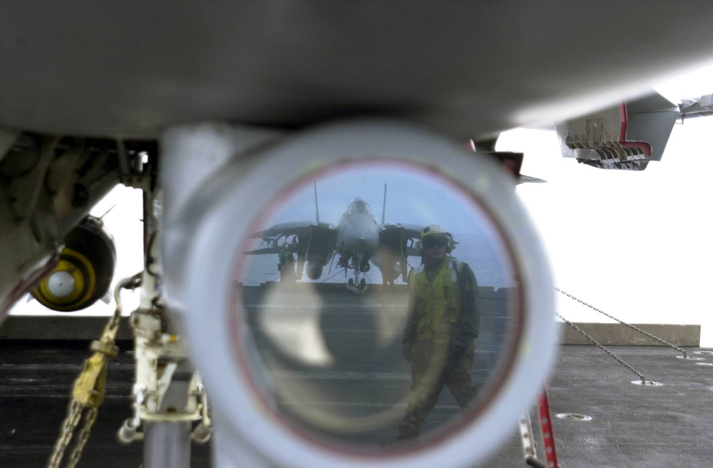
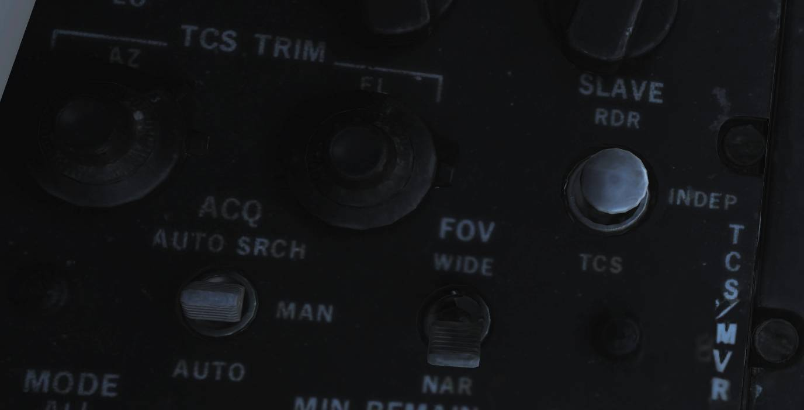
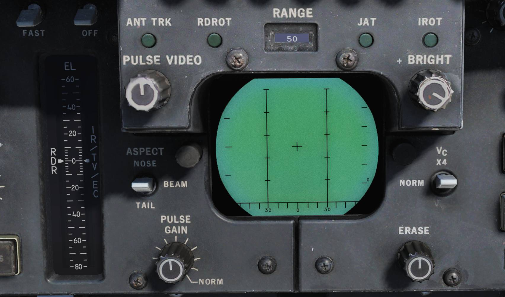
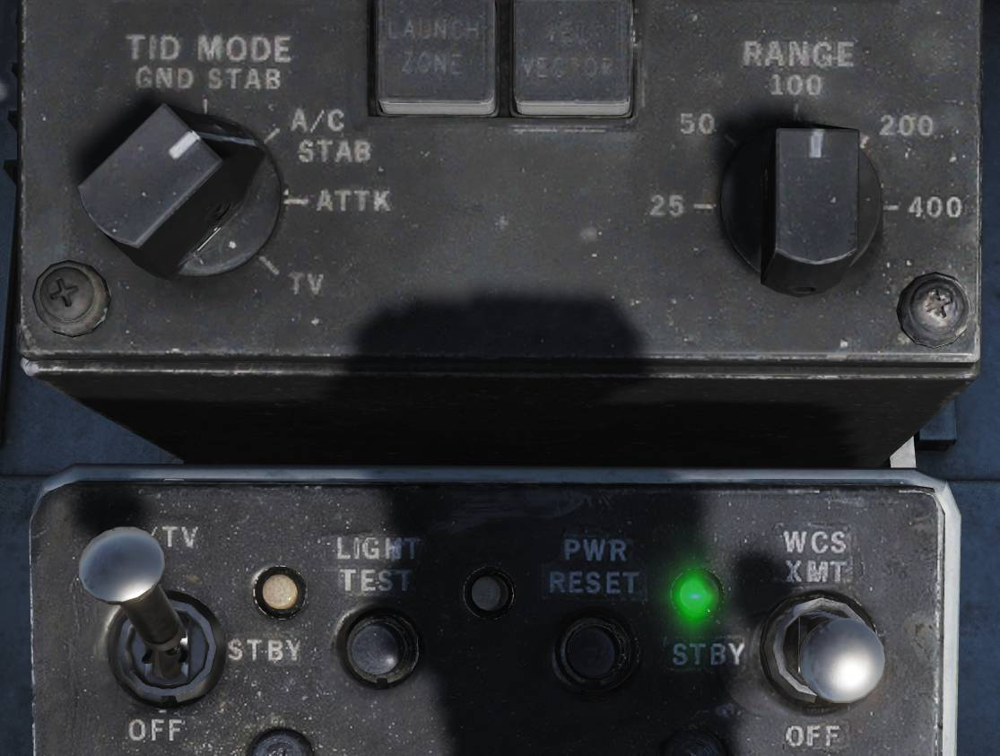

# AN/AXX-1 TCS

 _照片由美国海军摄影师 Justin S.
Osborne 拍摄（030418-N-0382O-591）_

电视摄像套件（TCS），是为了替代早期 F-14A 战斗机所搭载的 IRST 而制造的。
在军方发现 IRST 能力不足后，决定使用 TCS 替换原有的 IRST，以赋予 F-14 战机远程目视识别能力。

TCS 位于雷达天线罩的后下方，正好在前轮轮舱的前方。TCS 包含相对飞机稳定的高分辨率闭路电视摄像机（相对当时来说）。
传感器有两种视场（FOV），第一种是窄视场（NFOV）——视场 0.44°或10X 放大率，以及宽视场（WFOV）视场为 1.42°或4X 放大率。
除了向上角度限制为+11°外，环架运动的限制为 +/- 15°，并且 TCS 拥有单独的对比度锁定或隶属至 AN/AWG-9 雷达的能力。

TCS 可由 RIO 通过传感器控制面板、DDD、TID 和 HCU 来控制。传感器的视频可以显示在 TID 以及前座的 VDI 中。此外，视频还可以通过机载录像机来进行录制，以便事后观看。（DCS 中尚未实现）

## 控制开关/按钮

TCS 的控制器位于 RIO 驾驶舱中的传感器控制面板上，DDD 和 HCU/TID 上。飞行员显示控制面板中包含了一个开关可允许选择在 VDI 中显示 TCS 视频。

### 传感器控制面板

传感器控制面板上用于控制 TCS 的控制开关/按钮有： TCS 调整旋钮、SLAVE 开关、FOV 开关 、目标捕获开关 ACQ 。

**TCS TRIM**
旋钮用于控制 TCS 传感器的视线（LOS），校正相对于 AN/AWG-9 雷达的视线。如果有需要，可以使用这个旋钮来调整 TCS，使得两个传感器的视线相重合。
TCS 调整旋钮的运动范围为 ±2°，检查和校正 TCS 最简单的方法是使用 STT 锁定一个友方目标，并通过调整旋钮直到 TCS
LOS 正确地瞄准了锁定的目标为止。

**SLAVE** 开关主要用来控制传感器的隶属关系如果设置到 **RDR**
档位，雷达将会隶属至 TCS 直到光学跟踪丢失为止。如果设置为 **INDEP**
，则各传感器会独立工作如果将开关设置为 **TCS**
档位，TCS 将隶属至雷达 LOS 直到 STT 脱锁为止。

**FOV** ，视场开关用于控制 TCS 使用哪种 FOV。 **WIDE\***
档位将视场设置为 1.42°，4X 放大率，而 NAR 档位将视场设置为 0.44°, 10X 放大率。

最后—— **ACQ** 开关，捕获开关用于控制 TCS 使用的捕获模式。选择 **AUTO SRCH**
档位将启用带有搜索模式的自动捕获模式，此模式中即使目标在当前 FOV 外，也能够捕获最近的目标。选择
**MAN** 档位则使用 HCU 纯手动直接指向所需的目标。选择 **AUTO**
档位将使用无搜索模式的自动捕获模式，选择后将使得 TCS 可以自动捕获 FOV 内的目标。

#### TCS 控制开关/按钮

**TCS TRIM** 旋钮用来校正 TCS 的方位（AZ）和仰角（EL）。TCS
TRIM 旋钮用来校正 TCS 视线对准雷达视线。通常通过以下方式来完成校正：
使用 STT 锁定一个目标，设置隶属为 TCS，接着微调校正旋钮直到 TCS 视线对准锁定的目标。

最后两个用于控制 TCS 的开关是 ACQ（捕获）开关和 FOV（视场）开关。 **ACQ**
开关可以控制 TCS 如何锁定目标。当处于 AUTO
SRCH 档位时 TCS 传感器会在有限扫描模式中移动尝试找到目标。
MAN（手动）档位只能通过 HCU 在 IR/TV 模式下手动锁定目标，AUTO（自动）档位下 TCS 将自动尝试锁定进入视场内的目标。
**FOV** 开关可以用来控制 TCS 使用 WIDE（宽）或 NAR（窄）视场。

### DDD

DDD 中包含两个与 TCS 相关的指示器。

只要在 HCU 上选择 IR/TV 模式， **DDD EL** 仪表就会显示 TCS LOS 的仰角。

**IROT**
指示灯亮起表示 TCS 正在跟踪目标。缩写 IROT 是从被 TCS 所取代的 IRST 继承下来的。

### HCU/TID

HCU 中包含了 TCS 的电源开关和指示器，以及一个用于选择使用 HCU 控制 TCS 的按钮，
而 TID 中包含了一个用于在 TID 中显示 TCS 视频的控制旋钮以及用于控制 TID 中视频亮度与视频对比度的旋钮。

**IR/TV power**
开关位于 HCU 面板的左上角，这个按钮用来控制 TCS 的电源。处于 OFF 档位将关闭 TCS 的电源。
**STBY** 档位将为 TCS 中的冷却风扇和加热器供电。 **IR/TV**
档位为 TCS 中所有系统供电，等待1-2分钟使 TCS 起旋（译注：内部陀螺仪）并传输视频。
但在另一方面，TID 中的 TCS 符号将会直接可用。同时也无需先选择 STBY 档位，直接将开关拨动至 IR/TV 档位即可。

电源开关旁的指示灯亮起表示 TCS 超温。如果这个灯光亮起，应该关闭 TCS 的电源以防止系统损坏。

HCU 控制杆一旁的 **IR/TV**
按钮用来启用 HCU 控制杆来操纵 TCS 传感器，按下扳机第一段来手动操纵传感器 LOS，按下扳机第二段来指令捕获目标。

在 TID 控制面板上，转动 **TID MODE** 至 **TV**
档位将启用 TCS 视频显示在 TID 中。请注意，这同时会禁用 HSD 中的 TID 复显。

最后，位于导航控制与数据读数面板上的 **CONTRAST** 和 **BRIGHTNESS**
旋钮可用于控制显示在 TID 中的 TCS 视频。

## 标识符

TID 在非 TV 模式时，TCS 跟踪由 TCS LOS 方位上，1.5英寸长的射线和空心圆指示。

TCS 输出视频中的标识符包括了 FOV 指示器和两个十字准星，十字准星分别指示了相对本机的 TCS
LOS—— **GACH** ，以及相对于 AN/AWG-9 雷达 LOS 的 TCS LOS—— **RACH**
。此外，跟踪窗口由4个小正方形指示，每个小正方形对应跟踪窗口的一角。

在宽 FOV 中，视场线条将会显示出来，视场线条用来指示当切换为窄视场时，可见区域的大小。
视场线条由两条平行的线所组成，这两根平行线构成了虚构“框”的边，这个虚构的“框”则用来指示窄 FOV 的大小。

环架角度十字准星或称为 **GACH**
，这个十字准星为实线，用来指示相对于武器基准线（ADL）TCS
LOS 的偏转。中心的 GACH 十字准星指示 TCS
LOS 指向 ADL，GACH 向边缘偏转表示正在朝环架限制偏转，视频的边缘便是最大偏转角度。

**RACH** 或称为雷达角度十字准星（虚线十字准星），RACH 指示在 TCS
FOV 中雷达天线的 LOS。当传感器隶属至另一方时，RACH 和 GACH 将会重合，并将形成一个线条为实线的十字准星。

如果 TCS 已捕获了一个目标，那么跟踪窗口表示 TCS 对比度跟踪器当前锁定的区域。当没有跟踪目标时，跟踪窗口将居中于屏幕中心，在手动模式下将缩放为屏幕宽度的2%，在自动模式下则为5%。

## TCS 操作

TCS 的所有捕获模式都有一个共同点，那就是可以在 IR/TV 模式下使用 HCU 来控制 TCS。
选择 HCU 中的 IR/TV 按钮将启用这个模式，同时将设置 DDD
EL 指示器（右侧指示器）为显示当前 TCS 传感器 LOS 仰角。按下扳机第一段将启用 HCU 来直接控制 TCS
LOS，按下扳机第二段将指令使用所选择捕获模式来进行目标捕获。

手动 TCS 捕获模式—— **MAN**，表示必须使用 HCU 按下扳机第一段来将跟踪窗口置于目标上方，然后按下扳机第二段。
如果成功捕获到了目标，跟踪窗口将扩展来框住目标，并开始跟踪。

自动捕获模式下—— **AUTO**，按下扳机第一段和手动相同，但是当按下扳机第二段进行捕获时，TCS 将会自动尝试锁定在当前 FOV 中离中心最近的目标。
自动搜索捕获模式——**AUTO SRCH**，通过启用在指令 FOV 周围的搜索模式（通过移动传感器 LOS）来捕获发现的第一个目标，以此来进一步增强自动捕获模式。

当使用 TCS 隶属至雷达时，两个自动模式将会自动尝试锁定 STT 目标（一旦存在），TCS 将被转动至锁定的目标上，从而实现对 STT 锁定目标的全自动跟踪。
此外，一旦从 STT 锁定中捕获了一个跟踪，TCS 将会对 TCS 自身的 LOS 和雷达的 LOS 进行比较来检查是否锁定了正确的目标，
如果在3秒窗口内，两者的 LOS 相差超过一定度数，TCS 将会尝试新的捕获。手动模式下同样也会隶属至雷达，不过并不会锁定目标，而是仅跟随雷达的 LOS。

当没有隶属至雷达时，如需解锁跟踪的目标，按下扳机第一段并释放。

有关 RDR 隶属至 TCS 的信息，请参阅本章中 AN/AWG-9 部分下的相关介绍。

### 雷达隶属于 TCS 截获目标

TCS 可用于对目标进行角跟踪并同时使用雷达对目标距离和接近率进行跟踪。当通过传感器控制面板开关设置雷达隶属于 TCS 视线时（SLAVE 开关设置为 RDR 档位），
雷达仍启用但是当 TCS 正在跟踪一个目标时，雷达将指向 TCS 视线，而不是进行扫描。

此时可以按下 HCU 控制杆扳机第一段，然后将捕获门置于目标上方，接着按下扳机第二段。
根据先前所选的搜索模式，按下扳机第二段后将会使雷达以脉冲多普勒模式或脉冲模式隶属至目标。
可以使用 DDD 面板中的 P STT 按钮和 PD STT 按钮来切换 STT 模式。

雷达进入子模式等同于 STT 模式，在这个子模式下，TCS 代替雷达本身用来对目标进行角跟踪。雷达仍然可用于对目标进行距离和接近率跟踪，在 DDD 中，IROT 将代替 ANT
ROT 亮起，IROT 和红外跟踪有关，但是在模拟的 F-14 版本中红外跟踪已被 TCS 替代。

雷达隶属于 TCS 子模式可以为导弹提供制导，雷达在脉冲模式下使用主动模式发射和连续波模式来为导弹制导，在脉冲多普勒模式下则为 PD 模式为导弹提供制导。
如果从子模式将 SLAVE 设置为 INDEP 档位，那么系统将会根据当前的 STT 模式恢复至真脉冲 STT 或真脉冲多普勒 STT。
